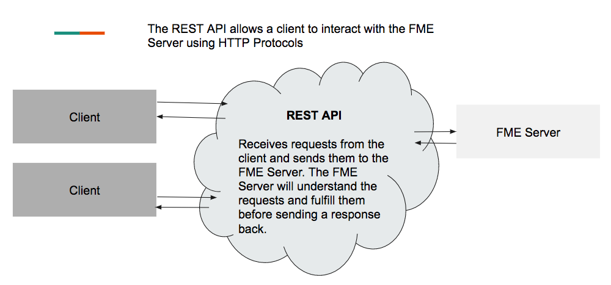

  

    <article class="markdown-body entry-content" itemprop="text"><h3>1.1什么是REST API？</h3>

REST API允许用户通过创建请求和接收响应来与服务器交互。REST代表REpresentational State Transfer(表述性状态传递)，API代表Application Programming Interface(应用程序编程接口)。REST API是一种遵循REST体系结构的API。

<h4>所有REST API都遵循以下六种架构约束：</h4>
<ol>
<li>

客户端 - 服务器体系结构 - 这表明客户端和服务器彼此分离，并且必须能够独立运行。

</li>
<li>

统一接口 - 所有REST API的调用和响应结构必须统一。

</li>
<li>

无状态 - 这意味着服务器不会存储先前对服务器进行的调用的历史记录。每个调用都将被视为新的。

</li>
<li>

可缓存 - 所有响应都必须是可缓存的。

</li>
<li>

分层系统 - 可以有许多服务器。客户端不应该知道它是否连接到终端服务器或中间服务器。

</li>
<li>

按需代码（可选） - 服务器可以将可执行代码返回给客户端。

</li>
</ol>

这些约束旨在使REST API快速可靠。

<table>
<tbody><tr>
<td>
<i></i>
定义： 
</td>
</tr>
<tr>
<td>
《韦氏词典》将<b>客户端</b>定义为使用服务器提供的服务(如访问文件或共享外围设备)的网络中的计算机。
</td>
</tr>
</tbody></table>

<h4>REST API如何与FME服务器交互？</h4>

REST API的作用类似于直接与FME Server通信并将响应中继回客户端的中介。您可以在下图中看到FME Server和AP​​I之间的关系：

<em>FME服务器和客户端之间关系图</em>

REST API读取由HTTP方法，URL和调用主体组成的调用。FME服务器将使用JSON进行响应。

<table>
<tbody><tr>
<td>
<i></i>
定义：
</td>
</tr>
<tr>
<td>

JSON是一种常见的数据交换格式，已成为支持网站和移动设备应用程序的主要选择之一。有关更多信息，请参阅知识中心上的教程：JSON入门文章

</td>
</tr>
</tbody></table>

<h4>REST API的目的是什么？</h4>

REST API允许用户在不使用FME Server图形用户界面的情况下与FME Server进行交互。这使用户能够创建允许客户端访问FME Server的Web应用程序，而无需登录或直接访问服务器。它还可用于自动化FME Server中的进程。例如，FME用户可以创建一个脚本，在服务器上定期运行健康检查。

<table>
<tbody><tr>
<td>
<i></i>
Ricky RESTless说......
</td>
</tr>
<tr>
<td>

我将FME Server REST API用于一切！从发送通知到正在运行的作业和查看作业历史记录。似乎FME Server REST API的可能性是无穷无尽的。

</td>
</tr>
</tbody></table>

<h4>使用REST API创建的Web应用程序示例</h4>

如果您对使用REST API的所有可能性感到好奇，请访问
 <a href="https://knowledge.safe.com/page/demos" rel="nofollow">FME Server演示</a>。FME知识中心提供现场演示，展示了使用FME Server和REST API的巨大功能。

以下示例演示了如何使用Web应用程序从FME Server收集数据。它允许用户在用户指定的区域内请求公共交通信息，您可以查看此
 <a href="http://demos.fmeserver.com/datadistribution-webmap/index.html?map=arcgis" rel="nofollow">现场在线</a>演示。

此演示允许用户在区域上绘制多边形。然后，用户将设置调用的参数，包括要下载的层和坐标系。用户点击请求数据并将收到包含所请求信息的zip文件。如果您想重建此演示，请访问<a href="https://knowledge.safe.com/articles/1117/data-distribution-with-web-maps.html" rel="nofollow">使用Web地图来进行数据分发</a>的演示。

<em>来自FME Server Playground的Web制图应用程序的图像</em>

</article>
  

