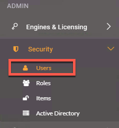

   

    <article class="markdown-body entry-content" itemprop="text"><table>
<tbody><tr>
<td width="25%">
<i></i>
练习1
</td>
<td>
创建新用户和令牌
</td>
</tr>
<tr>
<td>数据</td>
<td>没有</td>
</tr>
<tr>
<td>总体目标</td>
<td>教授用户如何创建具有有限权限的用户并获取令牌。</td>
</tr>
<tr>
<td>演示</td>
<td>如何创建用户和新令牌</td>
</tr>
</tbody></table>

此练习旨在教会用户如何创建具有有限权限的新用户。使用REST API进行开发时，建议不要使用管理员令牌。Admin令牌具有很多权力，如果暴露可能会很危险。通过创建具有有限权限的帐户，如果令牌被公开，我们将限制风险。

 <strong>1）打开FME Server</strong>

我们的第一步是访问FME Server。我们可以通过以下方式做到这一点：

<pre><code>&lt;yourServerHost&gt;/fmeserver
</code></pre>

如果您使用的是训练计算机，请访问：localhost / fmeserver

如果您使用的是训练计算机，使用以下凭据以管理员身份登录:

<b>用户名：</b> admin
  
<b>密码：</b> admin

 <strong>2）转到“用户”页面</strong>

现在，我们将导航到“用户”页面。我们将在左侧面板中找到<strong>Security</strong>，然后单击<strong>Users</strong>。

 <strong>3）创建一个新用户</strong>

单击页面右上角的“新建”按钮。

出现提示时，使用以下参数创建新用户：

<ul>
<li><strong>用户名：</strong> restapi</li>
<li><strong>全名：</strong> Forest Apier</li>
<li><strong>密码：</strong> restapi</li>
</ul>

 <strong>4）向下滚动并分配权限</strong>

为将来的用户分配权限时，请访问“ <a href="http://docs.safe.com/fme/2018.1/html/FME_Server_Documentation/Content/WebUI/Roles.htm" rel="nofollow">用户权限”</a>以查看完整文档。

现在分配以下权限：

<table>
<tbody><tr>
<th>权限</th>
<th>权限级别</th>
<th>权限说明</th>
</tr>
<tr>
<td>运行工作空间</td>
<td>高级</td>
<td>在运行工作空间时，可以访问“运行工作空间”页面并访问“作业指令”。</td>
</tr>
<tr>
<td>作业</td>
<td>管理</td>
<td>  访问和管理所有用户的工作作业。您可以，取消当前正在运行的任何作业，删除以前运行的作业的历史记录，以及管理作业队列。（还需要引擎和许可中的管理权限。）</td>
</tr>
<tr>
<td>存储库</td>
<td>创建</td>
<td>访问“存储库”页面并创建存储库。 </td>
</tr>
<tr>
<td>单个存储库  <b>单击“存储库”权限右侧的向下箭头以显示“单个存储库”权限。</b></td>
<td>样本=下载，读取，运行</td>
<td>可以将工作空间和其他存储库项目从FME Server下载到Workbench。可以查看存储库信息。可以从FME Server运行存储库工作空间。</td>
</tr>
<tr>
<td>工作空间查看器</td>
<td>访问</td>
<td> 可以访问工作区查看器。
</td>
</tr>
<tr>
<td>资源</td>
<td>创建</td>
<td>访问“资源”页面并创建新资源。</td>
</tr>
<tr>
<td>单个资源  <b>单击“资源”权限右侧的向下箭头以显示“个人资源”权限。</b></td>
<td>
数据=完全访问权限

Temp =完全访问权限
</td>
<td>可以访问，读取和下载文件。可以列出资源的文件夹和文件。可以写入文件，上传文件和删除文件。</td>
</tr>
<tr>
<td>项目</td>
<td>创建</td>
<td>访问“项目”页面并创建项目。</td>
</tr>
<tr>
<td>仪表板</td>
<td>访问</td>
<td>访问“仪表板”页面。</td>
</tr>
<tr>
<td>引擎和许可</td>
<td>管理</td>
<td>配置引擎和许可，但作业队列除外（还需要在作业中具有“管理”权限）。</td>
</tr>
</tbody></table>

<strong>如果要创建Web应用程序，则令牌的权限应限制在特定的存储库中。</strong>

设置应如下所示：

单个存储库应如下所示：

单个资源应如下所示：

 <strong>5）单击“确定”以创建restapi用户</strong>

 <strong>6）以restapi用户身份登录FME Server并找到您的令牌</strong>

以restapi用户身份登录FME Server。
 

<ul>
<li><strong>用户名：</strong> restapi</li>
<li><strong>密码：</strong> restapi</li>
</ul>
 
 

一旦我们登录到我们的FME Server，检查所有正确的组件是否存在是很重要的。

在左侧面板中，我们应该看到，运行工作空间，作业，存储库，工作空间查看器，资源，项目，仪表板以及引擎和许可。 

 
 

 
 

接下来，我们可以找到用户图标。如果我们希望找到有关用户的更多信息，这是我们访问的区域。

选择用户图标后，可以单击“管理令牌”。要找到令牌。

然后，我们可以看到当前令牌。或者，我们可以在此区域获得新令牌。

 <strong>7）保存此令牌</strong>

打开Notepad ++文档并将令牌粘贴到文档中以便于访问。

<table>
<tbody><tr>
<td>
<i></i>
恭喜
</td>
</tr>
<tr>
<td>

通过完成本练习，您已学会如何：
 
<ul><li>在FME Server中创建新用户</li>
<li>为用户分配特定权限</li>
<li>获取新用户令牌</li>

</ul></td>
</tr>
</tbody></table>
</article>
  

