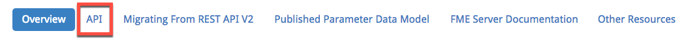
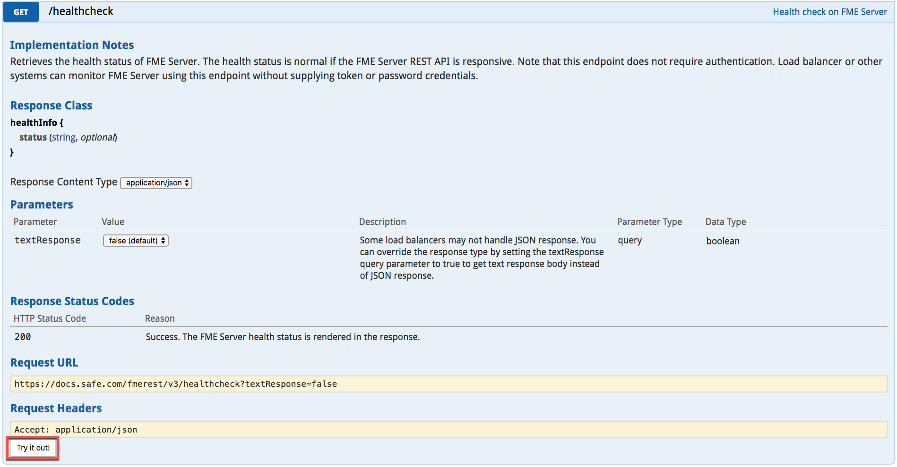
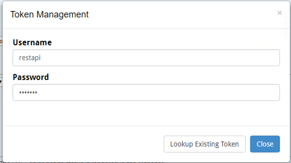

## 2.1 探索REST API主页

FME Server REST API主页是任何API用户的必备工具。本网站提供了解FME Server REST API所需的文档。它还允许用户查看REST API上可用的所有调用。每个调用都有关于调用的详细文档以及与调用相关的任何参数。它还允许用户在实施调用之前进行练习。

现在您已了解使用REST API的基本信息，我们可以探索如何使用它。第一步是访问您的主页以获取REST API。要找到这个，请转到

    http://<yourServerHost>/fmerest/

如果您在培训计算机上执行此课程，请转至 http://localhost/fmerest  您也可以通过FME Server访问此页面。只需转到您的FME Server主页。找到帮助按钮，然后单击REST API按钮。首次学习REST API时，此页面提供了有用的资源。这包括您可以对服务器进行的示例调用。在主工具栏上单击API链接。

在这里，您可以探索能够对服务器进行的各种调用。找到名为运行状况检查的第二个类别并展开调用。您应该看到与此类似的文档。

此页面概述了您需要了解的有关调用及其潜力的所有信息。点击“试一试！”，这会连接到您的服务器，并会响应您的调用。但是，在收到响应之前，您必须连接到服务器。

这是您应该收到的消息。系统将提示您输入服务器用户名和密码。这是您必须请求令牌才能完成调用的地方。

首先，单击Lookup Existing Token，然后单击Generate Token。您应该收到一条带有令牌的消息和一条声明，您现在可以尝试这些示例。复制令牌并将其粘贴到我们将在后面的示例中使用的任何文本编辑软件中。请务必注意，令牌充当您有权访问服务器的验证。这是一项安全功能，您可以在FME Server Rest API页面上访问令牌。

    http://<yourServerHost>/fmerest/

在调用FME服务器后，您将收到来自FME服务器的响应。
