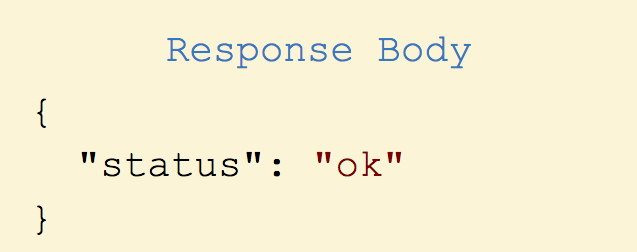
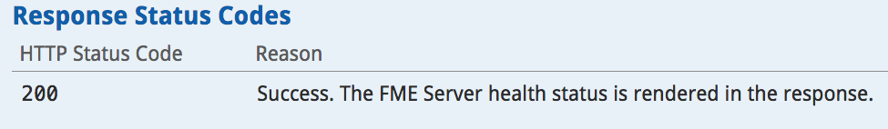

### 2.2 了解REST API响应

响应结构与请求结构非常相似。它具有响应主体，响应代码和响应头。

#### 响应主体

大多数对FME服务器的调用都会产生响应。这使得FME Server REST API成为一个非常强大的工具。通过此响应，您可以自动执行另一个进程。响应主体将始终使用JSON。

#### 响应代码

上面的请求应该产生代码200，在示例调用中概述：

##### 潜在的响应代码

下面是一个列出常见响应代码的表格。有关完整列表，请访问 
[Rest API 文档](https://docs.safe.com/fme/html/FME_REST/apidoc/v3/index.html).

<table>

<tr>
<th>响应代码</th>
<th>含义</th>

</tr>

<tr>
<td>200</td>
<td>调用已成功完成</td>

<tr>
<td>202</td>
<td>该请求已被接受处理</td>

</tr>

<tr>
<td>422</td>
<td>部分或全部输入参数无效</td>

</td>
</tr>

<tr>
<td>401</td>
<td>未授权的</td>

</tr>

</table>
