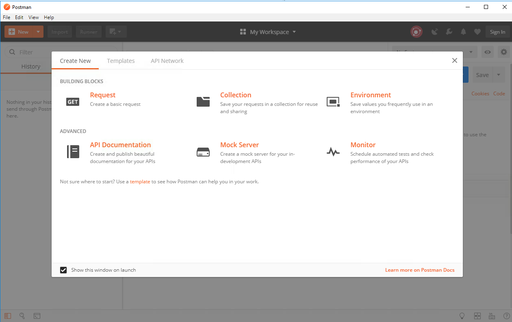
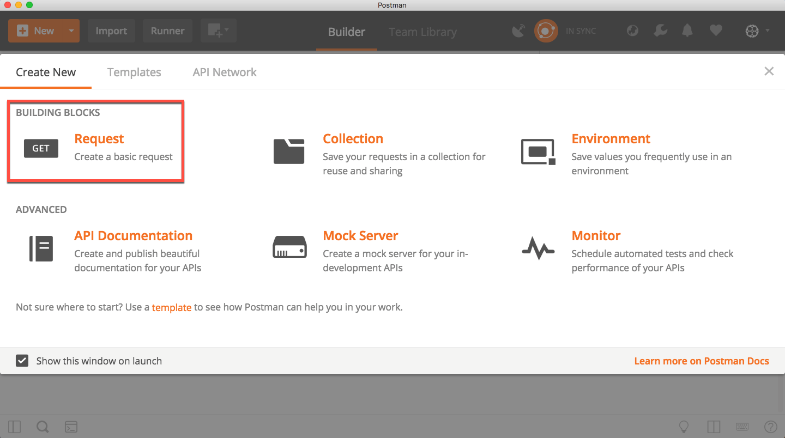
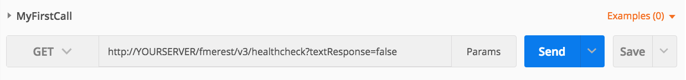

  

    <article class="markdown-body entry-content" itemprop="text"><table>
<tbody><tr>
<td width="25%">
<i></i>
练习2
</td>
<td>
使用Postman发出HTTP请求
</td>
</tr>
<tr>
<td>数据</td>
<td>无</td>
</tr>
<tr>
<td>总体目标</td>
<td>使用REST API从服务器检索信息</td>
</tr>
<tr>
<td>演示</td>
<td>来自REST API的运行状况检查</td>
</tr>
</tbody></table>

本练习演示了如何使用REST API调用FME Server。Postman是一个REST客户端工具。REST客户端工具允许用户输入请求URL并直接从服务器接收消息。此练习演示了healthcheck调用，该调用将检查FME Server是否已正常运行。

我们即将在Postman中进行以下调用。

&lt;style type="text/css"&gt;
.tg  {border-collapse:collapse;border-spacing:0;}
.tg td{font-family:Arial, sans-serif;font-size:14px;padding:10px 5px;border-style:solid;border-width:1px;overflow:hidden;word-break:normal;border-color:black;}
.tg th{font-family:Arial, sans-serif;font-size:14px;font-weight:normal;padding:10px 5px;border-style:solid;border-width:1px;overflow:hidden;word-break:normal;border-color:black;}
.tg .tg-ej3l{background-color:#66ccff;vertical-align:top}
.tg .tg-ufe5{background-color:#66ccff;vertical-align:top}
&lt;/style&gt;
<table>
  <tbody><tr>
    <th>GET</th>
    <th>http://<yourServerHost>/fmerest/v3/healthcheck?textResponse=false</th>
  </tr>
</tbody></table>

此调用不需要授权并且应该立即运行。请注意，此调用中有一个字符串查询参数。此调用将自动返回JSON响应; 但是，您可以通过将文本响应设置为true来覆盖它。这将返回文本响应而不是JSON。

 <strong>1）下载Postman - 如果您尚未使用虚拟机</strong>

第一步是下载Postman。只需单击此链接
 <a href="https://www.getpostman.com/apps" rel="nofollow">https://www.getpostman.com/apps</a> 
并下载该应用程序。它适用于Windows，Linux和Mac。

 <strong>2）打开Postman</strong>

欢迎来到Postman！我们现在准备使用上面的URL首次调用您的FME Server。打开Postman后，您应该会看到此页面。

 <strong>3）单击“请求”。</strong>

或者，单击“新建”&gt;“请求”

 <strong>4）填写请求并单击“保存”。</strong>

从这里，我们收到一个页面来保存我们的请求。如果您希望保存调用以便将来使用它，则使用此选项。通常，调用的名称将更具描述性。但是，出于本演示的目的，请创建一些有创意的内容，例如“MyFirstCall”。对于此调用，您可以为培训目的创建新集合。

要创建新的培训集合，请单击+创建文件夹。然后命名并保存您的集合。

 <strong>5）将URL复制到工具栏中。</strong>

将URL复制到工具栏中，然后点击发送！请注意，我们正在使用GET HTTP方法进行此调用。要了解此方法的含义，请查看第1.2节中的表格。

&lt;style type="text/css"&gt;
.tg  {border-collapse:collapse;border-spacing:0;}
.tg td{font-family:Arial, sans-serif;font-size:14px;padding:10px 5px;border-style:solid;border-width:1px;overflow:hidden;word-break:normal;border-color:black;}
.tg th{font-family:Arial, sans-serif;font-size:14px;font-weight:normal;padding:10px 5px;border-style:solid;border-width:1px;overflow:hidden;word-break:normal;border-color:black;}
.tg .tg-ej3l{background-color:#66ccff;vertical-align:top}
.tg .tg-ufe5{background-color:#66ccff;vertical-align:top}
&lt;/style&gt;
<table>
  <tbody><tr>
    <th>GET</th>
    <th>http://&lt;yourServerHost&gt;/fmerest/v3/healthcheck?textResponse=false</th>
  </tr>
</tbody></table>

<em>请注意，如果您正在使用培训机器，则需要将localServer替换为localhost</em>

 <strong>6）查看Postman的响应。</strong>

查看您的调用。这是您收到的响应。

单击“标头”部分以查看更详细的调用视图。

<table>
<tbody><tr>
<td>
<i></i>
技巧
</td>
</tr>
<tr>
<td>
如果您使用的是培训计算机，您的FME Server在打开时可能无法正常工作。如果FME Server不可用，请进入Windows任务管理器，退出所有Postgres任务。然后，进入Windows服务并重新启动FME Server数据库和FME Server核心。如果这不能解决问题，请访问 <a href="https://knowledge.safe.com/articles/540/fme-server-troubleshooting-guide.html" rel="nofollow">FME Server故障排除指南</a>   

</td>
</tr>
</tbody></table>

<strong>重要说明：</strong>

<ul>
<li>

响应是JSON格式的。这可以在报头“响应报头内容类型”中找到。

</li>
<li>

在右上角，您应该看到Status：200 OK。这表明它已成功与服务器进行交互。此通话不需要授权。但是，对服务器的大多数调用都需要授权。下一步是进行需要服务器授权的调用。

</li>
</ul>

<table>
<tbody><tr>
<td>
<i></i>
恭喜
</td>
</tr>
<tr>
<td>

通过完成本练习，您已学会如何：
 
<ul><li>设置并使用Postman</li>
<li>在Postman中创建一个调用</li>

</ul></td>
</tr>
</tbody></table>
</article>
  

