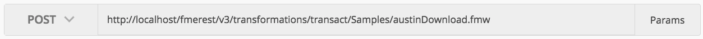
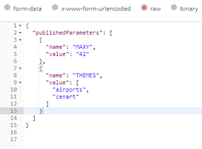
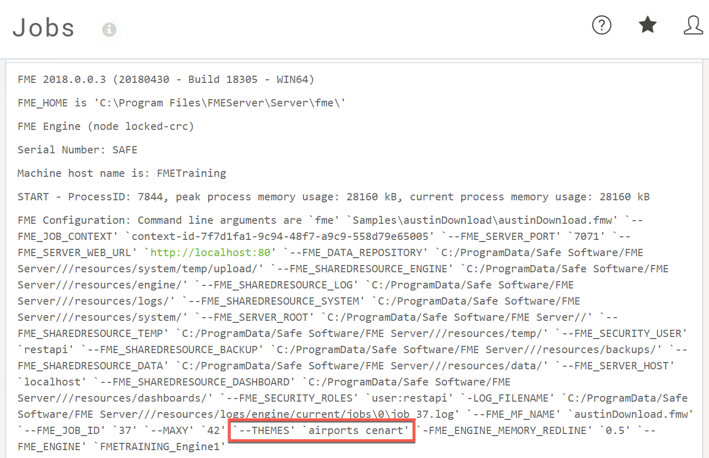

  

    <article class="markdown-body entry-content" itemprop="text"><table>
<tbody><tr>
<td width="25%">
<i></i>
练习4
</td>
<td>
使用标准参数运行同步作业
</td>
</tr>
<tr>
<td>数据</td>
<td>无</td>
</tr>
<tr>
<td>总体目标</td>
<td>使用FME REST API同步运行作业</td>
</tr>
<tr>
<td>演示</td>
<td>如何使用Transact调用</td>
</tr>
</tbody></table>

本练习演示了Transact（事物）调用，该调用用于在FME Server上同步运行作业。要查找有关Transact调用的更多信息，请访问FME REST API页面并查找转换部分或访问<a href="https://docs.safe.com/fme/html/FME_REST/apidoc/v3/index.html#!/transformations" rel="nofollow">Rest API转换</a>文档。

同步运行作业的一个示例是：

&lt;style type =“text / css”&gt; .tg {border-collapse：collapse; border-spacing：0;} .tg td {font-family：Arial，sans-serif; font-size：14px; padding：10px 5px ; border-style：solid; border-width：1px; overflow：hidden; word-break：normal; border-color：black;} .tg th {font-family：Arial，sans-serif; font-size：14px; font-weight：normal; padding：10px 5px; border-style：solid; border-width：1px; overflow：hidden; word-break：normal; border-color：black;} .tg .tg-ao4k {background-color ：＃e6ffe6;颜色：＃333333; vertical-align：top} .tg .tg-a080 {background-color：＃e6ffe6; vertical-align：top} &lt;/ style&gt;
<table>
  <tbody><tr>
    <th>POST</th>
    <th>HTTP：// &lt;yourServerHost&gt; /fmerest/v3/transformations/transact/Samples/austinDownload.fmw</th>
  </tr>
</tbody></table>

请注意，<strong>Transact</strong>语句向FME服务器指示您将在结束之前等待该进程完成。在Postman中，您还需要设置标头部分和URL。执行以下步骤以在Postman中设置此调用。

<table>
<tbody><tr>
<td>
<i></i>
警告
</td>
</tr>
<tr>
<td>

请注意，提交作业的所有调用 - 无论是同步还是异步 - 都需要授权

</td>
</tr>
</tbody></table>

<table>
<tbody><tr>
<td>
<i></i>
注意
</td>
</tr>
<tr>
<td>

虽然与异步调用相比，同步调用在Web应用程序中更容易使用，但应用程序将在调用完成之前停止运行。工作空间中处理的数据越多，等待的时间就越长。虽然一些工作几乎可以立即完成，但涉及大量数据或复杂计算的工作可能会花费大量时间。对于短期工作，最好保存同步调用。这是在使用FME Server REST API进行开发时应该考虑的权衡。

</td>
</tr>
</tbody></table>

 <strong>1）输入URL</strong>

单击加号以在Postman中打开新选项卡。第一步是在Postman中添加URL。将URL粘贴到工具栏中，然后使用下拉列表将GET更改为POST。

 

&lt;style type =“text / css”&gt; .tg {border-collapse：collapse; border-spacing：0;} .tg td {font-family：Arial，sans-serif; font-size：14px; padding：10px 5px ; border-style：solid; border-width：1px; overflow：hidden; word-break：normal; border-color：black;} .tg th {font-family：Arial，sans-serif; font-size：14px; font-weight：normal; padding：10px 5px; border-style：solid; border-width：1px; overflow：hidden; word-break：normal; border-color：black;} .tg .tg-ao4k {background-color ：＃e6ffe6;颜色：＃333333; vertical-align：top} .tg .tg-a080 {background-color：＃e6ffe6; vertical-align：top} &lt;/ style&gt;
<table>
  <tbody><tr>
    <th>POST</th>
    <th>HTTP：// &lt;yourServerHost&gt; /fmerest/v3/transformations/transact/Samples/austinDownload.fmw</th>
  </tr>
</tbody></table>

 培训计算机上的用户可以将&lt;yourServerHost&gt;更改为localhost，其他用户应将yourServerHost更改为其服务器的主机名。

Transact调用文档可以在<a href="https://docs.safe.com/fme/html/FME_REST/apidoc/v3/index.html#!/transformations/transact_post_23" rel="nofollow">这里</a>找到。

 <strong>2）输入标头</strong>

在这个调用中，我们有一个请求主体，它将是JSON。这将显示在“内容类型”部分中。另外，我们正在请求JSON，这是在Accept = application / JSON下。授权是您输入令牌的地方。

<ul>
<li>

<strong>Content-Type：</strong> application / json

</li>
<li>

<strong>Accept：</strong> application / json

</li>
<li>

<strong>Authorization：</strong> fmetoken token = &lt;yourTOKEN&gt;

</li>
</ul>

要输入令牌，我们可以使用上一练习中创建的预设。在键值中，键入单词“令牌”，将显示创建的预设。

输入此调用所需的标头。单击Headers标签，如下所示。

 <strong>3）输入主体并选择“原始”选项</strong>

接下来，我们需要输入调用的主体。<em>单击调用的主体部分，</em>然后<em>单击原始按钮</em>并粘贴提供的主体。<em>在Postman中，您需要使用键盘快捷键进行复制和粘贴。</em>

身体：

<pre><code>{
  "publishedParameters": [
    {
      "name": "MAXY",
      "value": "42"
    },
    {
      "name": "THEMES",
      "value": [
        "airports",
        "cenart"
      ]
    }
  ]
}
</code></pre>

 <strong>4）单击“发送”</strong>

点击发送！现在，等待直到调用返回(大约20秒)，您将收到这样的消息。

 <strong>5）在FME Server中查看</strong>

现在已提交作业，您可以在FME Server中查看它。转到您的FME Server并以restapi用户身份登录，然后单击左侧边栏上的“作业”&gt;“已完成”页面。

你应该能够注意到一些事情。该工作由restapi运行，因为使用的令牌属于restapi。

 <strong>6）找到工作日志并找到主题</strong>

单击作业。

作业页面提供了有关作业的更详细说明。在这里，我们可以找到工作日志。作业日志提供的信息包括：写入了哪些要素，写入了多少要素，用什么引擎来完成这项作业。

  向下滚动到“作业日志”

作业日志将始终位于完成的部分之后。完成的部分快速概述了日志更加详细的作业。

  在日志中找到主题

只需点击ctrl + f，即可在日志中找到THEMES。它应该显示'airports cenart'。

我们知道作业是用所请求的参数完成的。

让我们更新参数并再次尝试调用。

 <strong>7）找到工作空间的已发布参数</strong>

转到RunWorkspace页面。然后，选择Samples作为存储库，选择austinDownload.fmw作为工作空间。向下滚动页面，直到看到高级部分。单击加号，然后找到已发布的参数。在这里，我们可以在工作空间中修改所有参数。看看选项，这次我们将使用railroad和streetcl选项运行调用。

 <strong>8）打开Postman并修改主体</strong>

如果保持Postman打开，只需再次单击body选项卡。现在将THEMES值更改为railroad和streetcl。

然后单击“发送”。

 <strong>9）在FME Server中查找作业</strong>

打开您的FME Server，然后单击服务器的左侧面板，其中显示作业。单击最新的austinDownload作业。向下滚动以查找作业日志。

在这里，您可以调查作业是否成功完成以及使用了哪些参数。在这里，我们可以看到写入了正确的要素。

<table>
<tbody><tr>
<td>
<i></i>
恭喜
</td>
</tr>
<tr>
<td>

通过完成本练习，您已学会如何：
 
<ul><li>创建一个同步运行作业的调用</li>
<li>检查作业日志以查看作业是否正确运行并使用正确的参数</li>
<li>更改调用中的参数</li>

</ul></td>
</tr>
</tbody></table>
</article>
  

