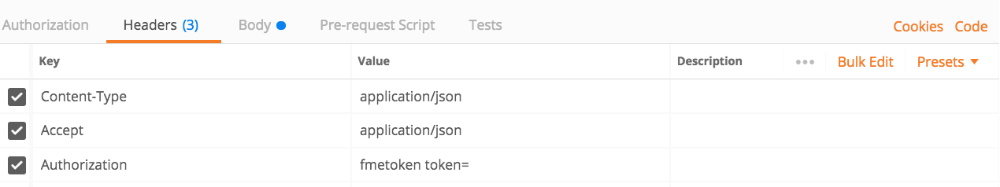

  

    <article class="markdown-body entry-content" itemprop="text"><table>
<tbody><tr>
<td width="25%">
<i></i>
练习5
</td>
<td>
异步运行作业
</td>
</tr>
<tr>
<td>数据</td>
<td>无</td>
</tr>
<tr>
<td>总体目标</td>
<td>使用FME REST API异步运行作业</td>
</tr>
<tr>
<td>演示</td>
<td>如何使用提交调用</td>
</tr>
</tbody></table>

本练习演示了提交调用，该调用用于在FME Server上异步运行作业。要查找有关“提交”调用的更多信息，请访问FME REST API页面并查找转换部分或访问<a href="https://docs.safe.com/fme/html/FME_REST/apidoc/v3/index.html#!/transformations" rel="nofollow">Rest API转换</a>文档。

如果异步运行作业，则在进行下一次调用之前不必等待作业完成。通过异步运行作业，您将从FME Server收到一个ID。您可以使用此ID再次调用FME服务器以获取调用状态更新。

我们将运行完全相同的调用，但不是Transact，而是将URL更改为Submit。通过提交，您将提交工作进行处理。

 <strong>1）将下面的URL粘贴到Postman中</strong>

单击加号以在Postman中打开新选项卡。复制下面的URL并将其粘贴到Postman中。

 

&lt;style type =“text / css”&gt; .tg {border-collapse：collapse; border-spacing：0;} .tg td {font-family：Arial，sans-serif; font-size：14px; padding：10px 5px ; border-style：solid; border-width：1px; overflow：hidden; word-break：normal; border-color：black;} .tg th {font-family：Arial，sans-serif; font-size：14px; font-weight：normal; padding：10px 5px; border-style：solid; border-width：1px; overflow：hidden; word-break：normal; border-color：black;} .tg .tg-ao4k {background-color ：＃e6ffe6;颜色：＃333333; vertical-align：top} .tg .tg-a080 {background-color：＃e6ffe6; vertical-align：top} &lt;/ style&gt;
<table>
  <tbody><tr>
    <th>POST</th>
    <th>HTTP：// &lt;yourServerHost&gt; /fmerest/v3/transformations/submit/Samples/austinDownload.fmw</th>
  </tr>
</tbody></table>

 <strong>2）输入标头</strong>

填写Postman的标头：

<ul>
<li>

<strong>Content-Type：</strong> application / json

</li>
<li>

<strong>Accept：</strong> application / json

</li>
<li>

<strong>Authorization：</strong> fmetoken token = &lt;yourTOKEN&gt;

</li>
</ul>

要输入令牌，我们可以使用之前创建的预设。在键值中，键入单词“令牌”，将显示创建的预设。

输入此调用所需的标头。单击Headers标签，如下所示。

 <strong>3）输入主体</strong>

接下来，我们需要输入调用的主体。单击调用的主体部分，然后单击原始按钮并粘贴提供的主体。<em>在Postman中，您需要使用键盘快捷键进行复制和粘贴。</em>

身体：

<pre><code>    {
      "publishedParameters": [
        {
          "name": "MAXY",
          "value": "42"
        },
        {
          "name": "THEMES",
          "value": [
            "airports",
            "cenart"
          ]
        }
      ]
    }
</code></pre>

 <strong>单击发送</strong>

 <strong>4）查看响应</strong>

调用的响应应该是：

请注意，您可能会从FME服务器收到不同的号码。这没关系，它只是作业ID。

 <strong>5）在FME服务器中找到作业</strong>

打开您的FME服务器，然后单击服务器的左侧菜单，其中显示作业。单击与从FME Server收到的号码匹配的作业ID。请注意，即使您已收到回复，转换仍可能仍在运行。这是因为此作业异步运行。单击“作业ID”以查看其完整状态。

然后，找到日志。如果滚动到几乎页面底部，您可以看到写入要素的摘要。

在这里，您可以调查作业是否成功完成以及使用了哪些参数。在这里，我们可以看到写入了正确的要素。

<table>
<tbody><tr>
<td>
<i></i>
恭喜
</td>
</tr>
<tr>
<td>

通过完成本练习，您已学会如何：
 
<ul><li>创建一个异步运行作业的调用</li>
<li>检查作业日志以查看作业是否正确运行并使用正确的参数</li>

</ul></td>
</tr>
</tbody></table>
</article>
  

