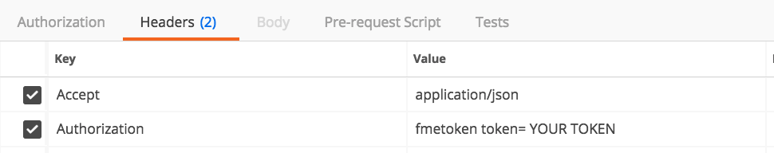

<table style="border-spacing: 0px;border-collapse: collapse;font-family:serif">
<tr>
<td width=25% style="vertical-align:middle;background-color:darkorange;border: 2px solid darkorange">
<i class="fa fa-cogs fa-lg fa-pull-left fa-fw" style="color:white;padding-right: 12px;vertical-align:text-top"></i>
练习6
</td>
<td style="border: 2px solid darkorange;background-color:darkorange;color:white">
使用REST API检索作业结果
</td>
</tr>

<tr>
<td style="border: 1px solid darkorange; font-weight: bold">数据</td>
<td style="border: 1px solid darkorange">无</td>
</tr>

<tr>
<td style="border: 1px solid darkorange; font-weight: bold">总体目标</td>
<td style="border: 1px solid darkorange">使用REST API检索有关已完成作业的信息 </td>
</tr>

<tr>
<td style="border: 1px solid darkorange; font-weight: bold">演示	</td>
<td style="border: 1px solid darkorange">如何使用作业调用</td>
</tr>

</table>

提交调用并收到ID后，您可以通过以下调用检查作业状态：

要查找有关此调用的文档，请访问[Rest API 转换 - GET作业](https://docs.safe.com/fme/html/FME_REST/apidoc/v3/index.html#!/transformations/get_get_13)文档。

**请注意，此调用需要获得授权**

 **1) 在Postman中输入以下URL**

单击加号以在Postman中打开新选项卡。要输入此URL，您需要将最后的数字修改为您在上一次调用中从响应中收到的作业ID。

<!--GET Table-->

<table class="tg" style="table-layout: fixed; width: 100%">
  <tr>
    <th class="tg-ej3l">GET</th>
    <th class="tg-ufe5" style="word-wrap: break-word">http://&lt;yourServerHost&#62;/fmerest/v3/transformations/jobs/id/&lt;JobID>
    </th>
  </tr>
</table>

 **2) 在Postman中输入以下标头**

- **Accept**: application/json

- **Authorization**: fmetoken token=&lt;yourToken>

这将返回作业已完成的响应。

此信息将显示在Postman中响应的底部。

---

<!--Exercise Congratulations Section-->

<table style="border-spacing: 0px">
<tr>
<td style="vertical-align:middle;background-color:darkorange;border: 2px solid darkorange">
<i class="fa fa-thumbs-o-up fa-lg fa-pull-left fa-fw" style="color:white;padding-right: 12px;vertical-align:text-top"></i>
恭喜
</td>
</tr>

<tr>
<td style="border: 1px solid darkorange">

通过完成本练习，您已学会如何：
 
<ul><li>根据作业ID查找作业结果。</li>

</li>

</td>
</tr>
</table>
