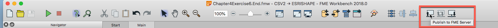
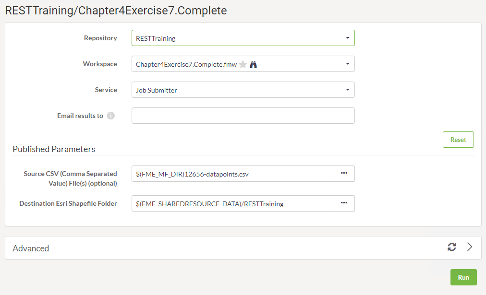
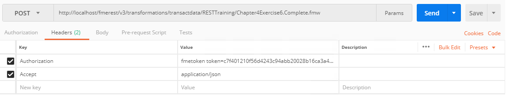

  

    <article class="markdown-body entry-content" itemprop="text"><table>
<tbody><tr>
<td width="25%">
<i></i>
练习7
</td>
<td>
同步运行作业并上载数据：处理数据
</td>
</tr>
<tr>
<td>数据</td>
<td>C:\FMEData2018\Resources\RESTAPI\Chapter4Exercise7\12656-datapoints.csv
</td>
</tr>
<tr>
<td>总体目标</td>
<td>使用单个调用上传数据并运行作业。 </td>
</tr>
<tr>
<td>演示</td>
<td>如何使用处理数据调用</td>
</tr>
<tr>
<td>启动工作空间</td>
<td>C:\FMEData2018\Resources\RESTAPI\Chapter4Exercise7\Chapter4Exercise7.Start.fmw
</td>
</tr>
<tr><td>结束工作空间</td>
<td>C:\FMEData2018\Resources\RESTAPI\Chapter4Exercise7\Chapter4Exercise7.Complete.fmw
</td>
</tr>
</tbody></table>

Transact Data调用的工作方式是上传数据并通过对服务器的调用来运行工作空间。它将按原样运行工作空间，并将输出写入写模块中指定的位置。这对于将新数据插入数据库很有用。调用完成后，FME Server将返回200 OK消息。这表示调用已成功提交。但是，它不会提供有关作业是否在FME Server上成功完成的反馈。建议定期检查服务器以确保您的作业在FME Server上成功运行。获取作业状态也可以通过REST API完成。这些调用将在<a href="https://safe-software.gitbooks.io/fme-server-rest-api-training-2018/content/FMESERVER_RESTAPI4Workspaces/4.6.Exercise.html" rel="nofollow">练习8中</a>显示。

让我们首先创建一个与Transact Data调用兼容的工作空间。

 <strong>1）打开Chapter4Exercise7.Start工作空间</strong>

启动FME Workbench并打开Chapter4Exercise7.Start.fmw工作空间。

这是一个非常简单的工作空间，它读取CSV文件并生成Shapefile。

但是，此转换在此调用中需要进行一项重要更改。CSV必须是可选参数。这是因为数据将在POST请求的主体中发送到URL，而不是通过在工作空间中设置源数据集参数的路径。需要保留源数据集参数以使其无效，因此我们需要使其成为可选项，以防止工作空间引发错误。

 <strong>2）将源数据集已发布参数设置为可选</strong>

通过右键单击已发布的参数并选择“编辑定义”，将“源数据集发布的参数”设置为可选。

然后在参数设置中选择可选设置。

<strong>如果您没有使用培训机器，您也可以设置默认值来浏览您的读模块数据集</strong>

<pre><code>C:\FMEData2018\Resources\RESTAPI\Chapter4Exercise7\12656-datapoints.csv
</code></pre>

 <strong>3）在FME Server中为输出创建一个文件夹</strong>

首先，转到您的FME Server并登录restapi帐户。在页面的左侧找到“资源”并单击它。接下来，单击“数据”。最后，单击“创建文件夹”并给其取名为<strong>RESTTraining</strong>

创建文件夹后，我们可以通过检查文件夹找到该文件夹​​的路径。然后，转到Actions并选择Properties。

<em>选择RESTTraining文件，然后选择Actions</em>

<em>选择属性</em>

复制系统路径。

 <strong>4）将Shapefile目标更新为您的FME Server中的共享资源文件</strong>

返回FME Workbench，将Shapefile更改为FME Server中的目标文件。

要执行此操作，请右键单击DestDataset已发布参数，然后单击“编辑值”。然后，将文件路径插入共享资源。

<pre><code>$(FME_SHAREDRESOURCE_DATA)/RESTTraining
</code></pre>

在发布之前保存工作空间。

 <strong>5）将工作空间上传到FME Server</strong>

现在，是时候将工作空间上传到您的FME Server了。这可以通过单击“发布到FME Server”按钮或从菜单栏中选择“文件”&gt;“发布到FME Server”来完成。

由于这是我们第一次连接到我们的FME Server，我们需要创建一个新连接，因此在Publish to FME Server向导中，从下拉菜单中选择A添加Web连接。

在打开的对话框中输入培训讲师提供的参数。在大多数情况下，参数如下：

<ul>
<li><strong>FME ServerURL：</strong> <a href="http://localhost/" rel="nofollow">http：// localhost</a></li>
<li><strong>用户名：</strong> restapi</li>
<li><strong>密码：</strong> restapi</li>
</ul>

单击“验证”以确认连接并返回上一个对话框。确保选中新定义的连接，然后单击“下一步”继续。

在本练习中，我们将通过单击“新建”按钮创建新的存储库。出现提示时输入名称RESTTraining。

将工作空间保存为Chapter4Exercise7.Complete并选中复选框以上传数据文件。

然后单击“下一步”继续向导。

在向导的最后一个屏幕中，我们可以注册工作空间以使用各种服务。

选择Job Submitter服务，因为这是我们现在使用的唯一服务。

单击“发布”以完成发布工作空间。

 <strong>6）在FME Server中运行工作空间</strong>

现在我们将作为restapi用户访问我们的FME Server以证明其有效。

在左侧菜单中，我们将看到“运行工作空间”选项卡。

现在选择以下选项：

<ul>
<li><strong>存储库：</strong> RESTTraining</li>
<li><strong>工作空间：</strong> Chapter4Exercise7.Complete.fmw</li>
<li><strong>服务：</strong>Job Submitter</li>
</ul>

现在点击Run！

 <strong>7）检查Shapefile是否已成功生成</strong>

转到资源&gt;数据&gt; RESTTraining并确保生成Shapefile。

删除Shapefile。这是通过选择“所有文件”，然后选择“操作”并选择“删除”来完成的。我们正在删除Shapefile，因为我们将使用REST API再次提交此作业。

 <strong>8）使用Postman完成Transact Data调用</strong>

<em>请注意，此调用需要授权</em>

单击加号按钮以创建新选项卡。我们现在将使用该调用来处理数据以上传CSV文件并通过REST API运行工作空间。

调用是：

&lt;style type =“text / css”&gt; .tg {border-collapse：collapse; border-spacing：0;} .tg td {font-family：Arial，sans-serif; font-size：14px; padding：10px 5px ; border-style：solid; border-width：1px; overflow：hidden; word-break：normal; border-color：black;} .tg th {font-family：Arial，sans-serif; font-size：14px; font-weight：normal; padding：10px 5px; border-style：solid; border-width：1px; overflow：hidden; word-break：normal; border-color：black;} .tg .tg-ao4k {background-color ：＃e6ffe6;颜色：＃333333; vertical-align：top} .tg .tg-a080 {background-color：＃e6ffe6; vertical-align：top} &lt;/ style&gt;
<table>
  <tbody><tr>
    <th>POST</th>
    <th>HTTP：// &lt;yourServerHost&gt; /fmerest/v3/transformations/transactdata/RESTTraining/Chapter4Exercise7.Complete.fmw</th>
  </tr>
</tbody></table>

<strong>如果您将工作空间保存到其他存储库，则必须修改上面的调用</strong>

在Postman中使用以下参数设置调用：

<ul>
<li><strong>Authorization：</strong> fmetoken token = &lt;yourToken&gt;</li>
</ul>

要输入令牌，我们可以使用之前创建的预设。在键值中，键入单词“令牌”，将显示创建的预设。

<ul>
<li><strong>Accept：</strong> application / json</li>
</ul>

要上传的文件将在调用主体中发送。单击body选项卡，然后单击二进制按钮。这将为您提供上传文件的选项。选择C：/ FMEData2018 / Resources / RESTAPI / Chapter4 / Exercise7中的12656-datapoints.csv。然后按“发送”按钮运行调用。

你应该收到一条消息200 OK这表示调用已经完成。检查FME Server中的“作业”页面以确认作业已正确提交。另外，检查输出位置以查看Shapefile是否已创建。

<table>
<tbody><tr>
<td>
<i></i>
恭喜
</td>
</tr>
<tr>
<td>

通过完成本练习，您已学会如何：
 
<ul><li>使用处理数据(Transact Data)调用上传文件并在一次调用中运行工作空间 </li>
<li>修改要与Transact Data一起使用的工作空间的参数 </li>
<li> 使用共享资源作为文件输出位置 </li>

</ul></td>
</tr>
</tbody></table>
</article>
  

