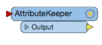

  

    <article class="markdown-body entry-content" itemprop="text"><h3>4.5 在工作空间中使用REST API命令</h3>

本教程中实践的所有调用都可以在FME工作空间中使用。这是在没有任何编码经验的情况下使用REST API的绝佳方式。

在我们开始之前，有一些转换器你应该知道。

<h4>Creator</h4>

该<a href="https://docs.safe.com/fme/html/FME_Desktop_Documentation/FME_Transformers/Transformers/creator.htm" rel="nofollow">Creator</a>转换器是用于测试工作空间的优秀工具。它将触发工作空间而无需添加数据。

<h4>HTTPCaller</h4>

该<a href="https://docs.safe.com/fme/html/FME_Desktop_Documentation/FME_Transformers/Transformers/httpcaller.htm" rel="nofollow">HTTPCaller</a>转换器用于连接到REST API。它将调用分为与Postman相似的类别。只需输入请求URL，HTTP方法，查询字符串参数，标头和主体。主体被分解成几个部分。您可以像以前一样上传数据，或者编写调用的主体。

<h4>JSONFlattener</h4>

该<a href="https://docs.safe.com/fme/html/FME_Desktop_Documentation/FME_Transformers/Transformers/jsonflattener.htm" rel="nofollow">JSONFlattener</a>转换器接受来自FME Server的JSON响应，并可以分解组件，以便将来可以很容易地将它们用于对服务器的调用。JSON响应可能很长，因此将响应放到可以在工作空间中使用的属性中非常重要。

<h4>AttributeKeeper</h4>

HTTPCaller将生成您可以在调用中使用的属性。但是，您可能只希望保留一个。<a href="https://docs.safe.com/fme/html/FME_Desktop_Documentation/FME_Transformers/Transformers/attributekeeper.htm" rel="nofollow">AttributeKeeper</a>转换器充当过滤器，它只保留您指定的属性。

<table>
<tbody><tr>
<td>
<i></i>
Ricky RESTless说......
</td>
</tr>
<tr>
<td>

所有FME Server REST API调用都可以在Workbench中使用。这可以允许您创建工作空间以在FME服务器上运行作业，创建存储库，以及处理服务器管理任务。您还可以在Workbench中使用其他REST API。

</td>
</tr>
</tbody></table>
</article>
  

