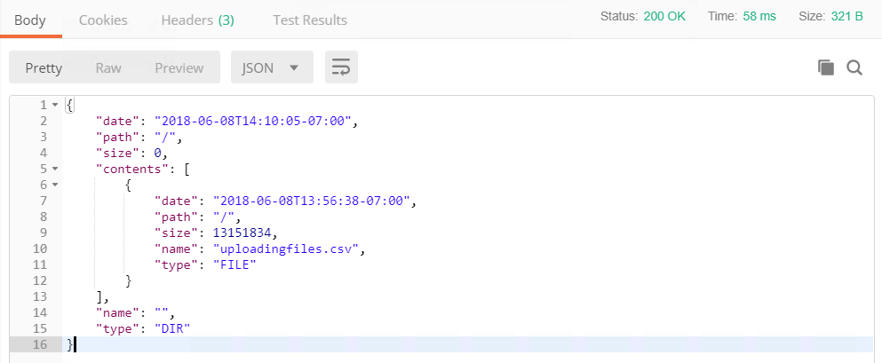

  

    <article class="markdown-body entry-content" itemprop="text"><table>
<tbody><tr>
<td width="25%">
<i></i>
练习10 
</td>
<td>
 使用资源
</td>
</tr>
<tr>
<td>数据</td>
<td>C：\ FMEData2018 \ DATA \ CellSignals \ CellSignal.csv
</td>
</tr>
<tr>
<td>总体目标</td>
<td> 演示如何使用REST API上传文件和下载文件。 </td>
</tr>
<tr>
<td>演示</td>
<td> 管理资源的调用 </td>
</tr>
</tbody></table>

通过REST API，您将可以访问FME Server中可用的资源。您可以使用REST API列出文件，上传文件和删除文件。如果要将数据定向到FME Server中的某个区域，这在Web应用程序中很有用。

<table>
<tbody><tr>
<td>
<i></i>
Ricky RESTless说......
</td>
</tr>
<tr>
<td>

大多数文件管理都可以通过REST API处理。这意味着在Web应用程序中可以让用户将文件上传到服务器，运行转换，然后将文件返回给用户。这些调用也在FME JavaScript API中，稍后将在课程中使用。

</td>
</tr>
</tbody></table>

<h4>上传文件</h4>

此调用会将文件上传到资源文件夹中的数据文件夹。文件名在Content-Disposition参数中指定。如果要在数据文件夹中指定目录，只需在filesys之后写入文件夹名称。如果从用户请求数据并将数据输入到工作空间中，则上传文件在Web应用程序中可能是有用的。

 <strong>1）在Postman中输入以下URL和Headers</strong>

在Postman中，单击加号以打开新选项卡。

&lt;style type =“text / css”&gt; .tg {border-collapse：collapse; border-spacing：0;} .tg td {font-family：Arial，sans-serif; font-size：14px; padding：10px 5px ; border-style：solid; border-width：1px; overflow：hidden; word-break：normal; border-color：black;} .tg th {font-family：Arial，sans-serif; font-size：14px; font-weight：normal; padding：10px 5px; border-style：solid; border-width：1px; overflow：hidden; word-break：normal; border-color：black;} .tg .tg-ao4k {background-color ：＃e6ffe6;颜色：＃333333; vertical-align：top} .tg .tg-a080 {background-color：＃e6ffe6; vertical-align：top} &lt;/ style&gt;
<table>
  <tbody><tr>
    <th>POST</th>
    <th>http://<yourServerHost>/fmerest/v3/resources/connections/FME_SHAREDRESOURCE_DATA/filesys/</th>
  </tr>
</tbody></table>

<strong>头域：</strong>

<ul>
<li>

<strong>Content-Type：</strong> application / octet-stream

</li>
<li>

<strong>Accept：</strong> application / json

</li>
<li>

<strong>Content-Disposition：</strong>attachment; filename= "uploadingfiles.csv"

</li>
<li>

<strong>Authorization：</strong> fmetoken token = &lt;yourToken&gt;

</li>
</ul>

 <strong>2）在Postman中上传文件</strong>
 

在Postman中上传文件。切换到Body选项卡。选择二进制。按选择文件并导航到

<pre><code>C:\FMEData2018\Data\CellSignals\CellSignal.csv
</code></pre>

点击发送！然后，查看响应

<strong>可选查询字符串参数</strong>

查询字符串参数添加在URL的末尾。如果您希望包含这些，那么URL将如下所示：

<pre><code>http://&lt;yourServerHost&gt;/fmerest/v3/resources/connections/FME_SHAREDRESOURCE_DATA/filesys?createDirectories=true&amp;overwrite=false
</code></pre>
<table>
<tbody><tr>
<th>参数</th>
<th>值</th>
<th>描述</th>
</tr>
<tr>
<td>createDirectories</td>
<td>True | false</td>
<td>如果路径不存在，则在路径中创建目录</td>
</tr><tr>
<td>overwrite</td>
<td>True | false</td>
<td> 如果文件已存在，则覆盖该文件 </td>
</tr>
</tbody></table>

<h4>列表文件</h4>

此调用将列出资源中的文件。资源中的列表文件可以在工作空间或Web应用程序中使用。一个可能的用例是创建一个工作空间来列出资源中的所有文件，并创建一个由上传日期组织的excel电子表格。

 <strong>3）在Postman中输入以下URL和头域</strong>

&lt;style type =“text / css”&gt; .tg {border-collapse：collapse; border-spacing：0;} .tg td {font-family：Arial，sans-serif; font-size：14px; padding：10px 5px ; border-style：solid; border-width：1px; overflow：hidden; word-break：normal; border-color：black;} .tg th {font-family：Arial，sans-serif; font-size：14px; font-weight：normal; padding：10px 5px; border-style：solid; border-width：1px; overflow：hidden; word-break：normal; border-color：black;} .tg .tg-ej3l {background-color ：＃66ccff; vertical-align：top} .tg .tg-ufe5 {background-color：＃66ccff; vertical-align：top} &lt;/ style&gt;
<table>
  <tbody><tr>
    <th>GET</th>
    <th>http://<yourServerHost>/fmerest/v3/resources/connections/FME_SHAREDRESOURCE_DATA/filesys/</th>
  </tr>
</tbody></table>

<strong>头域：</strong>

<ul>
<li>

<strong>Accept：</strong> application / json

</li>
<li>

<strong>Authorization:：</strong> fmetoken token = &lt;yourToken&gt;

</li>
</ul>

 <strong>4）查看Postman的响应</strong>

<h4>下载文件</h4>

下载文件调用在Web应用程序中特别有用。这可用于将文件返回给用户。此调用也可以在工作空间中用于下载文本文件。

此调用将资源连接中的文件作为内联资源或附件下载。'disposition'参数仅与某些REST客户端相关。特别是，Internet Explorer在没有附件处置头域的情况下表现不佳。此网页仅显示响应主体而不是下载文件，因此REST客户端应检查Content-Disposition头域并处理下载。

此调用将查看“资源/ 数据”目录以查找uploadedfiles.csv。

 <strong>5）在Postman中输入以下URL和头域</strong>

&lt;style type =“text / css”&gt; .tg {border-collapse：collapse; border-spacing：0;} .tg td {font-family：Arial，sans-serif; font-size：14px; padding：10px 5px ; border-style：solid; border-width：1px; overflow：hidden; word-break：normal; border-color：black;} .tg th {font-family：Arial，sans-serif; font-size：14px; font-weight：normal; padding：10px 5px; border-style：solid; border-width：1px; overflow：hidden; word-break：normal; border-color：black;} .tg .tg-ao4k {background-color ：＃e6ffe6;颜色：＃333333; vertical-align：top} .tg .tg-a080 {background-color：＃e6ffe6; vertical-align：top} &lt;/ style&gt;
<table>
  <tbody><tr>
    <th>POST</th>
    <th>HTTP：// &lt;yourServerHost&gt; /fmerest/v3/resources/connections/FME_SHAREDRESOURCE_DATA/download/uploadingfiles.csv</th>
  </tr>
</tbody></table>

<strong>头域：</strong>

<ul>
<li>

<strong>Accept：</strong> application / octet-stream

</li>
<li>

<strong>Authorization：</strong> fmetoken token = &lt;yourToken&gt;

</li>
<li>

<strong>Content-Type：</strong> application / x-www-form-urlencoded

</li>
</ul>

 <strong>6）输入调用主体</strong>

进入调用体内。单击body选项卡，选中raw，然后粘贴下面的内容。

<pre><code>accept=contents&amp;disposition=inline
</code></pre>

点击发送！然后，查看Postman的响应

<strong>参数：</strong>

<table>
<tbody><tr>
<th>参数</th>
<th>值</th>
<th>描述</th>
</tr>
<tr>
<td>disposition处理</td>
<td> inline/attachment </td>
<td>内联将显示如何使用“Content-Disposition”头域检索资源。此参数仅与某些REST客户端（主要是Web浏览器）相关。如果未选择处理，则不设置头域。</td>
</tr><tr>
<td>Path路径</td>
<td></td>
<td> 路径，相对于资源连接（例如，upload.csv） </td>
</tr><tr>
<td>资Resource源</td>
<td></td>
<td>资源连接的名称。只能包含字母数字字符。（例如，FME_SHAREDRESOURCE_DATA）</td>
</tr>
</tbody></table>

<table>
<tbody><tr>
<td>
<i></i>
恭喜
</td>
</tr>
<tr>
<td>

通过完成本练习，您已学会如何：
 
<ul><li>使用REST API上传文件</li>
<li>使用REST API列出文件</li>
<li>使用REST API下载文件</li>

</ul></td>
</tr>
</tbody></table>
</article>
  

