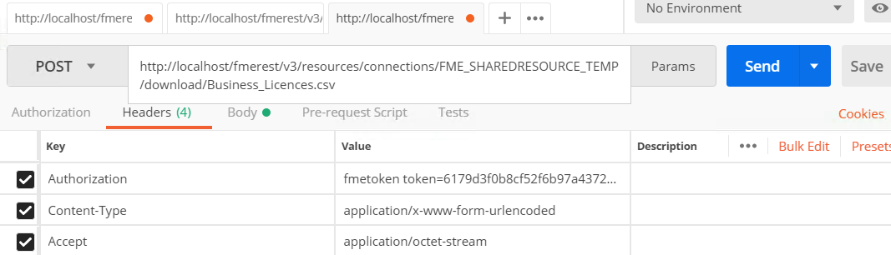

  

    <article class="markdown-body entry-content" itemprop="text"><table>
<tbody><tr>
<td width="25%">
<i></i>
练习11 
</td>
<td>
 使用共享资源作为工作空间输出位置
</td>
</tr>
<tr>
<td>数据</td>
<td>C:\FMEData2018\Data\Planning\BusinessLicenses.xlsx
</td>
</tr>
<tr>
<td>总体目标</td>
<td> 演示如何使用REST API上载文件和下载文件。 </td>
</tr>
<tr>
<td>演示</td>
<td> 用于管理资源的调用 </td>
</tr>
<tr>
<td>工作空间</td>
<td> C:\FMEData2018\Resources\RESTAPI\Chapter6Exercise11.fmw </td>
</tr>
</tbody></table>

<table>
<tbody><tr>
<td>
<i></i>
Ricky RESTless说......
</td>
</tr>
<tr>
<td>

如果您要创建一个运行转换并下载从转换创建的文件的Web应用程序，则下一个练习演示了一个典型的工作流程。首先，您将使用Workbench将工作空间上传到FME Server。然后，将指示用户上传文件，这应该上转到FME服务器内的共享资源文件夹。在用户上传文件之后，应用程序将运行工作空间，该工作空间将生成文件到共享资源位置。然后，用户将能够下载该文件。

</td>
</tr>
</tbody></table>

如果您希望通过REST API从工作空间检索结果数据集，最好的方法是将其写入客户端可访问的共享资源位置。在此示例中，我们将创建一个工作空间，然后在将输出更改为临时存储库时运行调用。我们将使用一个非常基本的工作空间来测试它。

<h4>创建工作空间</h4>

 <strong>1）打开FME Workbench并启动空白工作空间。</strong>

 <strong>2）使用BusinessLicenses文件添加Microsoft Excel读模块。</strong>

有许多方法可以将读模块添加到工作空间。我们可以通过单击画布并键入Excel来添加读模块。

选择Excel 读模块后，单击“...”按钮导航到“数据集”。

数据集位于：

<pre><code>C:\FMEData2018\Data\Planning\BusinessLicenses.xlsx
</code></pre>

 <strong>3）然后将CSV写模块添加到工作空间。</strong>

接下来，我们可以添加CSV写模块。CSV写模块可以以相同的方式添加。单击画布并开始键入CSV。选择CSV写模块。

接受默认参数是可以的。

然后，将Excel文件连接到CSV文件。

 <strong>4）设置目标文件夹。</strong>

下一步是确定目标数据集的已发布参数。已发布的参数位于FME Workbench的“导航器”面板中。它应该被称为DestDataset_CSV2。右键单击DestDataset_CSV2并选择Edit Value。然后使用下拉箭头展开FME Server Parameter菜单并选择$（FME_SHAREDRESOURCE_TEMP）。

通过REST API使用调用时，将文件写入FME Server可以访问的区域非常重要。临时文件夹是将文件写入测试的好地方，因为文件将被清除。

 <strong>5）设置源数据集</strong>

我们稍后将使用API​​上传数据。现在将源数据集文件夹更改为：

<pre><code>$(FME_SHAREDRESOURCE_DATA)/SharedResourceTest/BusinessLicenses.xlsx
</code></pre>

源数据集还必须位于FME Server可以访问的位置。我们在这里指定一个将通过REST API创建的文件夹。

 <strong>6）将源数据集设置为私有参数</strong>

下一步是将源数据集设置为私有参数。这可以通过转到导航器面板然后右键单击参数来完成。然后选择“转换为私有参数”。

将公共参数转换为私有参数可确保调用易于使用。由于数据集的来源不会改变，因此将其转换为私有参数是最佳做法。

 <strong>7）发布到FME Server</strong>

<em>如果您尚未设置服务器连接，则可以在<a href="https://safe-software.gitbooks.io/fme-server-rest-api-training-2018/content/FMESERVER_RESTAPI4Workspaces/4.4.TransactData.html" rel="nofollow">此处</a>找到相关说明<a href="https://safe-software.gitbooks.io/fme-server-rest-api-training-2018/content/FMESERVER_RESTAPI4Workspaces/4.4.TransactData.html" rel="nofollow"></a></em>

单击“发布到FME Server”按钮。

选择先前创建的FME Server连接。点击下一步。

将存储库名称设置为RESTTraining。

将工作空间名称设置为Chapter6Exercise11.fmw。点击下一步。

选择Job Submitter服务并发布工作空间

<h4>使用“资源调用”来上传数据</h4>

 <strong>8）在Postman中输入以下URL和Headers</strong>

&lt;style type =“text / css”&gt; .tg {border-collapse：collapse; border-spacing：0;} .tg td {font-family：Arial，sans-serif; font-size：14px; padding：10px 5px ; border-style：solid; border-width：1px; overflow：hidden; word-break：normal; border-color：black;} .tg th {font-family：Arial，sans-serif; font-size：14px; font-weight：normal; padding：10px 5px; border-style：solid; border-width：1px; overflow：hidden; word-break：normal; border-color：black;} .tg .tg-ao4k {background-color ：＃e6ffe6;颜色：＃333333; vertical-align：top} .tg .tg-a080 {background-color：＃e6ffe6; vertical-align：top} &lt;/ style&gt;
<table>
  <tbody><tr>
    <th>POST</th>
    <th>http://<yourServerHost>/fmerest/v3/resources/connections/FME_SHAREDRESOURCE_DATA/filesys/SharedResourceTest?createDirectories=true</th>
  </tr>
</tbody></table>

<strong>头域：</strong>

<ul>
<li>

<strong>Content-Type：</strong> application / octet-stream

</li>
<li>

<strong>Accept：</strong> application / json

</li>
<li>

<strong>Content-Disposition：</strong>附件; filename =“BusinessLicenses.xlsx”

</li>
<li>

<strong>Authorization：</strong> fmetoken token = &lt;yourToken&gt;

</li>
</ul>

 <strong>9）在Postman中添加调用主体</strong>

首先，单击Postman中的body选项卡。然后，选择二进制并单击选择文件。
 
找到C：\ FMEData2018 \ Data \ Planning \ BusinessLicenses.xlsx作为要上传的文件！

 <strong>10）单击发送！然后，查看响应</strong>

<h4>运行作业</h4>

 <strong>11）在Postman中输入以下URL和Headers</strong>

&lt;style type =“text / css”&gt; .tg {border-collapse：collapse; border-spacing：0;} .tg td {font-family：Arial，sans-serif; font-size：14px; padding：10px 5px ; border-style：solid; border-width：1px; overflow：hidden; word-break：normal; border-color：black;} .tg th {font-family：Arial，sans-serif; font-size：14px; font-weight：normal; padding：10px 5px; border-style：solid; border-width：1px; overflow：hidden; word-break：normal; border-color：black;} .tg .tg-ao4k {background-color ：＃e6ffe6;颜色：＃333333; vertical-align：top} .tg .tg-a080 {background-color：＃e6ffe6; vertical-align：top} &lt;/ style&gt;
<table>
  <tbody><tr>
    <th>POST</th>
    <th>http://<yourServerHost>/fmerest/v3/transformations/submit/RESTTraining/Chapter6Exercise11.fmw</th>
  </tr>
</tbody></table>

<strong>头域：</strong>

<ul>
<li>

<strong>Accept：</strong> application / json

</li>
<li>

<strong>Content-Type：</strong> application / json

</li>
<li>

<strong>Authorization：</strong> fmetoken token=

</li>
</ul>

 <strong>12）在Postman中添加调用主体</strong>

首先，单击Postman中的body选项卡。然后，单击原始(raw)按钮。然后，粘贴以下信息。

<pre><code>{
"publishedParameters": [
{
  "name": "DestDataset_CSV2",
  "value": "$(FME_SHAREDRESOURCE_TEMP)"
}
]
}
</code></pre>

 <strong>13）查看来自FME Server的响应</strong>

<pre><code>{

"id": 29

}
</code></pre>

请注意。图示的作业ID可能与您的机器返回的内容不同。

<h4>测试工作是否成功</h4>

 <strong>14）在Postman中输入以下调用。然后，单击发送！</strong>

此调用将异步运行，因此作为回应，您将收到一个id。要检查您的调用是否已完成，请使用此调用。

&lt;style type =“text / css”&gt; .tg {border-collapse：collapse; border-spacing：0;} .tg td {font-family：Arial，sans-serif; font-size：14px; padding：10px 5px ; border-style：solid; border-width：1px; overflow：hidden; word-break：normal; border-color：black;} .tg th {font-family：Arial，sans-serif; font-size：14px; font-weight：normal; padding：10px 5px; border-style：solid; border-width：1px; overflow：hidden; word-break：normal; border-color：black;} .tg .tg-ej3l {background-color ：＃66ccff; vertical-align：top} .tg .tg-ufe5 {background-color：＃66ccff; vertical-align：top} &lt;/ style&gt;
<table>
  <tbody><tr>
    <th>GET</th>
    <th>http://<yourServerHost>/fmerest/v3/transformations/jobs/id/<Jobid></th>
  </tr>
</tbody></table>

<strong>头域</strong>

<ul>
<li>

<strong>Accept：</strong> application / json

</li>
<li>

<strong>Authorization：</strong> fmetoken token = &lt;yourToken&gt;

</li>
</ul>

 <strong>15）查看响应以确保作业成功完成</strong>

<h4>下载生成的文件</h4>

 <strong>16）在请求URL和头域中输入Postman</strong>

然后，您可以使用下面的调用下载该文件。

&lt;style type =“text / css”&gt; .tg {border-collapse：collapse; border-spacing：0;} .tg td {font-family：Arial，sans-serif; font-size：14px; padding：10px 5px ; border-style：solid; border-width：1px; overflow：hidden; word-break：normal; border-color：black;} .tg th {font-family：Arial，sans-serif; font-size：14px; font-weight：normal; padding：10px 5px; border-style：solid; border-width：1px; overflow：hidden; word-break：normal; border-color：black;} .tg .tg-ao4k {background-color ：＃e6ffe6;颜色：＃333333; vertical-align：top} .tg .tg-a080 {background-color：＃e6ffe6; vertical-align：top} &lt;/ style&gt;
<table>
  <tbody><tr>
    <th>POST</th>
    <th>http://<yourServerHost>/fmerest/v3/resources/connections/FME_SHAREDRESOURCE_TEMP/download/Business_Licences.csv</th>
  </tr>
</tbody></table>

<strong>头域：</strong>

<ul>
<li>

<strong>Accept：</strong> application / octet-stream

</li>
<li>

<strong>Authorization：</strong> fmetoken token = &lt;yourToken&gt;

</li>
<li>

<strong>Content-Type：</strong> application / x-www-form-urlendcoded

</li>
</ul>

 <strong>17）在Postman中输入主体</strong>

单击Postman中的body选项卡。然后选择raw。然后，粘贴以下信息。点击发送！

<pre><code>accept=contents&amp;disposition=inline
</code></pre>

 <strong>18）在Postman中查看响应！</strong>

虽然Postman可以处理调用，但无法下载CSV文件。如果您想下载该文件的副本，可以通过FME JavaScript API进行下载。我们将在课程后面介绍这个过程。

<table>
<tbody><tr>
<td>
<i></i>
恭喜
</td>
</tr>
<tr>
<td>

通过完成本练习，您已学会如何：
 
<ul><li>创建与Submit调用兼容的工作空间</li>
<li>使用REST API将文件上传到共享资源</li>
<li>运行Submit调用并测试是否成功</li>
<li>使用REST API下载文件</li>

</ul></td>
</tr>
</tbody></table>
</article>
  

