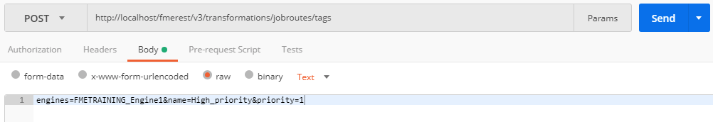
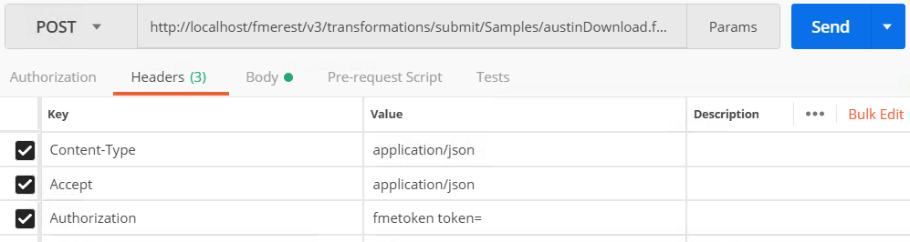

  

    <article class="markdown-body entry-content" itemprop="text"><table>
<tbody><tr>
<td width="25%">
<i></i>
练习12 
</td>
<td>
 创建作业队列
</td>
</tr>
<tr>
<td>数据</td>
<td>没有</td>
</tr>
<tr>
<td>总体的目标</td>
<td> 演示如何使用FME REST API管理FME Server中的作业队列   </td>
</tr>
<tr>
<td>演示</td>
<td> 如何创建队列 </td>
</tr>
<tr>
<td>工作空间</td>
<td>存储在范例存储库中austinDownload.fmw。 </td>
</tr>
</tbody></table>

<table>
<tbody><tr>
<td>
<i></i>
新变化
</td>
</tr>
<tr>
<td>

以前，通过引擎标签配置进行作业管理。这已被弃用，现在我们使用作业队列。但是，REST API端点是相同的，但是现在可以管理队列。
</td>
</tr>
</tbody></table>

<h4>创建作业队列</h4>

以下调用允许您为作业创建新队列。创建的以下标签将被称为High_Priority。任何带有此标签的作业都将发送到FMETRAINING_Engine1。您可能需要向多个引擎添加标签。

<em>FMETRAINING_Engine1特定于培训机器</em>

 <strong>1）在Postman中输入以下URL和Headers</strong>

&lt;style type =“text / css”&gt; .tg {border-collapse：collapse; border-spacing：0;} .tg td {font-family：Arial，sans-serif; font-size：14px; padding：10px 5px ; border-style：solid; border-width：1px; overflow：hidden; word-break：normal; border-color：black;} .tg th {font-family：Arial，sans-serif; font-size：14px; font-weight：normal; padding：10px 5px; border-style：solid; border-width：1px; overflow：hidden; word-break：normal; border-color：black;} .tg .tg-ao4k {background-color ：＃e6ffe6;颜色：＃333333; vertical-align：top} .tg .tg-a080 {background-color：＃e6ffe6; vertical-align：top} &lt;/ style&gt;
<table>
  <tbody><tr>
    <th>POST</th>
    <th>http://<yourServerHost>/fmerest/v3/transformations/jobroutes/tags</th>
  </tr>
</tbody></table>

<strong>头域：</strong>

<ul>
<li>

<strong>Content-Type：</strong> application / x-www-form-urlencoded

</li>
<li>

<strong>Accept：</strong> application / json

</li>
<li>

<strong>Authorization：</strong> fmetoken token = &lt;yourServerHost&gt;

</li>
</ul>

 <strong>2）切换到Body选项卡。单击raw 并粘贴以下信息</strong>

<pre><code>engines=FMETRAINING_Engine1&amp;name=High_priority&amp;priority=1
</code></pre>

<strong>附加参数</strong>

以下是您可能用于未来调用的一些其他参数。

<table>
<tbody><tr>
<th>参数</th>
<th>描述</th>
</tr>
<tr>
<td>描述</td>
<td>标签说明</td>
</tr><tr>
<td>引擎</td>
<td>标签的引擎分配
</td>
</tr><tr>
<td>名称</td>
<td>必需 - 要创建的标签的唯一名称</td>
</tr><tr>
<td>资料库</td>
<td>标签的存储库分配</td>
</tr><tr>
<td>优先</td>
<td>标签的优先级。优先级值必须是1到10之间的整数。</td>
</tr>
</tbody></table>

 <strong>3）单击发送并查看来自FME Server的响应。</strong>

您应该收到以下响应。

<pre><code> 201- Success. The queue was created.
</code></pre>

<h4>将引擎分配给作业队列</h4>

 <strong>4）在Postman中输入以下URL和头域</strong>

&lt;style type =“text / css”&gt; .tg {border-collapse：collapse; border-spacing：0;} .tg td {font-family：Arial，sans-serif; font-size：14px; padding：10px 5px ; border-style：solid; border-width：1px; overflow：hidden; word-break：normal; border-color：black;} .tg th {font-family：Arial，sans-serif; font-size：14px; font-weight：normal; padding：10px 5px; border-style：solid; border-width：1px; overflow：hidden; word-break：normal; border-color：black;} .tg .tg-ao4k {background-color ：＃e6ffe6;颜色：＃333333; vertical-align：top} .tg .tg-a080 {background-color：＃e6ffe6; vertical-align：top} &lt;/ style&gt;
<table>
  <tbody><tr>
    <th>POST</th>
    <th>http://<yourServerHost>/fmerest/v3/transformations/jobroutes/tags/High_priority/engines</th>
  </tr>
</tbody></table>

<strong>头域：</strong>

<ul>
<li>

<strong>Content-Type：</strong> application / x-www-form-urlencoded

</li>
<li>

<strong>Accept：</strong> application / json

</li>
<li>

<strong>Authorization：</strong> fmetoken token = &lt;yourServerHost&gt;

</li>
</ul>

 <strong>5）切换到Body选项卡。单击原始并粘贴以下信息：</strong>

<pre><code>engines=FMETRAINING_Engine1
</code></pre>

 <strong>6）单击发送并查看来自FME Server的响应。</strong>

<h4>将存储库分配给作业队列</h4>

在本练习的下一阶段，我们将获取刚刚创建的作业队列并将其分配给存储库。这可确保每次运行存储库中的作业时，都会将其分配给此队列。

 <strong>7）在Postman中输入以下URL和头域</strong>

<strong>请求</strong>

&lt;style type =“text / css”&gt; .tg {border-collapse：collapse; border-spacing：0;} .tg td {font-family：Arial，sans-serif; font-size：14px; padding：10px 5px ; border-style：solid; border-width：1px; overflow：hidden; word-break：normal; border-color：black;} .tg th {font-family：Arial，sans-serif; font-size：14px; font-weight：normal; padding：10px 5px; border-style：solid; border-width：1px; overflow：hidden; word-break：normal; border-color：black;} .tg .tg-ao4k {background-color ：＃e6ffe6;颜色：＃333333; vertical-align：top} .tg .tg-a080 {background-color：＃e6ffe6; vertical-align：top} &lt;/ style&gt;
<table>
  <tbody><tr>
    <th>POST</th>
    <th>http://<yourServerHost>/fmerest/v3/transformations/jobroutes/tags/High_priority/repositories</th>
  </tr>
</tbody></table>

<strong>头域：</strong>

<ul>
<li>

<strong>Content-Type：</strong> application / x-www-form-urlencoded

</li>
<li>

<strong>Accept：</strong> application / json

</li>
<li>

<strong>Authorization：</strong> fmetoken token = &lt;yourServerHost&gt;

</li>
</ul>

 <strong>8）切换到Body选项卡。单击原始并粘贴以下信息：</strong>

<pre><code>repositories=RESTTraining
</code></pre>

<strong>额外参数</strong>

以下是您可能用于未来调用的一些其他参数。

<table>
<tbody><tr>
<th>参数</th>
<th>描述</th>
</tr>
<tr>
<td>资料库</td>
<td>队列的存储库分配</td>
</tr><tr>
<td>标签</td>
<td>作业队列的名称
</td>
</tr>
</tbody></table>

 <strong>9）单击发送并查看来自FME Server的响应。</strong>

您应该收到以下响应。

<pre><code>204- Success. The assigned repositories were assigned.
</code></pre>

 <strong>10）检查FME Server以查看是否已成功分配存储库</strong>

转到FME Server并单击“存储库”。

在存储库名称的右侧，您应该看到潜在队列的下拉列表。应分配High_Priority队列。

<h4>提交作业并在请求中包含标签</h4>

当你提交工作。您可以在TMDirectives下的请求中指定队列。TMDirectives指定服务器应如何运行作业。以下是完整的参数列表。

<table>
<tbody><tr>
<td>
<i></i>
警告
</td>
</tr>
<tr>
<td>

请注意，优先级已被弃用，队列将被使用。

</td>
</tr>
</tbody></table>
<pre><code>TMDirectives {
rtc (boolean, optional): Runs a job until it is explicitly canceled. The job will run again regardless of whether the job completed successfully, failed, or the server crashed or was shut down.,

ttc (integer, optional): Time (in seconds) elapsed for a running job before it's canceled. The minimum value is 1 second, values less than 1 second are ignored.,

ttl (integer, optional): Time to live in the job queue (in seconds),
description (string, optional): Description of the request,

priority (integer, optional): The priority of the job. Priority values must be integers between 1 and 200. If a request's priority value is less than 1, greater than 200, or is not specified, then FME Server sets it to 100.,

tag (string, optional): The job routing tag for the request
}
</code></pre>

以下是TMDirectives的外观示例：

<pre><code>"TMDirectives": {
    "rtc": false,
    "ttc": 60,
    "description": "This is my description",
    "tag": "linux",
    "ttl": 60
  },
</code></pre>

现在，我们将使用Submit调用并更改参数以包括先前创建的作业队列（在REST API中也称为标签）。

 <strong>11）在Postman中输入以下URL和头域</strong>

&lt;style type =“text / css”&gt; .tg {border-collapse：collapse; border-spacing：0;} .tg td {font-family：Arial，sans-serif; font-size：14px; padding：10px 5px ; border-style：solid; border-width：1px; overflow：hidden; word-break：normal; border-color：black;} .tg th {font-family：Arial，sans-serif; font-size：14px; font-weight：normal; padding：10px 5px; border-style：solid; border-width：1px; overflow：hidden; word-break：normal; border-color：black;} .tg .tg-ao4k {background-color ：＃e6ffe6;颜色：＃333333; vertical-align：top} .tg .tg-a080 {background-color：＃e6ffe6; vertical-align：top} &lt;/ style&gt;
<table>
  <tbody><tr>
    <th>POST</th>
    <th>http://<yourServerHost>/fmerest/v3/transformations/submit/Samples/austinDownload.fmw</th>
  </tr>
</tbody></table>

<strong>头域：</strong>

<ul>
<li>

<strong>Content-Type：</strong> application / json

</li>
<li>

<strong>Accept：</strong> application / json

</li>
<li>

<strong>Authorization：</strong> fmetoken token = &lt;yourServerHost&gt;

</li>
</ul>

 <strong>12）切换到Body选项卡。单击原始并粘贴以下信息</strong>

<pre><code>{
  "publishedParameters": [
    {
      "name": "MAXY",
      "value": "42"
    },
    {
      "name": "THEMES",
      "value": [
        "airports",
        "cenart"
      ]
    }
  ],
  "TMDirectives": {
    "tag": "High_priority"

  }
}
</code></pre>

 <strong>13）单击发送并查看来自FME Server的响应。</strong>

<pre><code>{

    "id": 33

}
</code></pre>

请注意。根据FME Server已完成的作业数量，服务器返回的作业ID将有所不同。

现在我们可以检查作业，看看作业是否在High_priority标签下成功运行。

 <strong>14）在Postman中输入以下URL和头域</strong>

<em><strong>将33替换为您从上次调用中收到的ID</strong></em>

&lt;style type =“text / css”&gt; .tg {border-collapse：collapse; border-spacing：0;} .tg td {font-family：Arial，sans-serif; font-size：14px; padding：10px 5px ; border-style：solid; border-width：1px; overflow：hidden; word-break：normal; border-color：black;} .tg th {font-family：Arial，sans-serif; font-size：14px; font-weight：normal; padding：10px 5px; border-style：solid; border-width：1px; overflow：hidden; word-break：normal; border-color：black;} .tg .tg-ej3l {background-color ：＃66ccff; vertical-align：top} .tg .tg-ufe5 {background-color：＃66ccff; vertical-align：top} &lt;/ style&gt;
<table>
  <tbody><tr>
    <th>GET</th>
    <th>http://<yourServerHost>/fmerest/v3/transformations/jobs/id/<yourJobID></th>
  </tr>
</tbody></table>

<strong>头域：</strong>

<ul>
<li>

<strong>Accept：</strong> application / json

</li>
<li>

<strong>Authorization：</strong> fmetoken token = &lt;yourToken&gt;

</li>
</ul>

 <strong>15）单击发送并查看来自FME Server的响应</strong>

在响应中，您可以找到提交呼叫的引擎和呼叫参数。

正如您在此处看到的，作业是在High_priority标签下提交的。然而，所显示的优先级仍然是-1。标签会覆盖这个优先级，所以它仍然以优先级1提交，只是没有显示在FME Server中。

<table>
<tbody><tr>
<td>
<i></i>
恭喜
</td>
</tr>
<tr>
<td>

通过完成本练习，您已学会如何：
 
<ul><li>使用REST API创建作业队列</li>
<li>使用REST API将引擎分配给作业队列</li>
<li>使用REST API将存储库分配给作业队列</li>
<li>使用REST API运行作业并在调用中分配队列</li>

</ul></td>
</tr>
</tbody></table>
</article>
  

