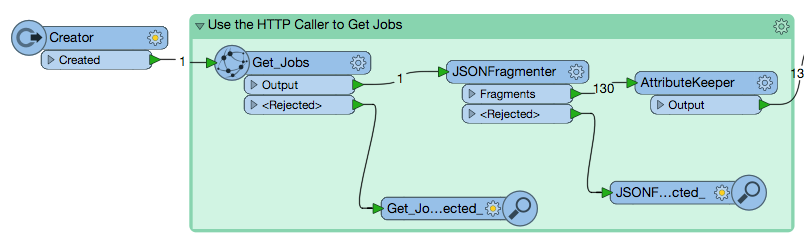
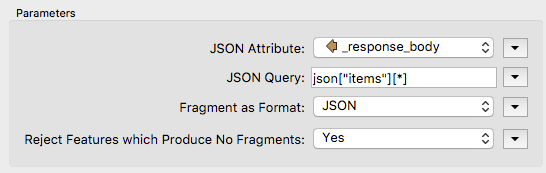
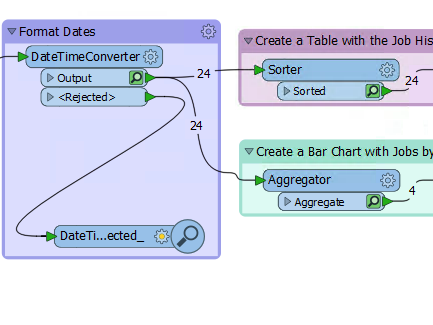

  

    <article class="markdown-body entry-content" itemprop="text"><table>
<tbody><tr>
<td width="25%">
<i></i>
练习13 
</td>
<td>
 创建工作空间以检索作业历史记录结果
</td>
</tr>
<tr>
<td>数据</td>
<td>无</td>
</tr>
<tr>
<td>总体目标</td>
<td> 创建可以检索最后1000个作业并将其显示在HTML中的工作空间。 </td>
</tr>
<tr>
<td>演示</td>
<td> 如何在工作空间中使用“获取作业(Get Jobs)”调用 </td>
</tr>
<tr>
<td>工作空间</td>
<td> C:\FMEData2018\Resources\RESTAPI\Chapter7Exercise13.Complete
</td>
</tr>
</tbody></table>

在本练习中，我们将创建一个工作空间，用于从FME Server检索作业历史记录，并创建包含结果的HTML文件。我们将创建的第一个工作空间从FME Server检索最新的1000个作业。然后将结果格式化为包含结果的表格，在此表格下方将有一个图表，其中包含按日期显示的结果数量。

<h4>使用HTTPCaller获取作业，然后格式化属性</h4>

 <strong>1）添加一个Creator</strong>

在空白的FME工作空间中添加Creator转换器。可以接受默认参数。

 <strong>2）添加HTTPCaller</strong>

添加HTTPCaller并设置如下所示的参数：

<strong>请求URL：</strong> http：// &lt;yourServerHost&gt; / fmerest / v3 / transformations / jobs / completed
 <strong>HTTP方法：</strong> GET

选中使用身份验证旁边的复选框。然后选择Basic作为身份验证模式，并使用Admin/Admin用户名和密码。您还可以将身份验证方法设置为Web连接，然后使用在上一个练习中创建的FME Server连接。

 <strong>3）附加一个Inspector</strong>

将Inspector附加到HTTPCaller。然后运行工作空间。工作空间运行后，将显示FME Data Inspector。

我们需要解析响应以将我们想要的信息转换为我们可以使用的属性。在本练习中，我们将保留id，timeSubmitted和status。我们希望在从FME Server返回的JSON中找到id，timeSubmitted和status。

 <strong>4）删除Inspector</strong>

现在，我们知道我们想要保留的属性并了解它们存储在从FME Server返回的JSON中的位置，我们可以删除Inspector。选择Inspector并点击键盘上的删除按钮。

 <strong>5）添加JSONFragmenter</strong>

我们将使用JSONFragmenter将响应解析为所需的属性。

JSON属性是从前一个调用生成的响应主体。

JSON查询应该以json开头，然后是存储属性的类别。这可能首先需要一些试错。

对于JSON查询，我们希望在项目类别中找到所有响应，因此，我们使用此语句json [“items”] [*]

接下来，我们需要在JSONFragmenter中设置Flattening Parameters。

在这里，我们输入我们希望保留的查询属性。您应该保留id，timeSubmitted和status。

 <strong>6）添加一个Attribute Keeper</strong>

接下来，添加AttributeKeeper。将AttributeKeeper附加到JSONFragmenter。在参数和要保留的属性下：写入timeSubmitted，id，status。

<h4>格式日期</h4>

 <strong>7）添加DateTimeConverter</strong>

添加DateTimeConverter并将其附加到AttributeKeeper。使用DateTimeConverter将日期格式化为％Y-％m-％d格式。从FME Server返回的日期时间格式可能难以阅读。通过修改输出格式，我们可以使我们的图表更具视觉吸引力。

参数应填写如下：

<strong>日期时间属性：</strong> timeSubmitted
  
<strong>输入格式：</strong>自动检测FME和ISO格式
  
<strong>输出格式：</strong>％Y-％m-％d
  
<strong>修复溢出：</strong>否

<h4>使用作业历史记录结果创建表格</h4>

如果我们用当前的结果编译一个表，它将创建一个表。但是，它没有顺序，所以我们使用Sorter转换器。

 <strong>8）添加Sorter转换器</strong>

Sorter转换器将连接到DateTimeConverter。在“排序依据”部分下，列出以下参数：

 <strong>9）添加HTMLReportGenerator</strong>

在HTML报告生成器中，我们可以添加自定义的HTML或包含从FME Server获取的信息的表。

 <strong>10）将自定义HTML添加到HTMLReportGenerator</strong>

首先，我们要添加自定义HTML以指定HTML文件中的头域。

<pre><code>&lt;h2&gt;&lt;strong&gt;Monthly Server Report&lt;/strong&gt;&lt;/h2&gt;
</code></pre>

如果您有一个简介或任何格式化要求，您也可以将它放在这里。

 <strong>11）将表添加到HTMLReportGenerator</strong>

接下来，在页面内容下，添加一个表。指定表将使用的列内容和标题。

要在创建表之前查看该表，请单击“在浏览器中预览”按钮。

<h4>使用”按日期的作业“创建条形图</h4>

 <strong>12）添加Aggregator转换器</strong>

添加Aggregator转换器并将其附加到DateTimeConverter。

我们需要按日期汇总所有作业以创建条形图，因此我们需要Aggregator。

在这里，我们按timeSubmitted对结果进行分组，timeSubmitted是提交属性的日期。然后在Count Attribute下，我们创建一个名为DateCount的新属性。
<strong>确保“聚合模式(Accumulation Mode)”设置为“合并传入属性(Merge Incoming Attributes)”</strong>

 <strong>13）附加HTMLReportGenerator</strong>

接下来，我们附加另一个HTMLReportGenerator。参数设置如下：

<h4>格式化布局并写入HTML</h4>

 <strong>14）添加HTMLLayouter</strong>

将HTMLReportGenerators连接到HTMLLayouter。

 <strong>15）添加HTML写模块</strong>

最后，添加一个HTML写模块。可以接受默认值。将文件保存到：

C:\FMEData2018\Resources\Output\Training\JobHistory.html

 <strong>16）查看结果！</strong>

运行工作空间并查看结果。

<table>
<tbody><tr>
<td>
<i></i>
恭喜
</td>
</tr>
<tr>
<td>

通过完成本练习，您已学会如何：
 
<ul><li>使用工作空间调用FME Server REST API以检索作业</li>
<li>查看FME Server的响应 </li>
<li>使用HTMLReportGenerator创建结果报告 </li>

</ul></td>
</tr>
</tbody></table>
</article>
  

