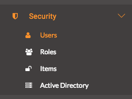

### 8.1 最佳实践

#### 设置权限

用户访问FME Server上的数据的能力取决于授予用户的权限。当应用程序通过JavaScript API（如数据下载或数据上载）使用函数时，用户首先必须使用令牌初始化应用程序。每个令牌都连接到用户。最佳做法是为每个应用程序创建一个新用户并使用该令牌。

请务必注意，如果您的Web应用程序使用直接URL，则权限会自动设置为guest帐户。保存工作空间的存储库必须具有guest权限。

要授予存储库guest权限，您必须访问FME服务器。首先，查看FME Server的左侧面板。找到安全性，然后查找用户。

进入“用户”页面后，**单击“guest”**

向下滚动到权限并展开存储库选项卡。然后勾选读取和运行权限。

现在，直接URL将起作用。

#### 为数据上传函数使用命名空间变量

练习4中展示了数据上载函数。当用户使用Web应用程序时，权限将通过应用程序开头授权的帐户。每个用户都是匿名的。如果两个用户上传相同的文件，则文件将最终位于同一位置并被覆盖。为了防止这种情况的发生，每个上载都有一个命名空间，它是一个随机生成的键。使用数据上载函数时，最好先使用getSession函数。这将在后面的课程中进行演示。

#### 需要时使用直接URL

直接URL很棒，特别是对于数据流。这是因为它们会自动将用户定向到要在计算机上打开的文件。练习2和练习3使用直接URL而练习1和4使用JavaScript库。

#### 一致的命名约定

在服务器上保持工作空间的组织非常重要。应该命名每个工作空间或其他项目，以便用户可以快速告知它属于哪个工作流程。

此外，在处理大量工作空间时，使用描述发布工作空间非常重要。这些描述将帮助您快速轻松地确定工作区的用途。您还可以在工作区查看器中查看工作区以获得快速概述。

#### 创建一个项目

项目是一种在一个区域中将服务器上的多个资源捆绑在一起的方法。如果您迁移服务器，这是将资源保持在一起的好方法。项目是一种将多种资源组织成一个统一格式的方法。如果您有需要的Web应用程序，特定存储库和资源文件夹，则可以将它们组合在项目文件夹中。可以共享此项目文件夹并将其移动到其他服务器。

#### 更多代码资源

如果您有兴趣增加对CSS，JavaScript和HTML的了解，那么有许多在线资源。 [W3Schools](https://www.w3schools.com/)和 [Mozilla Development Networks](https://developer.mozilla.org/en-US/docs/Learn)上有一些很好的指南。
