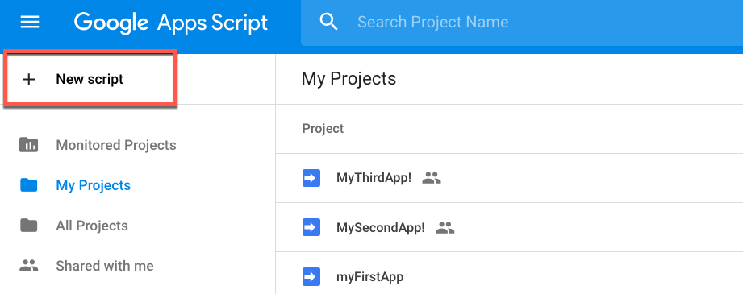

  

    <article class="markdown-body entry-content" itemprop="text"><h3>8.2 托管Web应用程序</h3>

有几种方法可以完成此培训并查看您的Web应用程序。

如果您没有自己的Web服务器，则可以使用以下选项之一进行本课程。

<h4>本地主机服务器</h4>

如果您没有面向外部的服务器，这是一个很好的方法。这是一种创建页面并在本地托管的简单方法。请注意，如果您的服务器仅在本地托管，则无法将数据流用于Google Maps和ESRI功能。在8.3节中将会有一个练习来设置这个。

<strong>1.安装Python</strong>

只需访问以下网站
 <a href="https://www.python.org/" rel="nofollow">https://www.python.org/</a>，找到下载最新版python的下载链接并安装到您的计算机上。

<strong>2.找到终端（Mac / Linux）或命令提示符（Windows）</strong>

使用命令浏览文件夹，找到文件的存储位置。

以下是有用的命令：

这些命令列在Github <a href="https://github.com/0nn0/terminal-mac-cheatsheet">Terminal Mac Cheatsheet</a>存储库中。

<table>
<tbody><tr>
<th>键</th>
<th>描述</th>
</tr>
<tr>
<td>CD [文件夹]</td>
<td>更改目录，例如cd Documents</td>
</tr><tr>
<td>CD </td>
<td> 主页目录
</td>
</tr><tr>
<td>ls（Mac）或dir（Windows）</td>
<td>列出文件</td>
</tr></tbody></table>

<strong>
3.输入Python命令
</strong>
 <
<em><strong>对于Python 2.7</strong></em>

<table>
<tbody><tr>
<td>
<i></i>
警告
</td>
</tr>
<tr>
<td>

Python 2.7已从FME产品中弃用。如果您在FME工作空间中使用Python 2.7，请阅读    <a href="https://knowledge.safe.com/articles/71635/python-27-deprecation.html" rel="nofollow">Python 2.7 Deprecation</a>。

</td>
</tr>
</tbody></table>
<pre>python -m“SimpleHTTPServer”8080
</pre>

请注意，如果由于格式问题而粘贴命令，这可能不起作用。如果键入命令，它将起作用。
  
<em><strong>对于Python 3.6</strong></em>

<pre>python -m http.server
</pre>

<strong>4.打开浏览器并输入：
 </strong><a href="http://localhost:8080/" rel="nofollow">http：// localhost：8080 /</a>

<strong>5.选择您的文件（可选）</strong>

如果您没有直接导航到该文件，则可能必须使用提示选择它。

<h4>Google Apps脚本</h4>

如果您有一个面向外部的服务器但没有预先存在的Web目录结构，这是一个很好的方法。GoogleAppsScript可免费使用，但需要Google登录。

只需转到<a href="https://script.google.com/home" rel="nofollow">https://script.google.com/home</a>，然后点击新建脚本即可创建您的网络应用程序。

删除Code.gs中当前的内容并粘贴：

<pre><code>function doGet() {
  return HtmlService.createHtmlOutputFromFile('index');

}
</code></pre>

然后，创建一个名为index.html的新HTML文件并开始工作。

创建网页后，您可以通过该应用程序查看它。单击“发布”，然后单击“部署为Web应用程序”。

<h4>Safe Software如何部署Web应用程序</h4>

虽然您不会在课程中部署这样的Web应用程序，但您可能很好奇Safe Software如何部署Web演示。

所有Safe Software的Web演示都以下列方式托管。首先，应用程序文件夹发布到GitHub。GitHub具有版本控制的优势。因此，一旦对代码进行了编辑，它将显示谁进行了更改以及何时进行了更改。

然后，Safe使用部署，当GitHub上的代码更新时，它就会得到通知。然后将应用程序推送到AWS S3 Web服务器。

有关此问题的更多详细信息，请访问在<a href="https://knowledge.safe.com/articles/677/deploying-a-web-application-on-top-of-fme-cloud-s3.html" rel="nofollow">FME云之上部署Web应用程序</a>的文章。

</article>
  

