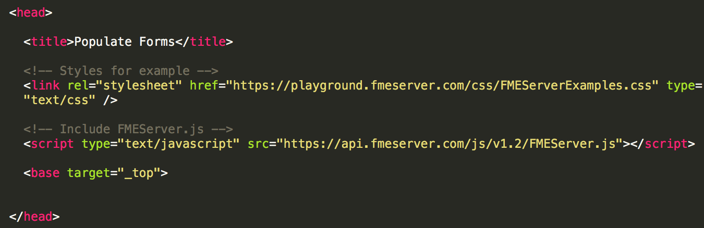
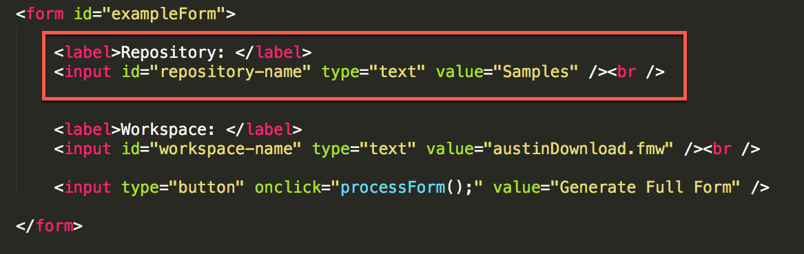
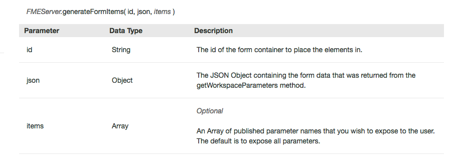
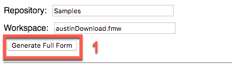

  <div id="readme" class="readme blob instapaper_body">
    <article class="markdown-body entry-content" itemprop="text"><table>
<tbody><tr>
<td width="25%">
<i></i><font style="vertical-align: inherit;"><font style="vertical-align: inherit;">
练习15
</font></font></td>
<td><font style="vertical-align: inherit;"><font style="vertical-align: inherit;">
 使用REST API动态生成表单 
</font></font></td>
</tr>
<tr>
<td><font style="vertical-align: inherit;"><font style="vertical-align: inherit;">数据</font></font></td>
<td><font style="vertical-align: inherit;"><font style="vertical-align: inherit;">无</font></font></td>
</tr>
<tr>
<td><font style="vertical-align: inherit;"><font style="vertical-align: inherit;">总体目标</font></font></td>
<td><font style="vertical-align: inherit;"><font style="vertical-align: inherit;">展示FME Server JavaScript API的功能。</font><font style="vertical-align: inherit;">此练习允许您根据工作空间中的参数动态生成表单，并让用户填写参数并运行工作空间。  </font></font></td>
</tr>
<tr>
<td><font style="vertical-align: inherit;"><font style="vertical-align: inherit;">演示</font></font></td>
<td><font style="vertical-align: inherit;"><font style="vertical-align: inherit;"> 如何使用getWorkspaceParameters，generateFormItems和runDataDownload函数。 </font></font></td>
</tr>
<tr>
<td><font style="vertical-align: inherit;"><font style="vertical-align: inherit;">完成的HTML </font></font></td>
<td><font style="vertical-align: inherit;"><font style="vertical-align: inherit;">C:\FMEData2018\Resources\RESTAPI\myFirstApp\myFirstApp.html
  </font></font></td>
</tr>
</tbody></table>
<p><font style="vertical-align: inherit;"><font style="vertical-align: inherit;">在下一个练习中，我们将创建一个表单，根据用户选择的内容自动更新参数。</font><font style="vertical-align: inherit;">如果要为客户端创建应用程序以访问数据而不通过FME Server，则可以使用此方法。</font></font></p>

<table>
<tbody><tr>
<td>
<i></i><font style="vertical-align: inherit;"><font style="vertical-align: inherit;">
警告
</font></font></td>
</tr>
<tr>
<td><font style="vertical-align: inherit;"><font style="vertical-align: inherit;">

要使本练习正常工作，您需要完成 </font></font><a href="https://safe-software.gitbooks.io/fme-server-rest-api-training-2018/content/FMESERVER_RESTAPI8Session2/8.3.Exercise.SettingUp.html" rel="nofollow"><font style="vertical-align: inherit;"><font style="vertical-align: inherit;">练习14</font></font></a><font style="vertical-align: inherit;"><font style="vertical-align: inherit;">或使用现有的Web服务器进行测试。

</font></font></td>
</tr>
</tbody></table>
<h4><a id="user-content-create-the-form" class="anchor" aria-hidden="true" href="./9.2.ExerciseForm.md#create-the-form"></a><font style="vertical-align: inherit;"><font style="vertical-align: inherit;">创建表单</font></font></h4>
<p><br><strong><font style="vertical-align: inherit;"><font style="vertical-align: inherit;">1）打开Notepad ++（或其他文本编辑器）</font></font></strong></p>
<p><font style="vertical-align: inherit;"><font style="vertical-align: inherit;">转到开始菜单并打开Notepad ++。</font><font style="vertical-align: inherit;">然后，在顶部工具栏中找到语言，找到H，然后选择HTML。</font><font style="vertical-align: inherit;">通过选择语言，它将打开语法高亮显示。</font></font></p>
<p><br><strong><font style="vertical-align: inherit;"><font style="vertical-align: inherit;">2）将空白文件另存为myFirstApp.html</font></font></strong></p>
<p><font style="vertical-align: inherit;"><font style="vertical-align: inherit;">导航到C：/ FMEData2018 / Resources / RESTAPI并将文件另存为myFirstApp.html。</font></font></p>
<p><br><strong><font style="vertical-align: inherit;"><font style="vertical-align: inherit;">3）复制并粘贴以下代码：</font></font></strong></p>

```javascript
<head>

    <title>Populate Forms</title>

    <!-- Styles for example -->
    <link rel="stylesheet" href="https://playground.fmeserver.com/css/FMEServerExamples.css" type="text/css" />

    <!-- Include FMEServer.js -->
    <script type="text/JavaScript" src="https://api.fmeserver.com/js/v1.2/FMEServer.js"></script>

    <base target="_top">


</head>
```

<p><a target="_blank" rel="noopener noreferrer" href="./Images/9.1.1.Head.png"></a></p>
<p><em><font style="vertical-align: inherit;"><font style="vertical-align: inherit;">HTML的头部分</font></font></em></p>
<p><font style="vertical-align: inherit;"><font style="vertical-align: inherit;">在页面的头部分，我们链接到外部样式表和</font></font><br><font style="vertical-align: inherit;"><font style="vertical-align: inherit;">
FME Server JavaScript API。</font></font></p>
<p><font style="vertical-align: inherit;"><font style="vertical-align: inherit;">接下来，我们将构建HTML的主体。</font><font style="vertical-align: inherit;">我们需要创建一个表单来</font></font><br><font style="vertical-align: inherit;"><font style="vertical-align: inherit;">
显示查找工作空间所需的初始信息。</font></font></p>
<p><br><strong><font style="vertical-align: inherit;"><font style="vertical-align: inherit;">4）在主体部分粘贴：</font></font></strong></p>
<div class="highlight highlight-source-js"><pre><span class="pl-k">&lt;</span>body<span class="pl-k">&gt;</span>
    <span class="pl-k">&lt;</span>form id<span class="pl-k">=</span><span class="pl-s"><span class="pl-pds">"</span>exampleForm<span class="pl-pds">"</span></span><span class="pl-k">&gt;</span>
        <span class="pl-k">&lt;</span>label<span class="pl-k">&gt;</span>Repository<span class="pl-k">:</span> <span class="pl-k">&lt;</span><span class="pl-k">/</span>label<span class="pl-k">&gt;</span>
        <span class="pl-k">&lt;</span>input id<span class="pl-k">=</span><span class="pl-s"><span class="pl-pds">"</span>repository-name<span class="pl-pds">"</span></span> type<span class="pl-k">=</span><span class="pl-s"><span class="pl-pds">"</span>text<span class="pl-pds">"</span></span> value<span class="pl-k">=</span><span class="pl-s"><span class="pl-pds">"</span>Samples<span class="pl-pds">"</span></span><span class="pl-k">/</span><span class="pl-k">&gt;&lt;</span>br <span class="pl-k">/</span><span class="pl-k">&gt;</span>
        <span class="pl-k">&lt;</span>label<span class="pl-k">&gt;</span>Workspace<span class="pl-k">:</span> <span class="pl-k">&lt;</span><span class="pl-k">/</span>label<span class="pl-k">&gt;</span>
        <span class="pl-k">&lt;</span>input id<span class="pl-k">=</span><span class="pl-s"><span class="pl-pds">"</span>workspace-name<span class="pl-pds">"</span></span> type<span class="pl-k">=</span><span class="pl-s"><span class="pl-pds">"</span>text<span class="pl-pds">"</span></span> value<span class="pl-k">=</span><span class="pl-s"><span class="pl-pds">"</span>austinDownload.fmw<span class="pl-pds">"</span></span> <span class="pl-k">/</span><span class="pl-k">&gt;</span> <span class="pl-k">&lt;</span>br <span class="pl-k">/</span><span class="pl-k">&gt;</span>
        <span class="pl-k">&lt;</span>input type<span class="pl-k">=</span><span class="pl-s"><span class="pl-pds">"</span>button<span class="pl-pds">"</span></span> onclick<span class="pl-k">=</span><span class="pl-s"><span class="pl-pds">"</span>processForm();<span class="pl-pds">"</span></span> value<span class="pl-k">=</span><span class="pl-s"><span class="pl-pds">"</span>Generate Full Form<span class="pl-pds">"</span></span> <span class="pl-k">/</span><span class="pl-k">&gt;</span>
    <span class="pl-k">&lt;</span><span class="pl-k">/</span>form<span class="pl-k">&gt;</span>
<span class="pl-k">&lt;</span><span class="pl-k">/</span>body<span class="pl-k">&gt;</span></pre></div>

<p><a target="_blank" rel="noopener noreferrer" href="./Images/9.1.2a.Form.png"></a></p>
<p><font style="vertical-align: inherit;"><font style="vertical-align: inherit;">这两个区域表明我们已经创建了一个被称为“exampleForm”的表单。</font><font style="vertical-align: inherit;">如果我们需要JavaScript来处理表单</font></font><br><font style="vertical-align: inherit;"><font style="vertical-align: inherit;">
，那么我们将通过id引用它。</font></font></p>
<p><a target="_blank" rel="noopener noreferrer" href="./Images/9.1.3a.Created.png"></a></p>
<p><font style="vertical-align: inherit;"><font style="vertical-align: inherit;">在表单中，我们创建标签和输入。</font><font style="vertical-align: inherit;">标签名为</font></font><br><font style="vertical-align: inherit;"><font style="vertical-align: inherit;">
Repository：它将出现在页面上。</font><font style="vertical-align: inherit;">然后我们需要给输入一个id，以便稍后调用它。</font><font style="vertical-align: inherit;">输入类型为text，名称为repository，默认值为Samples。</font></font></p>
<p><font style="vertical-align: inherit;"><font style="vertical-align: inherit;">我们为工作空间重复相同的输入过程。</font></font></p>
<p><a target="_blank" rel="noopener noreferrer" href="./Images/9.1.4a.Button.png"></a></p>
<p><br><strong><font style="vertical-align: inherit;"><font style="vertical-align: inherit;">5）将此代码粘贴到主体部分中</font></font></strong></p>
<p><font style="vertical-align: inherit;"><font style="vertical-align: inherit;">现在，我们需要一个区域来创建新表单。</font><font style="vertical-align: inherit;">因此，我们必须创建一个将由JavaScript修改的空白表单。</font><font style="vertical-align: inherit;">这将</font><font style="vertical-align: inherit;">在第一个表格后</font><font style="vertical-align: inherit;">插入</font></font><strong><font style="vertical-align: inherit;"><font style="vertical-align: inherit;">到主体中</font></font></strong><font style="vertical-align: inherit;"><font style="vertical-align: inherit;">。</font></font></p>
<div class="highlight highlight-source-js"><pre><span class="pl-k">&lt;</span>hr <span class="pl-k">/</span><span class="pl-k">&gt;</span>

<span class="pl-k">&lt;</span>form id<span class="pl-k">=</span><span class="pl-s"><span class="pl-pds">"</span>output-form<span class="pl-pds">"</span></span><span class="pl-k">&gt;&lt;</span><span class="pl-k">/</span>form<span class="pl-k">&gt;</span></pre></div>

<p><font style="vertical-align: inherit;"><font style="vertical-align: inherit;">在本节中，我们将创建一个按钮，该按钮将被处理以创建带有参数的表单。</font></font></p>
<p><br><strong><font style="vertical-align: inherit;"><font style="vertical-align: inherit;">6）测试代码！</font></font></strong></p>
<p><font style="vertical-align: inherit;"><font style="vertical-align: inherit;">目前，我们的代码应该是这样的！</font></font></p>
```javascript
<head>

  <title>Populate Forms</title>

  <!-- Styles for example -->
  <link rel="stylesheet" href="https://playground.fmeserver.com/css/FMEServerExamples.css" type="text/css" />

  <!-- Include FMEServer.js -->
  <script type="text/javascript" src="https://api.fmeserver.com/js/v1.2/FMEServer.js"></script>

  <base target="_top">

</head>

<body>

  <form id="exampleForm">

      <label>Repository: </label>
      <input id="repository-name" type="text" value="Samples" /><br />


      <label>Workspace: </label>
      <input id="workspace-name" type="text" value="austinDownload.fmw" /><br />

      <input type="button" onclick="processForm();" value="Generate Full Form" />

  </form>

  <hr />
  <form id="output-form"></form>
</body>

```

<p><font style="vertical-align: inherit;"><font style="vertical-align: inherit;">在继续之前，我们应该测试一下页面。</font><font style="vertical-align: inherit;">您可以通过单击HTML文件来测试您的页面。</font><font style="vertical-align: inherit;">你应该看到这个。</font></font></p>
<p><a target="_blank" rel="noopener noreferrer" href="./Images/9.1.5.FinalForm.png"></a></p>
<hr>
<h4><a id="user-content-add-the-javascript-to-populate-the-form" class="anchor" aria-hidden="true" href="./9.2.ExerciseForm.md#add-the-javascript-to-populate-the-form"></a><font style="vertical-align: inherit;"><font style="vertical-align: inherit;">添加JavaScript以填充表单</font></font></h4>
<p><font style="vertical-align: inherit;"><font style="vertical-align: inherit;">目前，我们有一个没有功能的页面。</font><font style="vertical-align: inherit;">所以让我们添加一些</font></font><br><font style="vertical-align: inherit;"><font style="vertical-align: inherit;">
JavaScript。</font></font></p>
<p><br><strong><font style="vertical-align: inherit;"><font style="vertical-align: inherit;">7）将JavaScript标签添加到代码中</font></font></strong></p>
<p><font style="vertical-align: inherit;"><font style="vertical-align: inherit;">在主体中，我们可以添加脚本标签。</font><font style="vertical-align: inherit;">这表明下一部分是在JavaScript中。</font></font><strong><font style="vertical-align: inherit;"><font style="vertical-align: inherit;">所有JavaScript都在这些标签内。</font></font></strong></p>
<div class="highlight highlight-source-js"><pre>  <span class="pl-k">&lt;</span>script type<span class="pl-k">=</span><span class="pl-s"><span class="pl-pds">"</span>text/JavaScript<span class="pl-pds">"</span></span><span class="pl-k">&gt;</span>

  <span class="pl-k">&lt;</span><span class="pl-k">/</span>script<span class="pl-k">&gt;</span></pre></div>
<p><br><strong>8) Add the following code within the JavaScript tags</strong></p>
<p>First, we have to connect to the FME Server to retrieve the information<br>
for the repository and the workspace.</p>
<div class="highlight highlight-source-js"><pre><span class="pl-c1">window</span>.<span class="pl-en">onload</span> <span class="pl-k">=</span> <span class="pl-k">function</span>() {
	<span class="pl-smi">FMEServer</span>.<span class="pl-en">init</span>({
	server <span class="pl-k">:</span> <span class="pl-s"><span class="pl-pds">"</span>http://52.xx.xx.xxx<span class="pl-pds">"</span></span>,
	token <span class="pl-k">:</span> <span class="pl-s"><span class="pl-pds">"</span>568c604bc1f235bbe137c514e7c61a8436043070<span class="pl-pds">"</span></span>
	});
};

</pre></div>
<p><br><strong><font style="vertical-align: inherit;"><font style="vertical-align: inherit;">8）在JavaScript标签中添加以下代码</font></font></strong></p>
<p><font style="vertical-align: inherit;"><font style="vertical-align: inherit;">首先，我们必须连接到FME Server以检索</font></font><br><font style="vertical-align: inherit;"><font style="vertical-align: inherit;">
存储库和工作空间的信息。</font></font></p>
<div class="highlight highlight-source-js"><pre><span class="pl-c1">window</span>.<span class="pl-en">onload</span> <span class="pl-k">=</span> <span class="pl-k">function</span>() {
	<span class="pl-smi">FMEServer</span>.<span class="pl-en">init</span>({
	server <span class="pl-k">:</span> <span class="pl-s"><span class="pl-pds">"</span>http://52.xx.xx.xxx<span class="pl-pds">"</span></span>,
	token <span class="pl-k">:</span> <span class="pl-s"><span class="pl-pds">"</span>568c604bc1f235bbe137c514e7c61a8436043070<span class="pl-pds">"</span></span>
	});
};

</pre></div>
<p><a target="_blank" rel="noopener noreferrer" href="./Images/9.1.6.ServerConnect.png"></a></p>
<p><br><strong><font style="vertical-align: inherit;"><font style="vertical-align: inherit;">9）查找您的公共IP地址</font></font></strong></p>
<p><font style="vertical-align: inherit;"><font style="vertical-align: inherit;">如果您的FME Server已设置为可从外部访问，则可以在FME Server URL中使用这些详细信息。</font><font style="vertical-align: inherit;">这些培训机器应面向外部，以便您可以使用它们。</font><font style="vertical-align: inherit;">如果您的Web服务器（对于Web应用程序）和FME Server位于同一个域或同一台计算机上，则可以使用内部IP地址或主机名来访问FME Server。</font></font></p>
<p><font style="vertical-align: inherit;"><font style="vertical-align: inherit;">但请注意，如果无法从外部访问FME Server，则Google Maps和Esri功能将无法使用。</font></font></p>
<p><font style="vertical-align: inherit;"><font style="vertical-align: inherit;">Google输入 "my IP address"。第一个结果应该是从谷歌显示的您的公共IP地址。</font></font></p>
<p><br><strong><font style="vertical-align: inherit;"><font style="vertical-align: inherit;">10）更新给你的服务器和令牌</font></font></strong></p>
<p><font style="vertical-align: inherit;"><font style="vertical-align: inherit;">下一步是将服务器和令牌部分更新为您自己的部分。</font><font style="vertical-align: inherit;">如果您想再次找到您的令牌。</font><font style="vertical-align: inherit;">转到此链接：</font></font></p>
<pre><code>http://&lt;yourServerHost&gt;/fmetoken/
</code></pre>
<p><br><strong><font style="vertical-align: inherit;"><font style="vertical-align: inherit;">11）插入下面的代码</font></font></strong></p>
<p><font style="vertical-align: inherit;"><font style="vertical-align: inherit;">接下来，我们可以插入函数processForm。</font><font style="vertical-align: inherit;">当</font></font><br><font style="vertical-align: inherit;"><font style="vertical-align: inherit;">
用户单击“生成完整表单”按钮时，这将被激活。</font></font></p>
```javascript
// The process form function that gets the repository and the workspace
function processForm() {
	var repository = document.getElementById( "repository-name" ).value;
	var workspace = document.getElementById( "workspace-name" ).value;

	// Get the workspace parameters from FME Server
	FMEServer.getWorkspaceParameters( repository, workspace, generateForm );
}


```

<p><a target="_blank" rel="noopener noreferrer" href="./Images/9.1.7.Repository.png"></a></p>
<p><font style="vertical-align: inherit;"><font style="vertical-align: inherit;">在本节中，我们将根据</font></font><br><font style="vertical-align: inherit;"><font style="vertical-align: inherit;">
从上一个表单</font><font style="vertical-align: inherit;">收到的输入创建变量</font><font style="vertical-align: inherit;">。</font></font></p>
<p><a target="_blank" rel="noopener noreferrer" href="./Images/9.1.8.workspace.png"></a></p>
<p><font style="vertical-align: inherit;"><font style="vertical-align: inherit;">然后我们使用函数FMEServer.getWorkspaceParameters来获取</font></font><br><font style="vertical-align: inherit;"><font style="vertical-align: inherit;">
在调用中创建</font><font style="vertical-align: inherit;">的</font><font style="vertical-align: inherit;">工作空间参数。</font></font></p>
<p><a target="_blank" rel="noopener noreferrer" href="./Images/9.1.9.Parameters.png"></a></p>
<p><br><strong><font style="vertical-align: inherit;"><font style="vertical-align: inherit;">12）将此部分粘贴在ProcessForm函数下面。</font></font></strong></p>
```JavaScript
function generateForm( json ) {

	// Build the form items using the API
	document.getElementById( "output-form" ).innerHTML = "";
	FMEServer.generateFormItems( "output-form", json );

}
```
<p><font style="vertical-align: inherit;"><font style="vertical-align: inherit;">该函数具有以下参数：</font></font></p>
<p><a target="_blank" rel="noopener noreferrer" href="./Images/9.1.10.GenerateForm.png"></a></p>
<p><font style="vertical-align: inherit;"><font style="vertical-align: inherit;">id是“输出表单”，它是创建的空白表单的id。</font></font></p>
<p><br><strong><font style="vertical-align: inherit;"><font style="vertical-align: inherit;">13）测试脚本</font></font></strong></p>
<p><font style="vertical-align: inherit;"><font style="vertical-align: inherit;">目前，脚本应如下所示：</font></font></p>
```JavaScript
<head>

    <title>Populate Forms</title>

    <!-- Styles for example -->
    <link rel="stylesheet" href="https://playground.fmeserver.com/css/FMEServerExamples.css" type="text/css" />

    <!-- Include FMEServer.js -->
    <script type="text/JavaScript" src="https://api.fmeserver.com/js/v1.2/FMEServer.js"></script>

    <base target="_top">


</head>

<body>

    <form id="exampleForm">
        <label>Repository: </label>
        <input id="repository-name" type="text" value="Samples" /><br />
        <label>Workspace: </label>
        <input id="workspace-name" type="text" value="austinDownload.fmw" /> <br />
        <input type="button" onclick="processForm();" value="Generate Full Form" />
    </form>
    <hr />

    <form id="output-form"></form>
    <script type="text/JavaScript">

        window.onload = function() {
                FMEServer.init({
                    server : "http://52.xx.xx.xxx",
                    token : "568c604bc1f235bbe137c514e7c61a8436043070"
                });
            };
         // The process form function that gets the repository and the workspace
                function processForm() {
                var repository = document.getElementById( "repository-name" ).value;
                var workspace = document.getElementById( "workspace-name" ).value;

                // Get the workspace parameters from FME Server
                FMEServer.getWorkspaceParameters( repository, workspace, generateForm );
            }
         function generateForm( json ) {

                // Build the form items using the API
                document.getElementById( "output-form" ).innerHTML = "";
                FMEServer.generateFormItems( "output-form", json );
            }


          </script>


</body>
```

<p><font style="vertical-align: inherit;"><font style="vertical-align: inherit;">是时候测试脚本了。</font><font style="vertical-align: inherit;">单击后，生成完整表单，生成的输出</font></font><br><font style="vertical-align: inherit;"><font style="vertical-align: inherit;">
应为：</font></font></p>
<p><a target="_blank" rel="noopener noreferrer" href="./Images/9.1.11.FinalOutput.png"></a></p>
<hr>
<h4><a id="user-content-add-the-javascript-to-run-the-data-download" class="anchor" aria-hidden="true" href="./9.2.ExerciseForm.md#add-the-javascript-to-run-the-data-download"></a><font style="vertical-align: inherit;"><font style="vertical-align: inherit;">添加Javascript以运行“数据下载”</font></font></h4>
<p><br><strong><font style="vertical-align: inherit;"><font style="vertical-align: inherit;">14）将以下代码添加到generateForm函数</font></font></strong></p>
<p><font style="vertical-align: inherit;"><font style="vertical-align: inherit;">下一步是添加处理表单所需的脚本。</font></font></p>
<p><font style="vertical-align: inherit;"><font style="vertical-align: inherit;">为此，我们需要在</font></font><em><strong><font style="vertical-align: inherit;"><font style="vertical-align: inherit;">generate form</font></font></strong></em><font style="vertical-align: inherit;"><font style="vertical-align: inherit;">函数中</font><font style="vertical-align: inherit;">添加以下代码</font><font style="vertical-align: inherit;">：</font></font></p>
<div class="highlight highlight-source-js"><pre><span class="pl-k">var</span> form <span class="pl-k">=</span> <span class="pl-c1">document</span>.<span class="pl-c1">getElementById</span>( <span class="pl-s"><span class="pl-pds">"</span>output-form<span class="pl-pds">"</span></span> );
<span class="pl-c"><span class="pl-c">//</span> Create the Run Data Download Button</span>
<span class="pl-k">var</span> submitButton <span class="pl-k">=</span> <span class="pl-c1">document</span>.<span class="pl-c1">createElement</span>( <span class="pl-s"><span class="pl-pds">"</span>input<span class="pl-pds">"</span></span> );
<span class="pl-smi">submitButton</span>.<span class="pl-c1">type</span> <span class="pl-k">=</span> <span class="pl-s"><span class="pl-pds">"</span>button<span class="pl-pds">"</span></span>;
<span class="pl-smi">submitButton</span>.<span class="pl-c1">value</span> <span class="pl-k">=</span> <span class="pl-s"><span class="pl-pds">"</span>Run Data Download<span class="pl-pds">"</span></span>;
<span class="pl-smi">submitButton</span>.<span class="pl-c1">setAttribute</span>( <span class="pl-s"><span class="pl-pds">"</span>onclick<span class="pl-pds">"</span></span>, <span class="pl-s"><span class="pl-pds">"</span>runDataDownload();<span class="pl-pds">"</span></span> );
<span class="pl-smi">form</span>.<span class="pl-c1">appendChild</span>( submitButton );
</pre></div>
<p><a target="_blank" rel="noopener noreferrer" href="./Images/9.1.12.Output.png"></a></p>
<p><font style="vertical-align: inherit;"><font style="vertical-align: inherit;">在本节中，我们将从现有的空白输出表单创建一个变量。</font></font></p>
<p><a target="_blank" rel="noopener noreferrer" href="./Images/9.1.13.Download.png"></a></p>
<p><br><strong><font style="vertical-align: inherit;"><font style="vertical-align: inherit;">15）添加以下代码</font></font></strong></p>
<p><font style="vertical-align: inherit;"><font style="vertical-align: inherit;">在本节中，我们将创建一个按钮，单击该按钮将运行数据下载。</font></font></p>
<div class="highlight highlight-source-js"><pre><span class="pl-k">function</span> <span class="pl-en">showResults</span>(<span class="pl-smi">json</span>)
{
<span class="pl-c"><span class="pl-c">//</span> The following is to write out the full return object</span>
<span class="pl-c"><span class="pl-c">//</span> for visualization of the example</span>
<span class="pl-k">var</span> hr <span class="pl-k">=</span> <span class="pl-c1">document</span>.<span class="pl-c1">createElement</span>(<span class="pl-s"><span class="pl-pds">"</span>hr<span class="pl-pds">"</span></span>);
<span class="pl-k">var</span> div <span class="pl-k">=</span> <span class="pl-c1">document</span>.<span class="pl-c1">createElement</span>(<span class="pl-s"><span class="pl-pds">"</span>div<span class="pl-pds">"</span></span>);

<span class="pl-c"><span class="pl-c">//</span> This extracts the download link to the clipped data</span>
<span class="pl-k">var</span> download <span class="pl-k">=</span> <span class="pl-smi">json</span>.<span class="pl-smi">serviceResponse</span>.<span class="pl-smi">url</span>;
<span class="pl-smi">div</span>.<span class="pl-smi">innerHTML</span> <span class="pl-k">+=</span> <span class="pl-s"><span class="pl-pds">"</span> &lt;hr &gt; &lt; a href = <span class="pl-cce">\"</span><span class="pl-pds">"</span></span> <span class="pl-k">+</span> download <span class="pl-k">+</span> <span class="pl-s"><span class="pl-pds">"</span><span class="pl-cce">\"</span>&gt;Download Result&lt;/a&gt;<span class="pl-pds">"</span></span>;
<span class="pl-c1">document</span>.<span class="pl-c1">body</span>.<span class="pl-c1">appendChild</span>(div);
}

<span class="pl-k">function</span> <span class="pl-en">runDataDownload</span>()
{
<span class="pl-k">var</span> repository <span class="pl-k">=</span> <span class="pl-c1">document</span>.<span class="pl-c1">getElementById</span>(<span class="pl-s"><span class="pl-pds">"</span>repository-name<span class="pl-pds">"</span></span>).<span class="pl-c1">value</span>;
<span class="pl-k">var</span> workspace <span class="pl-k">=</span> <span class="pl-c1">document</span>.<span class="pl-c1">getElementById</span>(<span class="pl-s"><span class="pl-pds">"</span>workspace-name<span class="pl-pds">"</span></span>).<span class="pl-c1">value</span>;
<span class="pl-k">var</span> form <span class="pl-k">=</span> <span class="pl-c1">document</span>.<span class="pl-c1">getElementById</span>(<span class="pl-s"><span class="pl-pds">"</span>output-form<span class="pl-pds">"</span></span>);
<span class="pl-k">var</span> params <span class="pl-k">=</span> <span class="pl-s"><span class="pl-pds">"</span><span class="pl-pds">"</span></span>;

<span class="pl-c"><span class="pl-c">//</span> Loop through unique parameters and build the parameter string</span>
<span class="pl-k">for</span> (<span class="pl-k">var</span> i <span class="pl-k">=</span> <span class="pl-c1">0</span>; i <span class="pl-k">&lt;</span> <span class="pl-smi">form</span>.<span class="pl-c1">length</span>; i<span class="pl-k">++</span>)
{
    <span class="pl-k">var</span> element <span class="pl-k">=</span> <span class="pl-smi">form</span>.<span class="pl-c1">elements</span>[i];
    <span class="pl-k">if</span> (<span class="pl-smi">element</span>.<span class="pl-c1">type</span> <span class="pl-k">==</span> <span class="pl-s"><span class="pl-pds">"</span>select<span class="pl-pds">"</span></span>)
    {
        params <span class="pl-k">+=</span> <span class="pl-smi">element</span>.<span class="pl-c1">name</span> <span class="pl-k">+</span> <span class="pl-s"><span class="pl-pds">"</span>=<span class="pl-pds">"</span></span> <span class="pl-k">+</span> element[<span class="pl-smi">element</span>.<span class="pl-c1">selectedIndex</span>].<span class="pl-c1">value</span> <span class="pl-k">+</span> <span class="pl-s"><span class="pl-pds">"</span> &amp;<span class="pl-pds">"</span></span>;
    }
    <span class="pl-k">else</span> <span class="pl-k">if</span> (<span class="pl-smi">element</span>.<span class="pl-c1">type</span> <span class="pl-k">==</span> <span class="pl-s"><span class="pl-pds">"</span>checkbox<span class="pl-pds">"</span></span>)
    {
        <span class="pl-k">if</span> (<span class="pl-smi">element</span>.<span class="pl-c1">checked</span>)
        {
            params <span class="pl-k">+=</span> <span class="pl-smi">element</span>.<span class="pl-c1">name</span> <span class="pl-k">+</span> <span class="pl-s"><span class="pl-pds">"</span>=<span class="pl-pds">"</span></span> <span class="pl-k">+</span> <span class="pl-smi">element</span>.<span class="pl-c1">value</span> <span class="pl-k">+</span> <span class="pl-s"><span class="pl-pds">"</span> &amp;<span class="pl-pds">"</span></span>;
        }
    }
    <span class="pl-k">else</span>
    {
        params <span class="pl-k">+=</span> <span class="pl-smi">element</span>.<span class="pl-c1">name</span> <span class="pl-k">+</span> <span class="pl-s"><span class="pl-pds">"</span>=<span class="pl-pds">"</span></span> <span class="pl-k">+</span> <span class="pl-smi">element</span>.<span class="pl-c1">value</span> <span class="pl-k">+</span> <span class="pl-s"><span class="pl-pds">"</span> &amp;<span class="pl-pds">"</span></span>;
    }
}
<span class="pl-c"><span class="pl-c">//</span> Remove trailing &amp; from string</span>
params<span class="pl-k">=</span><span class="pl-smi">params</span>.<span class="pl-c1">substr</span>( <span class="pl-c1">0</span>, <span class="pl-smi">params</span>.<span class="pl-c1">length</span> <span class="pl-k">-</span> <span class="pl-c1">1</span> );
<span class="pl-c"><span class="pl-c">//</span> Use the FME Server Data Download Service</span>
<span class="pl-smi">FMEServer</span>.<span class="pl-en">runDataDownload</span>( repository, workspace, params, showResults );
}</pre></div>
<p><font style="vertical-align: inherit;"><font style="vertical-align: inherit;">接下来的两个函数读取参数并运行数据下载。</font></font></p>
<p><a target="_blank" rel="noopener noreferrer" href="./Images/9.1.14.FormVariables.png"></a></p>
<p><font style="vertical-align: inherit;"><font style="vertical-align: inherit;">在本节中，我们将获取从第一个表单中收集的变量。</font><font style="vertical-align: inherit;">我们还创建了一个空白变量，用于保存参数。</font></font></p>
<p><a target="_blank" rel="noopener noreferrer" href="./Images/9.1.15.Parameters.png"></a></p>
<p><font style="vertical-align: inherit;"><font style="vertical-align: inherit;">在本节中，我们循环遍历参数以查找其名称和值。</font><font style="vertical-align: inherit;">我们这样做是因为必须以这种格式编写参数才能使此函数正常工作。</font></font></p>
<pre><code>任何工作空间特定的参数值都必须用以下格式写成字符串:<font></font>
name1=value1&amp;name2=value2 etc\...<font></font>
</code></pre>
<p><font style="vertical-align: inherit;"><font style="vertical-align: inherit;">编译参数后</font></font><br><font style="vertical-align: inherit;"><font style="vertical-align: inherit;">
，字符串末尾</font><font style="vertical-align: inherit;">会有一个额外的＆符号</font><font style="vertical-align: inherit;">（＆）。</font><font style="vertical-align: inherit;">这被以下声明删除，</font></p>
<p><a target="_blank" rel="noopener noreferrer" href="./Images/9.1.16.Remove.png"></a></p>
<p><font style="vertical-align: inherit;"><font style="vertical-align: inherit;">最后，我们可以使用runDataDownload函数。</font></font></p>
<p><a target="_blank" rel="noopener noreferrer" href="./Images/9.1.17.RunDataDownload.png"></a></p>
<p><a target="_blank" rel="noopener noreferrer" href="./Images/9.1.18.DataDownload.png"></a></p>
<p><font style="vertical-align: inherit;"><font style="vertical-align: inherit;">这个函数的最后一个参数是我们命名为showResults的回调函数。</font><font style="vertical-align: inherit;">回调函数是一个函数，它需要另一个函数在它能被使用之前先发生。</font><font style="vertical-align: inherit;">在这种情况下，我们需要在showResults之前发生runDataDownload函数，从runDataDownload创建的信息将传递给showResults。</font><font style="vertical-align: inherit;">showResults是显示下载内容的函数。</font></font></p>
<p><a target="_blank" rel="noopener noreferrer" href="./Images/9.1.19.Results.png"></a></p>
<p><br><strong><font style="vertical-align: inherit;"><font style="vertical-align: inherit;">16）测试最终产品</font></font></strong></p>
<p><font style="vertical-align: inherit;"><font style="vertical-align: inherit;">再次测试应用程序，它应该已完成！</font></font></p>
<p><font style="vertical-align: inherit;"><font style="vertical-align: inherit;">如果您错过了一个步骤，可以在myFirstApp.HTML下的FMEData2018中找到完整的代码</font></font></p>
<p><font style="vertical-align: inherit;"><font style="vertical-align: inherit;">结果应如下所示：</font></font></p>
<p><font style="vertical-align: inherit;"><font style="vertical-align: inherit;">首先，我们将收到一个页面，您可以在其中输入我们要运行的作业的工作空间和存储库：</font></font></p>
<p><a target="_blank" rel="noopener noreferrer" href="./Images/9.1.20.GenerateFullForm.png"></a></p>
<p><font style="vertical-align: inherit;"><font style="vertical-align: inherit;">然后，我们可以输入我们想要完成的工作的参数。</font></font></p>
<p><font style="vertical-align: inherit;"><font style="vertical-align: inherit;">选择cenart和streetcl，然后单击Run Data Download。</font></font></p>
<p><a target="_blank" rel="noopener noreferrer" href="./Images/9.1.21.RunDataDownload.png"></a></p>
<p><font style="vertical-align: inherit;"><font style="vertical-align: inherit;">在此之后，您将收到一个下载生成的文件的链接。</font><font style="vertical-align: inherit;">请耐心等待，因为这可能需要一分钟才能完成，具体取决于服务器。</font></font></p>
<p><a target="_blank" rel="noopener noreferrer" href="./Images/9.1.22.DownloadResult.png"></a></p>
<hr>

<table>
<tbody><tr>
<td>
<i></i><font style="vertical-align: inherit;"><font style="vertical-align: inherit;">
恭喜
</font></font></td>
</tr>
<tr>
<td><font style="vertical-align: inherit;"><font style="vertical-align: inherit;">

通过完成本练习，您已学会如何：
</font></font><br>
<ul><li><font style="vertical-align: inherit;"><font style="vertical-align: inherit;">使用FME REST API JavaScript库创建应用程序</font></font></li>
<li><font style="vertical-align: inherit;"><font style="vertical-align: inherit;">使用getWorkspaceParameters，generateFormItems和runDataDownload函数 </font></font></li>

</ul></td>
</tr>
</tbody></table>
</article>
  </div>
