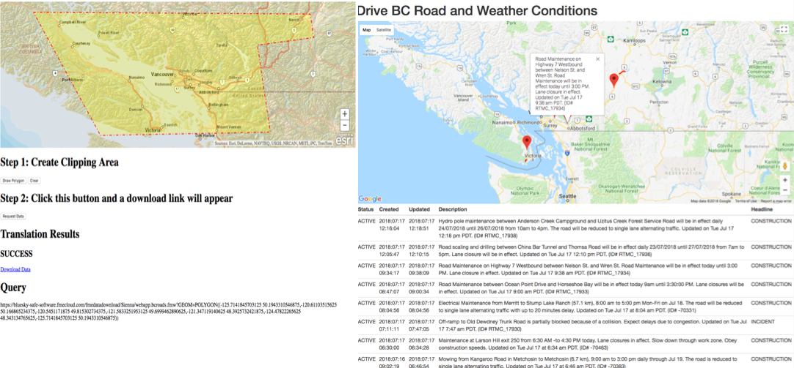

### 9.3 集成外部地图工具和FME Server Javascript API

在第一个练习中，我们构建了一个允许用户下载所请求数据的表单。但是，用户很难测量下载所需的坐标。可以合并ESRI地图，以便用户可以在地图上选择他们想要查看的区域。

此示例允许用户使用ArcGIS JavaScript API中的绘图工具绘制点，线或多边形。在地图上创建几何图形后，将其作为众所周知的文本（WKT）发送到工作空间。工作空间将该几何图形转换为GeoJSON并将其流回Web应用程序。
