  

    <article class="markdown-body entry-content" itemprop="text"><table>
<tbody><tr>
<td width="25%">
<i></i>
练习16
</td>
<td>
 使用Esri Maps进行数据可视化 
</td>
</tr>
<tr>
<td>数据</td>
<td>无</td>
</tr>
<tr>
<td>总体目标</td>
<td> 演示如何将工作空间集成到Web应用程序中，并允许用户根据他们在地图上的选择来设置工作空间中的参数。  </td>
</tr>
<tr>
<td>演示</td>
<td> Esri Maps集成，DriveBC API，数据流和数据可视化。 </td>
</tr>
<tr>
<td>完成的HTML </td>
<td>C:\FMEData2018\Resources\RESTAPI\mySecondApp\www\index.html
在  </td>
</tr>
<tr>
<td>完成JavaScript </td>
<td>C:\FMEData2018\Resources\RESTAPI\mySecondApp\www\arcgismap.js
  </td>
</tr>
<tr>
<td>完成的工作区 </td>
<td>C:\FMEData2018\Resources\RESTAPI\mySecondApp\fme\webapp.bcroads.fmw
 </td>
</tr>
</tbody></table>

在本练习中，我们将创建一个允许用户选择区域的地图。此选择将发送到工作空间。在工作空间中，所选区域将剪切当前的事故。系统会向用户发送带有Google地图的链接，其中包含所选区域内的事故。本练习旨在演示如何在工作空间中使用其他API，如何将从用户选择的坐标引入工作空间，以及如何将数据流回用户。

<table>
<tbody><tr>
<td>
<i></i>
警告
</td>
</tr>
<tr>
<td>

要使本练习正常工作，您需要完成 <a href="https://safe-software.gitbooks.io/fme-server-rest-api-training-2018/content/FMESERVER_RESTAPI8Session2/8.3.Exercise.SettingUp.html" rel="nofollow">练习14</a>或使用现有的Web服务器进行测试。

</td>
</tr>
</tbody></table>
<h4>设置HTML文件</h4>

此应用程序分为几个不同的文档。许多网站分别存储他们的JavaScript，CSS和HTML页面，以促进更清洁的工作流程。

 <strong>1）创建index.html文档</strong>

创建一个HTML文件并将其另存为index.html。将此文件保存在此处的mySecondApp文件夹中：C：\ FMEData2018 \ Resources \ RESTAPI \ mySecondApp。

 <strong>2）复制并粘贴HTML文件的头部分</strong>

将以下代码复制并粘贴到index.html文件中：

<pre>&lt;html&gt;

&lt;head&gt;
    &lt;title&gt;ArcGIS Maps Example from FME Server Developer Playground&lt;/title&gt;
    &lt;!-- Styles for example --&gt;
    &lt;link rel="stylesheet" href="https://playground.fmeserver.com/css/FMEServerExamples.css" type="text/css" /&gt;
    &lt;!-- Include FMEServer.js --&gt;
    &lt;script type="text/javascript" src="https://api.fmeserver.com/js/v1.2/FMEServer.js"&gt;&lt;/script&gt;
    &lt;!-- The following are Required for ArcGIS Maps --&gt;
    &lt;link rel="stylesheet" href="https://js.arcgis.com/3.8/js/esri/css/esri.css" /&gt;
    &lt;script type="text/javascript" src="https://js.arcgis.com/3.8/"&gt;&lt;/script&gt;
    &lt;!-- Connects to our JavaScript file --&gt;
    &lt;script type="text/javascript" src="arcgismap.js"&gt;&lt;/script&gt;
&lt;/head&gt;
&lt;!--PLACE FUTURE CODE HERE--&gt;

&lt;/html&gt;</pre>

这个头部看起来非常类似于上一个练习中的部分。不同之处在于还有一些额外的代码行：

首先，我们需要这段代码将Esri CSS链接到我们的代码。Esri CSS将样式组件添加到地图中。然后JavaScript链接到Esri制作的JavaScript库。

我们还添加了这行代码：

 我们将编写一个JavaScript文件来使我们的HTML动态化。最好将JavaScript与HTML分开，以确保每个文件尽可能干净且易于使用。

 <strong>3）将主体复制并粘贴到索引文件中</strong>

接下来，我们将主体粘贴到index.html文件中。此部分属于这里以后的代码注释：

<pre>&lt;!-- PLACE FUTURE CODE HERE--&gt;

&lt;body&gt;
    &lt;h4&gt;This example clips an area selected by the user to BC Traffic Data.&lt;/h4&gt;
    &lt;form id="exampleForm"&gt;
        &lt;label&gt;&lt;b&gt;Step 1&lt;/b&gt; - Draw the Polygon: &lt;/label&gt;
        &lt;input id="draw" type="button" value="Draw" /&gt;
        &lt;input id="reset" type="button" value="Reset" /&gt;&lt;br /&gt;
        &lt;div id="mapDiv"&gt;&lt;/div&gt;
        &lt;label&gt;&lt;b&gt;Step 2&lt;/b&gt; - Submit the Request to FME Server: &lt;/label&gt;
        &lt;input type="button" onclick="processClip();" value="Clip Data To Area" /&gt;
    &lt;/form&gt;
&lt;/body&gt;</pre>

首先，我们有一个非常简单的标题来解释应用程序的目的。然后我们创建一个表单，使用按钮激活JavaScript中的不同函数。

 <strong>4）检查index.html文件的组件</strong>

转到您的Web目录并导航到您创建文件的位置。在页面上单击鼠标右键，然后选择“检查”。你应该看到这个：

左侧是页面的外观，右侧是HTML文件。

当您将光标悬停在页面上时，它将在页面上选择不同的元素并突出显示它们存在的位置。它还会显示我们可能遇到的任何错误。我们目前有错误，因为我们没有初始化地图所需的代码。

为了使这个页面有效，我们需要代码：

<ul>
<li>初始化地图</li>
<li>绘制多边形</li>
<li>重置多边形</li>
<li>将请求提交给FME服务器</li>
</ul>

我们现在可以启动JavaScript来创建这些功能！

 <strong>5）创建一个新的JavaScript文件</strong>

现在，我们可以创建一个新的JavaScript文件，标题为arcgismap.js并将其保存在与index.html相同的文件夹中。

 <strong>6）添加代码以初始化地图</strong>

将以下代码粘贴到我们刚刚创建的JavaScript文件中。确保更改您的服务器和令牌。

<pre>var map, toolbar, clippingGeometry;

   window.onload = function()
   {
       require([
           "esri/map", "esri/toolbars/draw",
           "esri/graphic", "esri/geometry/webMercatorUtils",
           "esri/symbols/SimpleLineSymbol", "esri/symbols/SimpleFillSymbol",
           "dojo/_base/Color", "dojo/dom", "dojo/on", "dojo/domReady!"
       ], function(
           Map, Draw,
           Graphic, webMercatorUtils,
           SimpleLineSymbol, SimpleFillSymbol,
           Color, dom, on
       )
       {
           map = new Map("mapDiv",
           {
               basemap: "streets",
               center: [-123.114166, 49.27],
               zoom: 7,
               minZoom: 4,
               smartNavigation: false
           });

           map.on("load", function()
           {
               toolbar = new Draw(map);

               dojo.connect(toolbar, "onDrawEnd", addToMap);

               on(dom.byId("draw"), "click", drawPolygon);
               on(dom.byId("reset"), "click", drawReset);
           });

           function addToMap(geometry)
           {
               var symbol = new SimpleFillSymbol(
                   SimpleFillSymbol.STYLE_SOLID,
                   new SimpleLineSymbol(
                       SimpleLineSymbol.STYLE_DASHDOT,
                       new Color([255, 0, 0]), 2
                   ),
                   new Color([255, 255, 0, 0.25])
               );
               geometry = webMercatorUtils.webMercatorToGeographic(geometry);
               var graphic = new Graphic(geometry, symbol);
               map.graphics.clear();
               map.graphics.add(graphic);
               toolbar.deactivate(Draw.POLYGON);
               clippingGeometry = geometry.rings[0];
           }

           function drawPolygon()
           {
               drawReset();
               toolbar.activate(esri.toolbars.Draw.POLYGON);
           }

           function drawReset()
           {
               toolbar.deactivate(esri.toolbars.Draw.POLYGON);
               map.graphics.clear();
           }
       });
       FMEServer.init(
       {
           server: "https://demos-safe-software.fmecloud.com", //Update to your FME Server hostname - on FME training machines this is http://fmetraining
           token: "568c604bc1f235bbe137c514e7c61a8436043070" //Update to your fmetoken
       });
   };</pre>

 

<strong>7）刷新index.html页面并测试它</strong>

此代码使用Esri JavaScript API在页面上显示地图并激活绘图和重置功能。如果您在其他应用程序中使用此代码，则大部分代码都可以保持不变。但是，您可能希望更新下面显示的地图设置：

<a target="_blank" rel="noopener noreferrer" href="./Images/10.2.3.map.png">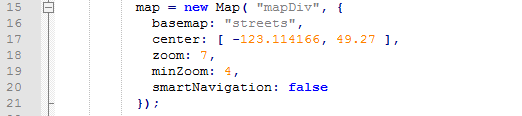</a>

在这里，您可以调整地图的中心（地图所在的位置），缩放和最小缩放。

或者，您可以更改存储用户指定的几何图形的变量。

这里我们说明第一个几何环将在剪切几何。如果您愿意，我们可以用这行代码向用户显示坐标:

<pre>    alert(JSON.stringify(clippingGeometry));</pre>

 <strong>8）将以下函数添加到JavaScript文件中。</strong>

在我们插入的第一个函数下面，我们需要再插入两个。这些函数运行数据下载服务并显示FME Server返回的结果。

<pre>function showResults(json)
{
    // The following is to write out the full return object
    // for visualization of the example
    var hr = document.createElement("hr");
    var div = document.createElement("div");

    // This extracts the download link to the clipped data
    var download = json.serviceResponse.url;

    div.innerHTML += "&lt;hr&gt;&lt;a href=\"" + download + "\"&gt;Download Result&lt;/a&gt;";
    document.body.appendChild(hr);
    document.body.appendChild(div);
}

function processClip()
{
    var repository = "RESTTraining";
    var workspace = "webapp.bcroads.fmw";

    // Process the clippingGeometry into a WKT Polygon string
    var geometry = "POLYGON((";

    for (var i = 0; i &lt; clippingGeometry.length; i++)
    {
        var lat = clippingGeometry[i][1];
        var lng = clippingGeometry[i][0];
        geometry += lng + " " + lat + ",";
    }

    // Remove trailing , from string
    geometry = geometry.substr(0, geometry.length - 1);
    geometry += "))";

    var params = "GEOM=" + geometry;

    // Use the FME Server Data Download Service
    FMEServer.runDataDownload(repository, workspace, params, showResults);
}</pre>

首先，我们还没有将工作空间上传到我们的服务器，因此它们目前无法工作，但让我们讨论如何重新创建这些函数。我们使用processClip函数的目标是使用runDataDownload函数。在<a href="https://playground.fmeserver.com/javascript/data-delivery/arcgis-maps-integration/" rel="nofollow">ArcGIS的地图集成</a>文档可以在 FME Server Playground被找到。

<a target="_blank" rel="noopener noreferrer" href="./Images/10.1.3.DataDownload.png">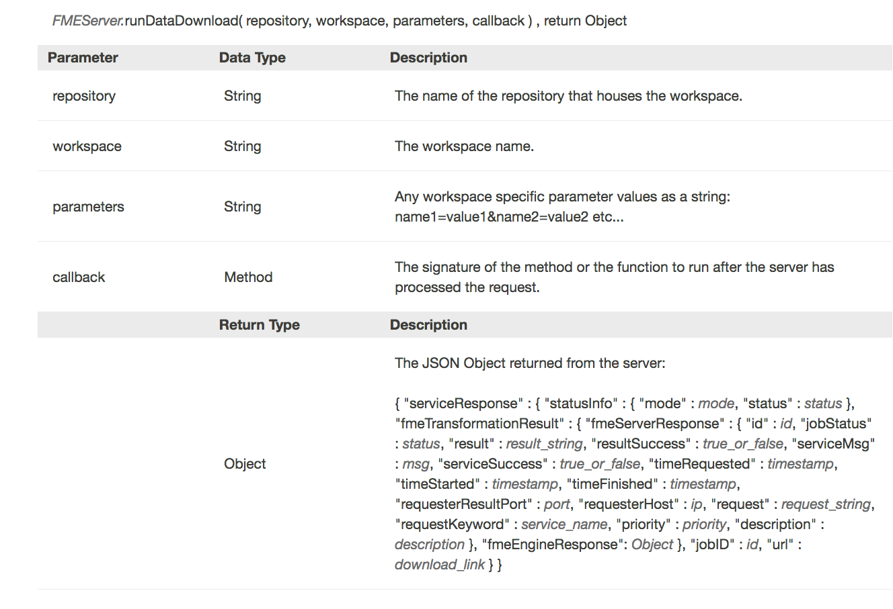</a>

要使用此函数，我们需要以下变量：

<ul>
<li>存储库</li>
<li>工作空间</li>
<li>参数</li>
<li>回调</li>
</ul>

要使用此函数，我们必须在代码中包含此函数：

<a target="_blank" rel="noopener noreferrer" href="./Images/10.2.5.DataDownload.png">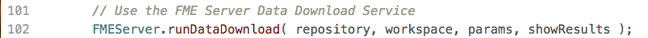</a>

然后我们可以开始指定变量，第一个也是最简单的是存储库和工作空间。

接下来，我们可以创建参数变量。通过工作空间，我们将创建我们需要知道所有高级参数，以便能够使用这个调用。因此，如果您在实际情况下使用此调用，则最好先创建工作空间。但是，工作空间中唯一的参数是GEOM，它将接受来自我们应用程序的Well Known Text（WKT）。

Well Known Text是一种格式，可以创建如下所示的字符串：

<pre><code>POLYGON((-123.31968482260129 49.05758039932133,-123.64927466635129 50.269944861577876,-119.33714087728879 50.34712582770931))
</code></pre>

在JavaScript中，我们可以将一些字符串添加到一起以创建完整参数，例如我们可以创建一个函数：

<pre>    a="app";
    b="le";
    apple= a+b;</pre>

apple将​​等于字符串“apple”。

这也可以通过以下语句完成：

<
<pre>    a= "The REST API is ";
    a += "fun";</pre>

a将等于“The REST API is fun”。

我们将使用此方法来创建此调用运行所需的参数字符串。

首先，我们从声明输入将是Polygon（多边形）开始。

现在，我们需要输入用户选择的坐标。在程序的早期，我们指定clippingGeometry将包含用户选择的几何图形。

我们需要一个函数来对clippingGeometry变量中的所有数据进行排序。为此，我们将使用for循环。当没有剩余数据时，此循环将结束。

重要的是要注意JavaScript中数组中元素的索引从0开始而不是1，lng(经度），我们分配第一个坐标读取，然后lat（纬度）位于第二个位置。然后通过以下语句添加几何字符串：

这将给我们留下以下声明：

要完成几何字符串，我们需要删除结尾的逗号并关闭括号。

我们现在已经为参数创建了语句。

您创建的每个参数都将具有与之关联的名称。在我们的例子中，我们的参数名称将是GEOM。

最后，我们已经完成了运行DataDownload函数所需的参数。我们只需要一个函数来接受DataDownload函数生成的json，所以我们使用showResults函数。

再次使用该文档，我们可以从FME Server查看JSON的外观：

要查找下载链接，我们使用以下语句：

这说明了URL下载链接的位置，它位于JSON内，serviceResponse里以及URL下面。你可以在这里找到这个：

<a target="_blank" rel="noopener noreferrer" href="./Images/10.1.5.URL.png">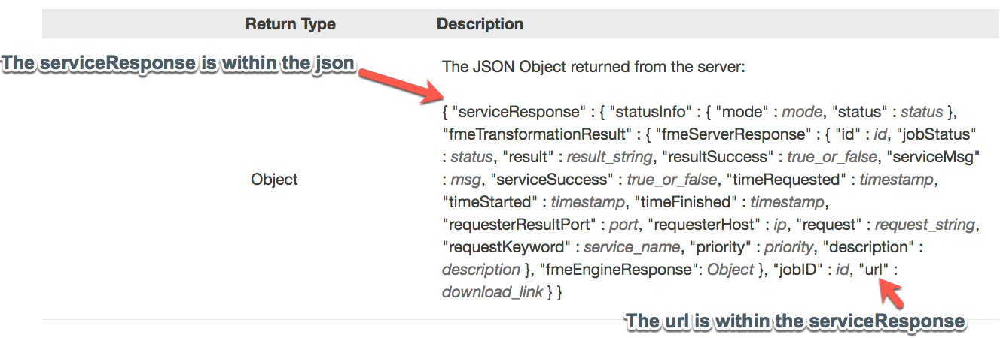</a>

现在我们有了URL，我们可以在这里的链接中显示URL：

<pre><code>div.innerHTML += "&lt;hr&gt;&lt;a href=\""+download+"\"&gt;Download Result&lt;/a&gt;";
</code></pre>

我们现在有一个应用程序将接受用户选择的坐标，然后使用DataDownload服务返回该区域中的函数。现在我们可以创建一个工作空间来使用。

<h4>创建工作空间</h4>

 <strong>9）在FME Workbench中打开一个空白工作空间，并将Creator 转换器添加到工作空间</strong>

 <strong>10）添加GeometryReplacer</strong>

第一步是从Web应用程序获取用户输入。如果您查看代码的这一部分，您可以看到我们设置的代码是从用户输入接受一个well-known文本字符串并将其放在一个名为GEOM的参数中。

<pre><code>var params = "GEOM=" + wktString;
</code></pre>

因此，要将此信息引入工作空间，我们将使用GeometryReplacer。在GeometryReplacer中填写以下参数：

几何编码是OGC Well Known Text。几何源是将创建的用户参数。在几何编码上单击下拉列表，找到用户参数，然后单击“创建用户参数”。

打开的对话框允许我们创建一个新的参数。使用以下参数创建一个：

<strong>Name（名称）:</strong> GEOM

<strong>Published（已发布）:</strong> Yes

<strong>Optional（可选）:</strong> No

<strong>Prompt（提示）:</strong> Area of Interest（感兴趣的区域）

<strong>Default Value（默认值）:</strong> POLYGON((-123.31968482260129 49.05758039932133,-123.64927466635129 50.269944861577876,-119.33714087728879 50.34712582770931))

 <strong>11）添加CoordinateSystemSetter</strong>

在工作空间的这一点上，我们将坐标系统放入系统，并将其转换为几何要素。但是，FME无法知道坐标系是什么。所以我们将它设置为LL84。将CoordinateSystemSetter连接到GeometryReplacer的Output端口。

 <strong>12）添加HTTPCaller</strong>

将HTTPCaller添加到画布并将其附加到Creator。

在本节中，我们使用的是Drive BC API。Drive BC API检索最新的交通信息，并将其转发到您的地图。如果您想了解更多信息，请访问<a href="https://catalogue.data.gov.bc.ca/dataset/open511-drivebc-api" rel="nofollow">Drive BC API网站</a>。

接下来，我们需要添加HTTPCaller以联系Drive BC API。Drive BC API向公众开放，因此无需授权或身份验证。在请求URL下：

<pre><code>http://api.open511.gov.bc.ca/events?format=json&amp;status=ACTIVE
</code></pre>

HTTP方法是GET

HTTPCaller参数应如下所示：

 <strong>13）使用要素缓存运行</strong>

现在，我们将测试工作空间。这将确保工作空间连接到DriveBC API。这也将让我们检查API返回的内容。

首先，将工作空间保存为mySecondApp文件夹中的webapp.bcroads.fmw。要使用要素缓存，请单击工具栏中的“运行”。然后单击使用要素缓存运行。

然后，选择play按钮来运行。

单击HTTPCaller上的放大镜，检查REST API的输出。API返回的JSON存储在response_body中。

在response_body中，您应该看到的结构应该与下面的结构相似。

<pre><code>  {
    "events": [
        {
            "jurisdiction_url": "http://api.open511.gov.bc.ca/jurisdiction",
            "url": "http://api.open511.gov.bc.ca/events/drivebc.ca/DBC-1301",
            "id": "drivebc.ca/DBC-1301",
            "headline": "CONSTRUCTION",
            "status": "ACTIVE",
            "created": "2018-09-04T13:18:13-07:00",
            "updated": "2018-09-04T13:18:13-07:00",
            "description": "Highway 1, westbound. Paving operations planned between Exit 146 and Exit 135: Highway 9 for 11.0 km (Chilliwack). Starting today at 9:00 PM PDT until tomorrow at about 6:30 AM PDT. 28 km west of Hope between Herrling Island and Hwy 9. Last updated today at 1:18 PM PDT. (DBC-1301)",
            "+ivr_message": "Highway 1, westbound. Paving operations planned between Exit 146 and Exit 135: Highway 9 for 11.0 km (Chilliwack). Starting Tuesday, September 4 at 9:00 PM until tomorrow at about 6:30 AM. Last updated Tuesday, September 4 at 1:18 PM.",
            "schedule": {
    "intervals": [
        "2018-09-05T04:00/2018-09-05T13:30"
    ]
},
            "event_type": "CONSTRUCTION",
            "event_subtypes": [
                "ROAD_MAINTENANCE"
            ],
            "severity": "MINOR",
            "geography": {
                "type": "LineString",
                "coordinates": [                    
                    [
                        -121.760359,
                        49.181117
                    ],  
</code></pre>

 <strong>14）添加JSONFragmenter</strong>

在画布上添加JSONFragmenter并将其附加到HTTPCaller。

响应主体将以JSON的长段形式返回。我们需要将其分解并暴露所需的属性。此JSONFragmenter将用于暴露在上面的代码中"events"下列出的属性。

在Source下填写参数：

<strong>输入源：</strong> JSON属性

<strong>JSON属性：</strong> response_body

接下来转到参数部分。

所有重要信息都存储在"事件"类别中，以便在如下的JSON查询下能够访问它：

<pre><code>json["events"][*]
</code></pre>

<strong>片段格式：</strong> JSON

<strong>拒绝不产生片段的要素：</strong>是的

现在我们可以对JSON进行展平来生成表所需的属性。

<em>在“要暴露的属性”部分中，写入以下属性：状态，标题，说明，已创建和已更新。</em>

展平参数应如下所示：

<a target="_blank" rel="noopener noreferrer" href="./Images/10.1.12.JSONF.png">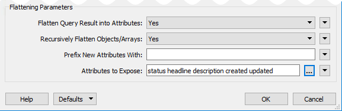</a>

 <strong>15）添加另一个JSONFragmenter</strong>

将另一个JSONFragmenter添加到画布并将其附加到以前的JSONFragmenter。现在，我们需要暴露Geography组件来创建要素。

填写以下参数：

<strong>源</strong>

输入源：JSON属性

JSON属性：response_body

<strong>参数</strong>

JSON查询：json [“geography”]

片段格式：JSON

拒绝不产生片段的要素：是的

<strong>展平参数</strong>

将查询结果展平为属性：否

<a target="_blank" rel="noopener noreferrer" href="./Images/10.1.13.NewJ.png">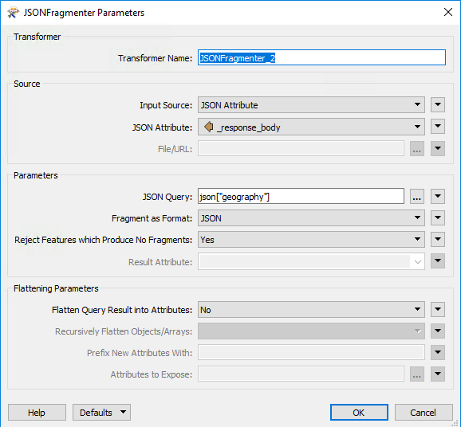</a>

 <strong>16）添加GeometryReplacer</strong>

添加GeometeryReplacer并将其附加到第二个JSONFragmenter。

GeometeryReplacer是一个神奇的变压器。它可以从Response Body读取JSON，并自动创建与之关联的几何图形。

填写以下参数：

<strong>几何编码：</strong> GeoJSON

<strong>几何来源：</strong> response_body

<strong>删除属性：</strong>是

 <strong>17）添加CoordinateSystemSetter</strong>

添加CoordinateSystemSetter并将其附加到GeometryReplacer。

现在，我们需要设置使用的坐标系。坐标系在调用返回的URL中引用。所以我们可以将它设置为LL-WGS84。

目前，工作空间应如下所示：

 <strong>18）添加Clipper转换</strong>

将Clipper Transformer添加到画布并接受当前默认值。

现在我们将使用限幅器变换器来剪切选定区域。限幅器是用户选择的区域，限幅器是BC Drive API的几何形状。

工作空间应如下所示：

 <strong>19）使用要素缓存运行</strong>

现在，我们将测试工作空间。这将确保工作空间正常工作并剪切正确的区域。

选择播放按钮来运行。

单击clipper上“Inside”端口上的放大镜，查看所选区域。

这将打开FME Data Inspector。

FME Data Inspector将显示创建的点和线。要显示背景地图，请转到顶部菜单栏。查找工具，选择FME选项。这将打开FME选项窗口。

背景格式应从None更改为Stamen Maps。然后，选择参数...

选择，地形图列表。选择确定。然后，在FME选项窗口中选择确定。这将激活背景地图。

所有结果都应该在BC。在探索返回的要素后，关闭 Data Inspector。然后，返回FME Workbench。

 <strong>20）添加NoFeaturesTester</strong>

在FME Workbench中开始键入NoFeaturesTester并选择自定义转换器。NoFeaturesTester应该附加到Clipper的Inside端口。该转换将测试是否有输出。如果没有输入，则表示所有要素都在外面或被拒绝。

 <strong>20）添加DateTimeConverter</strong>

添加DateTimeConverter并将其附加到NoFeaturesTester的OUTPUT端口。DateTimeConverter用于更新时间和日期，因此对用户来说更具可读性。

填写以下参数：

<strong>日期时间属性：</strong>已更新已创建

<strong>输入格式：</strong>自动检测FME和ISO格式

<strong>输出格式：</strong>％Y：％m：％d％H：％M：％S

<strong>修复溢出：</strong>没有

<a target="_blank" rel="noopener noreferrer" href="./Images/10.1.17.DateTimeConverter.png">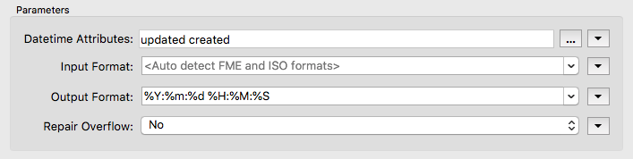</a>

 <strong>21）添加HTMLReportGenerator</strong>

添加HTMLReportGenerator并将其附加到DateTimeConverter。现在，我们已准备好创建包含以下信息的网页。我们需要三个部分，标题，地图和表格。

在页面设置下，找到页面标题框。页面标题应为Drive BC API。

然后，创建标题。在页面内容下选择自定义HTML。在内容设置下，复制并粘贴以下内容：

<pre><code>&lt;h1&gt; Drive BC Road and Weather Conditions &lt;/h1&gt;
</code></pre>

接下来，我们将添加一个地图组件(Map Component)。页面内容应为Map（Google）。然后，内容设置应设置如下：

<strong>标签属性：</strong>描述

<strong>图层颜色：</strong> 255,55,5

<strong>API密钥：</strong>   &lt;&lt;空白&gt;&gt;

目前，我们不打算填写API密钥。由于这是出于开发目的，这是可以的。如果要在生产设置中使用它，则需要API密钥。

如果您希望获得API密钥，请访问此网站<a href="https://developers.google.com/maps/documentation/javascript/get-api-key#quick-guide-to-getting-a-key" rel="nofollow">Google API密钥</a>

<a target="_blank" rel="noopener noreferrer" href="./Images/10.1.19.Map.png">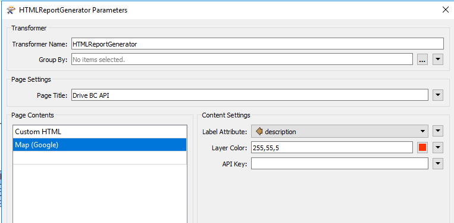</a>

接下来，创建一个表,包含状态，已创建，已更新，描述和标题列。

 <strong>22）添加另一个HTMLReportGenerator</strong>

添加另一个HTMLReportGenerator并将其附加到NoFeaturesTester的NOINPUT端口。

在页面标题框中写入：

Drive BC API

在页面内容下选择标题。然后，在“内容设置”下写入：

在你选择的区域没有发生事故。(There are no incidents in the area you selected.)

 <strong>23）添加HTML写模块</strong>

最后，添加HTML写模块以写入您选择的文件。将HTML写模块附加到HTMLReportGenerators。

<a target="_blank" rel="noopener noreferrer" href="./Images/10.1.17.HTML.png">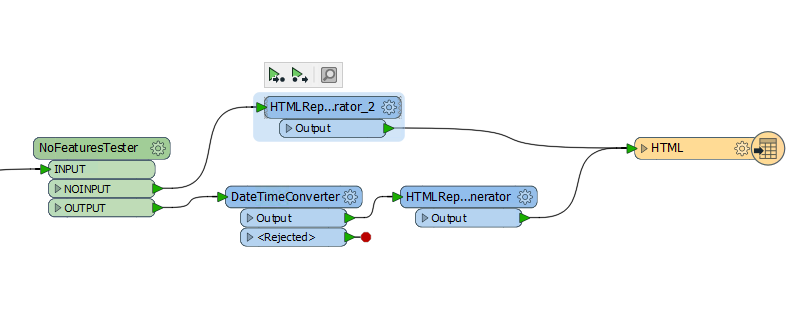</a>

完整工作空间应如下所示：

 <strong>24）保存并运行工作空间</strong>

现在，我们可以保存并运行工作空间以确保一切正常。由于我们没有API密钥，因此我们会收到一条消息，指出这仅用于开发目的。如果我们添加了密钥，我们就会有一个更复杂的页面。

 <strong>25）将工作空间上传到您的服务器。</strong>

将工作空间发布到FME Server。上传到RESTTraining存储库并将工作空间保存为webapp.bcroads.fmw。使用数据下载服务注册工作空间。

<h4>测试应用程序</h4>

步骤1.绘制区域（双击以关闭多边形）

步骤2.选择“剪切数据到区域( Clip Data to Area)”

<a target="_blank" rel="noopener noreferrer" href="./Images/10.1.22.step1and2.png">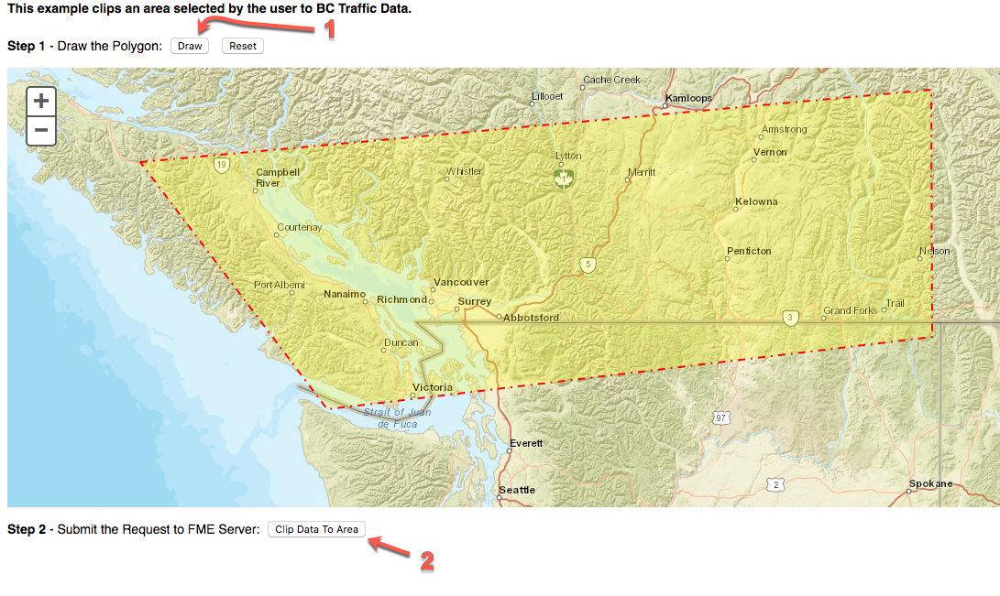</a>

步骤3.下载DataDownload

步骤4.查看文件

<a target="_blank" rel="noopener noreferrer" href="./Images/10.1.24.step4.png">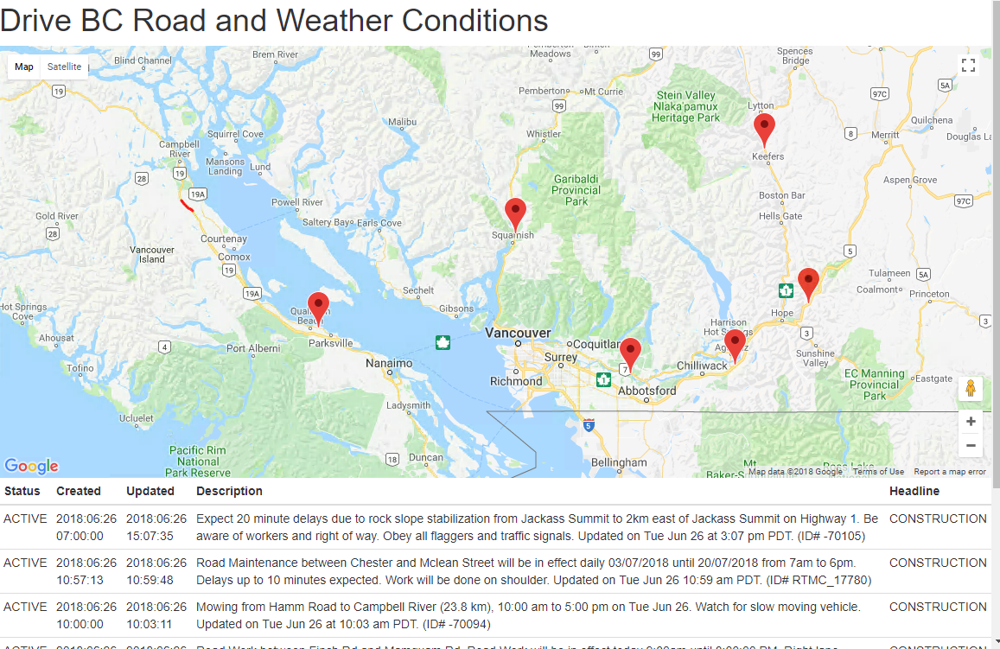</a>

<table>
<tbody><tr>
<td>
<i></i>
恭喜
</td>
</tr>
<tr>
<td>

通过完成本练习，您已学会如何：
 
<ul><li>使用ArcGIS地图将坐标发送到工作空间</li>
<li>在工作空间使用中在线资源的坐标</li>
<li>使用FME Server JavaScript API中的DataDownload函数</li>
<li>在工作空间中使用外部API</li>

</ul></td>
</tr>
</tbody></table>
</article>
  

