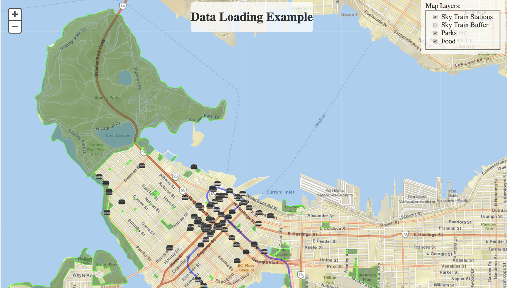

### 9.4 使用ArcGIS Map进行数据可视化

在此示例中，我们将使用Esri底图创建地图并使用Esri JavaScript函数。在此示例中，选中框时，将加载KML图层。取消选中该框后，该图层将不可见。这是将实时数据流式传输到地图的一个很好的例子。虽然公园和轻轨站可能不会经常更新，但此演示可能会应用于实时数据。有关Esri JavaScript的更多信息，请参阅 [ArcGIS Developers](https://developers.arcgis.com/javascript/latest/sample-code/intro-layers/index.html) 文档。

请注意，上传工作空间的存储库必须具有访客权限。如果您需要知道如何执行此操作，请转至 [第8.1节](https://safe-software.gitbooks.io/fme-server-rest-api-training-2018/content/FMESERVER_RESTAPI8Session2/8.1.BestPractices.html) 并查看设置权限。
