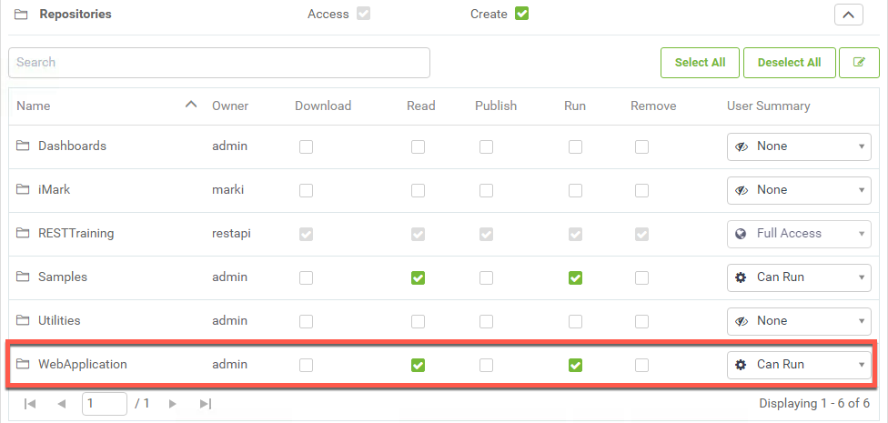
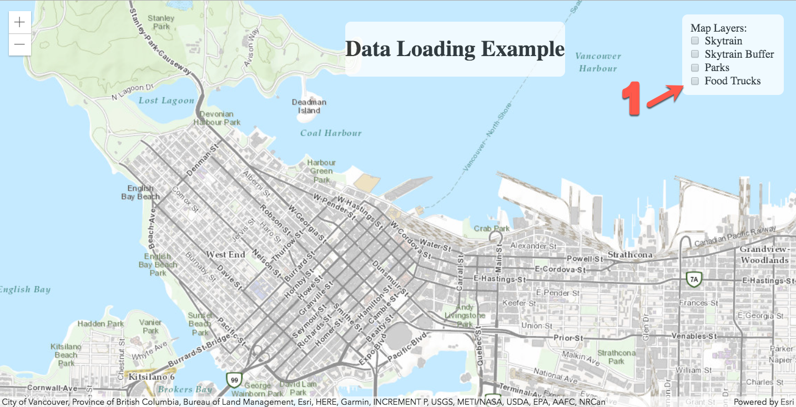

  <div id="readme" class="readme blob instapaper_body">
    <article class="markdown-body entry-content" itemprop="text"><table>
<tbody><tr>
<td width="25%">
<i></i><font style="vertical-align: inherit;"><font style="vertical-align: inherit;">
练习17
</font></font></td>
<td><font style="vertical-align: inherit;"><font style="vertical-align: inherit;">
数据可视化 
</font></font></td>
</tr>
<tr>
<td><font style="vertical-align: inherit;"><font style="vertical-align: inherit;">数据</font></font></td>
<td><font style="vertical-align: inherit;"><font style="vertical-align: inherit;">无</font></font></td>
</tr>
<tr>
<td><font style="vertical-align: inherit;"><font style="vertical-align: inherit;">总体目标</font></font></td>
<td><font style="vertical-align: inherit;"><font style="vertical-align: inherit;">使用Esri JavaScript和Power of FME创建易于使用且有趣的地图与实时数据。 </font></font></td>
</tr>
<tr>
<td><font style="vertical-align: inherit;"><font style="vertical-align: inherit;">演示</font></font></td>
<td><font style="vertical-align: inherit;"><font style="vertical-align: inherit;">如何在工作空间中使用Esri JavaScript，数据流直接URL和在线资源。 </font></font></td>
</tr>
<tr>
<td><font style="vertical-align: inherit;"><font style="vertical-align: inherit;">完成的HTML </font></font></td>
<td><font style="vertical-align: inherit;"><font style="vertical-align: inherit;">C:\FMEData2018\Resources\RESTAPI\myThirdApp\myThirdApp.html
  </font></font></td>
</tr>
<tr>
<td><font style="vertical-align: inherit;"><font style="vertical-align: inherit;"> 项目 </font></font></td>
<td><font style="vertical-align: inherit;"><font style="vertical-align: inherit;">C:\FMEData2018\Resources\RESTAPI\myThirdApp\WebApplication.fsproject
 </font></font></td>
</tr>
</tbody></table>
<p><font style="vertical-align: inherit;"><font style="vertical-align: inherit;">本练习旨在演示如何将从工作空间生成的KML图层流式传输到在线地图。</font><font style="vertical-align: inherit;">此方法可用于每次激活该层时都持续更新的数据，该工作空间将运行并生成新的KML。</font></font></p>

<table>
<tbody><tr>
<td>
<i></i><font style="vertical-align: inherit;"><font style="vertical-align: inherit;">
警告
</font></font></td>
</tr>
<tr>
<td><font style="vertical-align: inherit;"><font style="vertical-align: inherit;">

要使本练习正常工作，您需要完成 </font></font><a href="../FMESERVER_RESTAPI8Session2/8.3.Exercise.SettingUp.md" rel="nofollow"><font style="vertical-align: inherit;"><font style="vertical-align: inherit;">练习14</font></font></a><font style="vertical-align: inherit;"><font style="vertical-align: inherit;">或使用现有的Web服务器进行测试。

</font></font></td>
</tr>
</tbody></table>
<p><br><strong><font style="vertical-align: inherit;"><font style="vertical-align: inherit;">1）在文本编辑器中创建一个新文件</font></font></strong></p>
<p><font style="vertical-align: inherit;"><font style="vertical-align: inherit;">在文本编辑器中创建一个新文件，并将其另存为myThirdApp.html。</font><font style="vertical-align: inherit;">将其保存在此处的REST API文件夹中：FMEData2018 / Resources / RESTAPI。</font></font></p>
<p><br><strong><font style="vertical-align: inherit;"><font style="vertical-align: inherit;">2）将以下头代码粘贴到新文件中</font></font></strong></p>

```JavaScript
<head>
    <meta charset="utf-8">
    <meta name="viewport" content="initial-scale=1,maximum-scale=1,user-scalable=no">
    <title>Data Loading Example</title>

    <link rel="stylesheet" href="https://js.arcgis.com/4.7/esri/css/main.css">
    <script src="https://js.arcgis.com/4.7/"></script>

</head>
```

<p><font style="vertical-align: inherit;"><font style="vertical-align: inherit;">这是访问ESRI JavaScript所需的代码，我们将使用它来托管通过FME Server流式传输到应用程序的KML图层。</font></font></p>
<p><br><strong><font style="vertical-align: inherit;"><font style="vertical-align: inherit;">3）将以下主体粘贴到HTML页面中</font></font></strong></p>

```JavaScript
<body>
    <div id="viewDiv"></div>
    <div id="heading">
        <h1> Data Loading Example </h1>
    </div>
    <span id="layerToggle">
        <legend> Map Layers: </legend>
        <input type="checkbox" id="streetsLyr"> Skytrain
        <br>
        <input type="checkbox" id="skytrainbufferLyr"> Skytrain Buffer
        <br>
        <input type="checkbox" id="parksLyr"> Parks
        <br>
        <input type="checkbox" id="foodLyr"> Food Trucks

    </span>
</body>
```

<p><font style="vertical-align: inherit;"><font style="vertical-align: inherit;">上面的代码在网页上创建了标题和复选框列表。</font><font style="vertical-align: inherit;">这些复选框将代表地图的图层。</font><font style="vertical-align: inherit;">激活复选框后; </font><font style="vertical-align: inherit;">这将触发启用数据流的函数。</font></font></p>
<p><br><strong><font style="vertical-align: inherit;"><font style="vertical-align: inherit;">4）在body标签下面粘贴以下样式组件</font></font></strong></p>
<table>
<tbody><tr>
<td>
<i></i><font style="vertical-align: inherit;"><font style="vertical-align: inherit;">
技巧
</font></font></td>
</tr>
<tr>
<td><font style="vertical-align: inherit;"><font style="vertical-align: inherit;">

*以下CSS源自 </font></font><a href="https://developers.arcgis.com/javascript/latest/sample-code/intro-layers/index.html" rel="nofollow"><font style="vertical-align: inherit;"><font style="vertical-align: inherit;">ArcGIS图层简介</font></font></a><font style="vertical-align: inherit;"><font style="vertical-align: inherit;"> *

</font></font></td>
</tr>
</tbody></table>

```CSS
<style type="text/css">
/* CSS from https://developers.arcgis.com/javascript/latest/sample-code/intro-layers/index.html*/

#heading {
    position: absolute;
    text-align: center;
    z-index: 99;
    background-color: white;
    border-radius: 8px;
    margin: 0 auto;
    max-width: 700px;
    left: 500px;
    top: 30px;
    opacity: 0.75;
}

html,
body,
#viewDiv {
    padding: 0;
    margin: 0;
    height: 100%;
    width: 100%;
}

#layerToggle {
    top: 20px;
    right: 20px;
    position: absolute;
    z-index: 99;
    background-color: white;
    border-radius: 8px;
    padding: 10px;
    opacity: 0.75;
}
</style>

```

<p><br><strong><font style="vertical-align: inherit;"><font style="vertical-align: inherit;">5）导航到FME Server中的项目</font></font></strong></p>
<p><font style="vertical-align: inherit;"><font style="vertical-align: inherit;">访问localhost / fmeserver打开FME Server。</font><font style="vertical-align: inherit;">接下来，查看左侧面板，然后单击“项目”。</font></font></p>
<p><br><strong><font style="vertical-align: inherit;"><font style="vertical-align: inherit;">6）导入项目文件夹</font></font></strong></p>
<p><font style="vertical-align: inherit;"><font style="vertical-align: inherit;">单击“导入”按钮。</font></font></p>
<p><a target="_blank" rel="noopener noreferrer" href="./Images/11.1.1.Import.png"></a></p>
<p><font style="vertical-align: inherit;"><font style="vertical-align: inherit;">下一步是上传包含此Web应用程序所需的存储库和工作空间的项目文件夹。</font></font></p>
<p><font style="vertical-align: inherit;"><font style="vertical-align: inherit;">转到文件资源管理器窗口。</font><font style="vertical-align: inherit;">导航FMEData2018文件夹，单击“资源”，选择“REST API”，然后选择“myThirdApp”。</font></font></p>
<p><font style="vertical-align: inherit;"><font style="vertical-align: inherit;">在此文件夹中，有两个.fsproject文件。</font><font style="vertical-align: inherit;">WebApplication项目包含Web应用程序所需的工作空间和存储库。</font></font></p>
<p><font style="vertical-align: inherit;"><font style="vertical-align: inherit;">另外，上传BestPracticeAnalysis.fsproject文件。</font><font style="vertical-align: inherit;">此项目文件夹包含用于KMLStyler的其他图像。</font><font style="vertical-align: inherit;">这允许用户在创建KML时具有更多符号化选项。</font></font></p>
<p><font style="vertical-align: inherit;"><font style="vertical-align: inherit;">将每个文件拖放到“删除要上传的文件(Drop file to upload)”区域，一次一个。</font><font style="vertical-align: inherit;">然后，单击“导入”。</font></font></p>
<p><br><strong><font style="vertical-align: inherit;"><font style="vertical-align: inherit;">7）授予Guest帐户访问WebApplication存储库的权限</font></font></strong></p>
<p><font style="vertical-align: inherit;"><font style="vertical-align: inherit;">要授予存储库Guest权限，您必须访问FME Server。</font><font style="vertical-align: inherit;">首先，查看FME Server的左侧面板。</font><font style="vertical-align: inherit;">查找安全性，然后查找用户。</font></font></p>
<p><a target="_blank" rel="noopener noreferrer" href="./Images/11.1.2.Users.png"></a></p>
<p><font style="vertical-align: inherit;"><font style="vertical-align: inherit;">进入“用户”页面后，</font></font><strong><font style="vertical-align: inherit;"><font style="vertical-align: inherit;">单击“Guest”</font></font></strong></p>
<p><font style="vertical-align: inherit;"><font style="vertical-align: inherit;">向下滚动到权限并展开存储库选项卡。</font><font style="vertical-align: inherit;">然后检查读取和运行权限。</font></font></p>
<p><a target="_blank" rel="noopener noreferrer" href="./Images/11.1.3.GuestPermissions.png"></a></p>
<p><br><strong><font style="vertical-align: inherit;"><font style="vertical-align: inherit;">8）将restapi帐户访问权限提供给WebApplication存储库（如果您在课程前面创建了此用户）</font></font></strong></p>
<p><font style="vertical-align: inherit;"><font style="vertical-align: inherit;">restapi用户是在</font><font style="vertical-align: inherit;">课程</font></font><a href="../FMESERVER_RESTAPI1Overview/1.5.UserCreation.md" rel="nofollow"><font style="vertical-align: inherit;"><font style="vertical-align: inherit;">练习1</font></font></a><font style="vertical-align: inherit;"><font style="vertical-align: inherit;">中</font><font style="vertical-align: inherit;">创建的，</font><font style="vertical-align: inherit;">以减少与使用管理令牌相关的任何安全风险。</font></font></p>
<p><font style="vertical-align: inherit;"><font style="vertical-align: inherit;">在同一个用户页面上，</font></font><strong><font style="vertical-align: inherit;"><font style="vertical-align: inherit;">单击restapi。</font></font></strong></p>
<p><font style="vertical-align: inherit;"><font style="vertical-align: inherit;">向下滚动到权限并展开存储库选项卡。</font><font style="vertical-align: inherit;">然后，检查读取和运行权限。</font><font style="vertical-align: inherit;">即使restapi帐户导入了项目，</font><font style="vertical-align: inherit;">也无法保证会自动授予用户访问文件的权限。</font></font></p>
<p><a target="_blank" rel="noopener noreferrer" href="./Images/11.1.4.restapipermissions.png"></a></p>
<p><br><strong><font style="vertical-align: inherit;"><font style="vertical-align: inherit;">9）在CSS上面添加以下代码，但要在主体内</font></font></strong></p>

```JavaScript
<script>
    require([
            "esri/Map",
            "esri/views/MapView",
            "esri/layers/KMLLayer",
            "dojo/dom",
            "dojo/on",
            "dojo/domReady!"
        ],
        function(
            Map, MapView, KMLLayer, dom, on
        )
        {
            // ALL Future Code Placed Here
        }); // End of JavaScript
</script>
```

<p><font style="vertical-align: inherit;"><font style="vertical-align: inherit;">此部分导入此Web应用程序运行所需的ESRI组件。</font><font style="vertical-align: inherit;">其余代码将需要存在于ALL Future Code Placed here的方括号内。</font></font></p>
<p><br><strong><font style="vertical-align: inherit;"><font style="vertical-align: inherit;">10）在这里放置的ALL Future代码注释之后添加以下代码</font></font></strong></p>
<br>
<p><em><font style="vertical-align: inherit;"><font style="vertical-align: inherit;">将IP地址更新为您自己的IP地址</font></font></em></p>

```JavaScript
var transportationLyr = new KMLLayer(
{
    url: "http://52.xx.xxx.xxx/fmedatastreaming/WebApplication/webapp.skytrains.fmw?SourceDataset_ESRISHAPE=ftp%3A%2F%2Fwebftp.vancouver.ca%2FOpenData%2Fshape%2Fshape_rapid_transit.zip", // Skytrain Layer
    id: "skytrainlayer",
    visible: false
});

var skytrainbufferLyr = new KMLLayer(
{
    url: "http://52.xx.xxx.xxx/fmedatastreaming/WebApplication/webapp.skytrainbuffer.fmw?", // Skytrain Buffer Layer
    id: "skytrainbufferlayer",
    visible: false
});
var parksLyr = new KMLLayer(
{
    url: "http://52.xx.xxx.xxx/fmedatastreaming/WebApplication/webapp.parks.fmw?SourceDataset_ESRISHAPE=ftp%3A%2F%2Fwebftp.vancouver.ca%2FOpenData%2Fshape%2Fpark_polygons_shp.zip&DestDataset_OGCKML=C%3A%5CUsers%5CAdministrator%5CDocuments%5CFME%5CWorkspaces%5Coutput.kml", // Parks Layer
    id: "parkslayer",
    visible: false
});
var foodLyr = new KMLLayer(
{
    url: "http://52.xx.xxx.xxx/fmedatastreaming/WebApplication/webapp.foodTrucks.fmw?DestDataset_OGCKML=%24(FME_SHAREDRESOURCE_DATA)%2FSienna%2FOutput%2FfoodTrucks.kml", // Food Truck Layer
    id: "foodlayer",
    visible: false
});
```

<p><em><font style="vertical-align: inherit;"><font style="vertical-align: inherit;">确保使用您的公共IP地址更新直接URL</font></font></em></p>
<p><font style="vertical-align: inherit;"><font style="vertical-align: inherit;">此代码用于地图的图层。</font><font style="vertical-align: inherit;">在这里，我们使用ESRI函数KMLLayer，这将从服务器的直接URL创建一个层。</font><font style="vertical-align: inherit;">对于每个图层，都需要一个id。</font><font style="vertical-align: inherit;">此外，可见性（ visibility）最初应设置为false。</font></font></p>
<p><br><strong><font style="vertical-align: inherit;"><font style="vertical-align: inherit;">11）添加以下代码以初始化底图</font></font></strong></p>
<p><font style="vertical-align: inherit;"><font style="vertical-align: inherit;">此代码应直接添加到数据流链接下方。</font></font></p>

```JavaScript
/*****************************************************************
* Initialize the basemap
*****************************************************************/
var map = new Map(
{
basemap: "topo"
});
```

<p><br><strong><font style="vertical-align: inherit;"><font style="vertical-align: inherit;">12）添加代码以将图层添加到地图中</font></font></strong></p>

```JavaScript
/*****************************************************************
 * Add the layers to the map
 *****************************************************************/
map.add(transportationLyr);
map.add(skytrainbufferLyr);
map.add(parksLyr);
map.add(foodLyr);

```

<p><br><strong><font style="vertical-align: inherit;"><font style="vertical-align: inherit;">13）添加代码以调整底图的视图</font></font></strong></p>

```JavaScript
/*****************************************************************
 * Creates the view for the basemap, adjusts the center and the zoom level.
 *****************************************************************/
var view = new MapView(
{
    container: "viewDiv",
    map: map,
    center: [-123.10, 49.268],
    zoom: 14
});
```

<p><br><strong><font style="vertical-align: inherit;"><font style="vertical-align: inherit;">14）添加代码以创建切换变量</font></font></strong></p>

```JavaScript
/*****************************************************************
 * Variables are created for the Toggles, these
 * toggles are attached to the ids assigned to the checkboxes
 *****************************************************************/
var streetsLyrToggle = dom.byId("streetsLyr");
var skytrainbufferLyrToggle = dom.byId("skytrainbufferLyr");
var parksLyrToggle = dom.byId("parksLyr");
var foodLyrToggle = dom.byId("foodLyr");
```

<p><br><strong><font style="vertical-align: inherit;"><font style="vertical-align: inherit;">15）添加代码以切换图层的可见性</font></font></strong></p>

```JavaScript
/*****************************************************************
 * The following code manipulates the visibility of the layer.
 * When the layer is checked then the layer becomes visible.
 *******************************************************************/
on(streetsLyrToggle, "change", function()
{
    transportationLyr.visible = streetsLyrToggle.checked;
});
on(skytrainbufferLyrToggle, "change", function()
{
    skytrainbufferLyr.visible = skytrainbufferLyrToggle.checked;
});
on(parksLyrToggle, "change", function()
{
    parksLyr.visible = parksLyrToggle.checked;
});
on(foodLyrToggle, "change", function()
{
    foodLyr.visible = foodLyrToggle.checked;
})

```

<p><br><strong><font style="vertical-align: inherit;"><font style="vertical-align: inherit;">16）测试页面！</font></font></strong></p>
<p><font style="vertical-align: inherit;"><font style="vertical-align: inherit;">当您测试页面时，您应该能够选择和取消选择不同的图层。</font><font style="vertical-align: inherit;">每个层在您的FME Server上运行一个工作空间。</font></font></p>
<p><a target="_blank" rel="noopener noreferrer" href="./Images/11.1.4.Step1.png"></a></p>
<p><a target="_blank" rel="noopener noreferrer" href="./Images/11.1.5.Step2.png"></a></p>
<p><a target="_blank" rel="noopener noreferrer" href="./Images/11.1.6.Final.png"></a></p>
<hr>

<table>
<tbody><tr>
<td>
<i></i><font style="vertical-align: inherit;"><font style="vertical-align: inherit;">
恭喜
</font></font></td>
</tr>
<tr>
<td><font style="vertical-align: inherit;"><font style="vertical-align: inherit;">

通过完成本练习，您已学会如何：
</font></font><br>
<ul><li><font style="vertical-align: inherit;"><font style="vertical-align: inherit;">使用Esri JavaScript API创建Web应用程序</font></font></li>
<li><font style="vertical-align: inherit;"><font style="vertical-align: inherit;">使用工作空间生成KMLLayer </font></font></li>
<li><font style="vertical-align: inherit;"><font style="vertical-align: inherit;">使用directURL在地图上生成图层 </font></font></li>

</ul></td>
</tr>
</tbody></table>
</article>
  </div>
