  <div id="readme" class="readme blob instapaper_body">
    <article class="markdown-body entry-content" itemprop="text"><table>
<tbody><tr>
<td width="25%">
<i></i><font style="vertical-align: inherit;"><font style="vertical-align: inherit;">
练习18
</font></font></td>
<td><font style="vertical-align: inherit;"><font style="vertical-align: inherit;">
 数据上传和转换 
</font></font></td>
</tr>
<tr>
<td><font style="vertical-align: inherit;"><font style="vertical-align: inherit;">数据</font></font></td>
<td><font style="vertical-align: inherit;"><font style="vertical-align: inherit;">无</font></font></td>
</tr>
<tr>
<td><font style="vertical-align: inherit;"><font style="vertical-align: inherit;">总体目标</font></font></td>
<td><font style="vertical-align: inherit;"><font style="vertical-align: inherit;"> 显示如何使用FME Server JavaScript API将文件上传到FME Server并通过工作空间运行它们。  </font></font></td>
</tr>
<tr>
<td><font style="vertical-align: inherit;"><font style="vertical-align: inherit;">演示</font></font></td>
<td><font style="vertical-align: inherit;"><font style="vertical-align: inherit;"> 如何在Web应用程序中使用getSession，generateOptions，dataUpload函数。 </font></font></td>
</tr>
<tr>
<td><font style="vertical-align: inherit;"><font style="vertical-align: inherit;">完成的HTML </font></font></td>
<td><font style="vertical-align: inherit;"><font style="vertical-align: inherit;">C:\FMEData2018\Resources\RESTAPI\myFourthApp\myFourthApp.html
  </font></font></td>
</tr>
</tbody></table>
<p><font style="vertical-align: inherit;"><font style="vertical-align: inherit;">此应用程序旨在演示数据上传函数并解释其在FME Server中的工作方式。</font><font style="vertical-align: inherit;">完成此应用程序后</font></font></p>

<table>
<tbody><tr>
<td>
<i></i><font style="vertical-align: inherit;"><font style="vertical-align: inherit;">
警告
</font></font></td>
</tr>
<tr>
<td><font style="vertical-align: inherit;"><font style="vertical-align: inherit;">

要使本练习正常工作，您需要完成 </font></font><a href="../FMESERVER_RESTAPI8Session2/8.3.Exercise.SettingUp.md" rel="nofollow"><font style="vertical-align: inherit;"><font style="vertical-align: inherit;">练习14</font></font></a><font style="vertical-align: inherit;"><font style="vertical-align: inherit;">或使用现有的Web服务器进行测试。

</font></font></td>
</tr>
</tbody></table>
<p><br><strong><font style="vertical-align: inherit;"><font style="vertical-align: inherit;">1）创建一个新的HTML文档并粘贴进这个内容：</font></font></strong></p>

```JavaScript
<!doctype html>
<html>

<head>
    <meta charset="UTF-8">
    <title>Upload Files In Session Example from FME Server Developer Playground</title>
    <!-- Styles for example -->
    <link rel="stylesheet" href="https://playground.fmeserver.com/css/FMEServerExamples.css" type="text/css" />
    <!-- Include FMEServer.js -->
    <script type="text/javascript" src="https://api.fmeserver.com/js/v1.2/FMEServer.js"></script>
</head>

<body>
    <form id="exampleForm">
        <label>Repository: </label>
        <input id="repository-name" type="text" name="repository" value="Samples" /><br />
        <label>Workspace: </label>
        <input id="workspace-name" type="text" name="workspace" value="easyTranslator.fmw" />
    </form>
    <hr />
    <label><b>File List </b>(Be patient, some files may take a while to upload) : </label>
    <input id="refresh" type="button" onclick="getFiles();" value="Refresh File List" />
    <div id="fileList"></div>
    <hr />
    <form id="options"></form>
    <hr />
    <input type="button" onclick="runWorkspace();" value="Run Workspace With Data" />
    <div id="finalResults"></div>
    <div id="results"></div>


</body>

</html>
```

<p><font style="vertical-align: inherit;"><font style="vertical-align: inherit;">上面的代码包含链接到样式表和JavaScript API的head部分。</font></font></p>
<p><br><strong><font style="vertical-align: inherit;"><font style="vertical-align: inherit;">2）将空白文件另存为myFourthApp.html</font></font></strong></p>
<p><font style="vertical-align: inherit;"><font style="vertical-align: inherit;">导航到C：/ FMEData2018 / Resources / RESTAPI并将文件另存为myFourthApp.html。</font></font></p>
<hr>
<h4><a id="user-content-initialize-the-server-and-set-variables" class="anchor" aria-hidden="true" href="./9.8.ExerciseUpload.md#initialize-the-server-and-set-variables"><svg class="octicon octicon-link" viewBox="0 0 16 16" version="1.1" width="16" height="16" aria-hidden="true"><path fill-rule="evenodd" d="M4 9h1v1H4c-1.5 0-3-1.69-3-3.5S2.55 3 4 3h4c1.45 0 3 1.69 3 3.5 0 1.41-.91 2.72-2 3.25V8.59c.58-.45 1-1.27 1-2.09C10 5.22 8.98 4 8 4H4c-.98 0-2 1.22-2 2.5S3 9 4 9zm9-3h-1v1h1c1 0 2 1.22 2 2.5S13.98 12 13 12H9c-.98 0-2-1.22-2-2.5 0-.83.42-1.64 1-2.09V6.25c-1.09.53-2 1.84-2 3.25C6 11.31 7.55 13 9 13h4c1.45 0 3-1.69 3-3.5S14.5 6 13 6z"></path></svg></a><font style="vertical-align: inherit;"><font style="vertical-align: inherit;">初始化服务器和设置变量</font></font></h4>
<p><br><strong><font style="vertical-align: inherit;"><font style="vertical-align: inherit;">3）将以下JavaScript粘贴到文件中的body标签内。</font></font></strong></p>

```JavaScript
<script type = "text/javascript">
    var jsid, path, fileInput, files, archives, repository, workspace;

window.onload = function()
{
    FMEServer.init(
    {
        server: "<YOURSERVER>",
        token: "<YOURTOKEN>"
    });

    // Initialize variables
    setWorkspace();

    // Generate a JSID  for the session
    FMEServer.getSession(repository, workspace, setVars);

    // Get options for the workspace
    generateOptions();
};

</script>

```

<p><font style="vertical-align: inherit;"><font style="vertical-align: inherit;">代码的这一部分概述了在运行工作空间之前获取有关工作空间的信息所采取的步骤。</font><font style="vertical-align: inherit;">首先，我们连接到服务器。</font><font style="vertical-align: inherit;">然后我们根据用户的输入设置工作空间，生成会话ID或JSID，然后生成工作空间的参数。</font></font></p>
<p><font style="vertical-align: inherit;"><font style="vertical-align: inherit;">如果您使用自己的FME Server并且在连接服务器时遇到问题，请确保您的服务器URL格式为
 </font></font><a href="http://yourserver/" rel="nofollow"><font style="vertical-align: inherit;"><font style="vertical-align: inherit;">http：// yourserver</font></font></a><font style="vertical-align: inherit;">。</font><font style="vertical-align: inherit;">如果您有一个类似HTTP://YouServer／FMEServer的尾随语句，可能会出现问题。</font></p>
<p><br><strong><font style="vertical-align: inherit;"><font style="vertical-align: inherit;">4）在脚本标记中添加setWorkspace函数</font></font></strong></p>
<p><font style="vertical-align: inherit;"><font style="vertical-align: inherit;">调用的第一个函数是setWorkspace函数，现在可以将其添加到我们的应用程序中。</font></font></p>

```JavaScript
function setWorkspace()
{
  repository = document.getElementById("repository-name").value.trim();
  workspace = document.getElementById("workspace-name").value.trim();
}
```

<p><font style="vertical-align: inherit;"><font style="vertical-align: inherit;">此部分获取用户在表单中输入的信息，以便为存储库和工作空间创建变量。</font></font></p>
<p><font style="vertical-align: inherit;"><font style="vertical-align: inherit;">接下来，我们在JavaScript 1.2库中调用一个函数</font></font><strong><font style="vertical-align: inherit;"><font style="vertical-align: inherit;">getSession</font></font></strong><font style="vertical-align: inherit;"><font style="vertical-align: inherit;">。</font><font style="vertical-align: inherit;">此函数需要运行存储库，工作空间和回调。</font><font style="vertical-align: inherit;">我们需要getSession函数从服务器生成一个随机数。</font><font style="vertical-align: inherit;">这使会话保持唯一，并防止多个用户覆盖相同的文件。</font><font style="vertical-align: inherit;">此随机数在其他函数中称为JSID。</font><font style="vertical-align: inherit;">然后将JSID设置为数据上传函数中的命名空间。</font><font style="vertical-align: inherit;">如果指定了命名空间，则将上传文件放在以FME Server生成的随机数命名的文件夹中。</font><font style="vertical-align: inherit;">如果未指定，则将上传文件放在以上传用户名称命名的文件夹中。</font><font style="vertical-align: inherit;">有关更多信息，请查看
 </font></font><a href="http://docs.safe.com/fme/2018.1/html/FME_Server_Documentation/Content/ReferenceManual/service_dataupload.htm" rel="nofollow"><font style="vertical-align: inherit;"><font style="vertical-align: inherit;">数据上传文档</font></font></a><font style="vertical-align: inherit;"><font style="vertical-align: inherit;">。</font></font></p>
<p><a target="_blank" rel="noopener noreferrer" href="./Images/12.1.0.GetSessionFunction.png">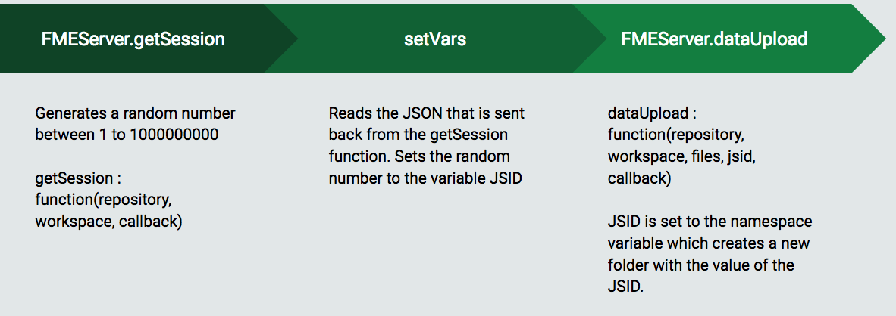</a></p>
<p><br><strong><font style="vertical-align: inherit;"><font style="vertical-align: inherit;">5）添加generateOptions函数</font></font></strong></p>
<p><font style="vertical-align: inherit;"><font style="vertical-align: inherit;">接下来，我们使用</font></font><strong><font style="vertical-align: inherit;"><font style="vertical-align: inherit;">generateOptions函数</font></font></strong><font style="vertical-align: inherit;"><font style="vertical-align: inherit;">在最后一个函数下面插入这个。</font></font></p>

```JavaScript
function generateOptions()
{
    setWorkspace();

    // Get the workspace parameters from FME Server
    FMEServer.getWorkspaceParameters(repository, workspace, buildOptions);
}
```

<p><font style="vertical-align: inherit;"><font style="vertical-align: inherit;">此函数使用setWorkspace函数设置变量。</font><font style="vertical-align: inherit;">然后它调用getWorkspaceParameters获取工作空间并将传入的JSON放入buildOptions回调中。</font></font></p>
<p><font style="vertical-align: inherit;"><font style="vertical-align: inherit;">接下来，我们使用getSession调用的回调来创建新函数setVars。</font></font></p>
<p><br><strong><font style="vertical-align: inherit;"><font style="vertical-align: inherit;">6）添加setVars函数</font></font></strong></p>

```JavaScript
function setVars(json)
{
    if (json.serviceResponse.files)
    {
        jsid = json.serviceResponse.session;
        path = json.serviceResponse.files.folder[0].path;
    }
    else
    {
        showResults(json);
    }
}
```

<p><font style="vertical-align: inherit;"><font style="vertical-align: inherit;">此函数从响应中查找会话，该会话将是一个字符串，并将在JSID变量中设置。</font><font style="vertical-align: inherit;">路径是文件到服务器的位置。</font></font></p>
<p><br><strong><font style="vertical-align: inherit;"><font style="vertical-align: inherit;">7）添加buildOptions函数</font></font></strong></p>
<p><font style="vertical-align: inherit;"><font style="vertical-align: inherit;">一旦服务器具有工作空间参数，我们需要一个函数来执行操作。</font><font style="vertical-align: inherit;">这将生成一个用户可用于输入其信息的表单。</font><font style="vertical-align: inherit;">所以我们使用</font></font><strong><font style="vertical-align: inherit;"><font style="vertical-align: inherit;">buildOptions函数</font></font></strong><font style="vertical-align: inherit;"><font style="vertical-align: inherit;">，它是generateOptions函数的回调函数。</font></font></p>

```JavaScript
function buildOptions(json)
{
    // Use the API to build the form items
    FMEServer.generateFormItems("options", json);

    // Attach the upload button to the form file input
    var inputs = document.getElementById("options").getElementsByTagName("input");
    var added = false;

    for (var i in inputs)
    {
        if (inputs[i].type == "file" && added === false)
        {
            fileInput = inputs[i];
            var button = document.createElement("input");
            button.type = "button";
            button.value = "Upload File";
            button.setAttribute("onclick", "uploadFile();");
            fileInput.parentNode.insertBefore(button, fileInput.nextSibling);
            added = true;
        }
    }
}
```

<p><a target="_blank" rel="noopener noreferrer" href="./Images/12.1.1.BuildOption.png">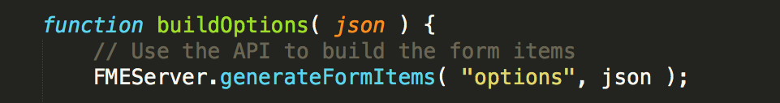</a></p>
<p><font style="vertical-align: inherit;"><font style="vertical-align: inherit;">首先，我们使用API​​生成表单项。</font><font style="vertical-align: inherit;">此函数可以使用三个参数。</font><font style="vertical-align: inherit;">第一个是可以放置表单元素的字符串。第二个是包含表单数据的json对象。</font><font style="vertical-align: inherit;">这是在generateOptions函数中生成的。</font><font style="vertical-align: inherit;">最后，还有一个名为“项(items)”的附加可选参数，它列出了您要暴露的属性。</font><font style="vertical-align: inherit;">项应该采用数组格式，默认情况下，所有项都会暴露。</font></font></p>
<p><a target="_blank" rel="noopener noreferrer" href="./Images/12.1.2.InputandAddedVariables.png">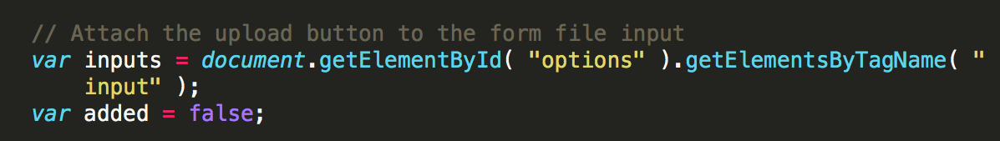</a></p>
<p><font style="vertical-align: inherit;"><font style="vertical-align: inherit;">此部分将上传按钮附加到表单文件输入。</font></font></p>
<p><a target="_blank" rel="noopener noreferrer" href="./Images/12.1.3.UploadFileButton.png">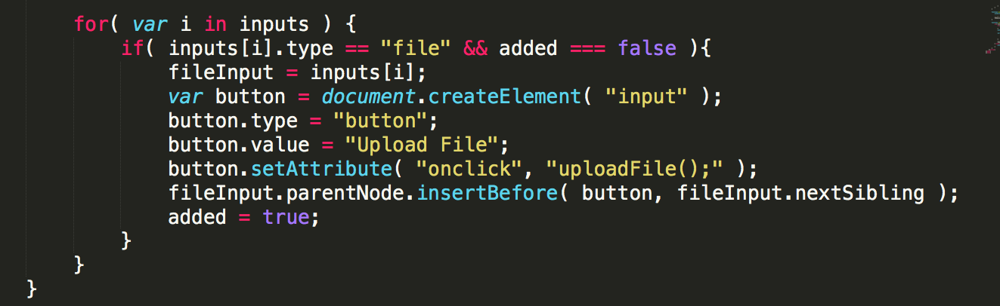</a></p>
<p><font style="vertical-align: inherit;"><font style="vertical-align: inherit;">此部分检查输入类型，如果输入等于文件但尚未添加，则会为文件创建一个按钮和输入。</font><font style="vertical-align: inherit;">变量fileInput设置为该文件。</font><font style="vertical-align: inherit;">此函数此按钮也链接到FME Server函数，uploadFile将上传文件。</font></font></p>
<hr>
<h4><a id="user-content-add-the-javascript-for-the-file-upload" class="anchor" aria-hidden="true" href="./9.8.ExerciseUpload.md#add-the-javascript-for-the-file-upload"></a><font style="vertical-align: inherit;"><font style="vertical-align: inherit;">添加文件上传的JavaScript</font></font></h4>
<p><br><strong><font style="vertical-align: inherit;"><font style="vertical-align: inherit;">8）添加uploadFile函数</font></font></strong></p>

```JavaScript
function uploadFile()
{
    setWorkspace();

    // Ask FME Server to upload the file
    FMEServer.dataUpload(repository, workspace, fileInput, jsid, processFiles);
}
```

<p><a target="_blank" rel="noopener noreferrer" href="./Images/12.1.4.UploadFile.png">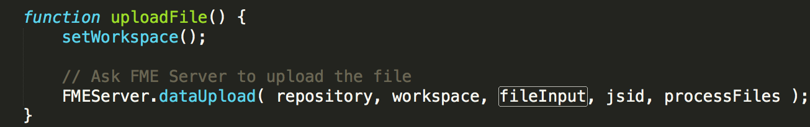</a></p>
<p><font style="vertical-align: inherit;"><font style="vertical-align: inherit;">该</font></font><strong><font style="vertical-align: inherit;"><font style="vertical-align: inherit;">dataUpload</font></font></strong><font style="vertical-align: inherit;"><font style="vertical-align: inherit;">函数文档可以在</font></font><a href="http://docs.safe.com/fme/2018.1/html/FME_Server_Documentation/Content/ReferenceManual/service_dataupload.htm" rel="nofollow"><font style="vertical-align: inherit;"><font style="vertical-align: inherit;">这里</font></font></a><font style="vertical-align: inherit;"><font style="vertical-align: inherit;">找到。</font></font></p>
<p><font style="vertical-align: inherit;"><font style="vertical-align: inherit;">此函数需要存储库，工作空间，fileInput（我们从buildOptions函数获取的），以及JSID（我们从getSession函数获取的）。proccessFiles参数是此函数的回调。</font></font></p>
<p><font style="vertical-align: inherit;"><font style="vertical-align: inherit;">如果您想看一下JavaScript库中的dataUpload函数，可以</font><a href="http://api.fmeserver.com/js/v1.2/FMEServer.js." rel="nofollow"><font style="vertical-align: inherit;">在这里</font></a><font style="vertical-align: inherit;">找到</font></font><a href="http://api.fmeserver.com/js/v1.2/FMEServer.js." rel="nofollow"><font style="vertical-align: inherit;"><font style="vertical-align: inherit;">。</font></font></a></p>
<p><a target="_blank" rel="noopener noreferrer" href="./Images/12.1.5.UploadFileFunction.png">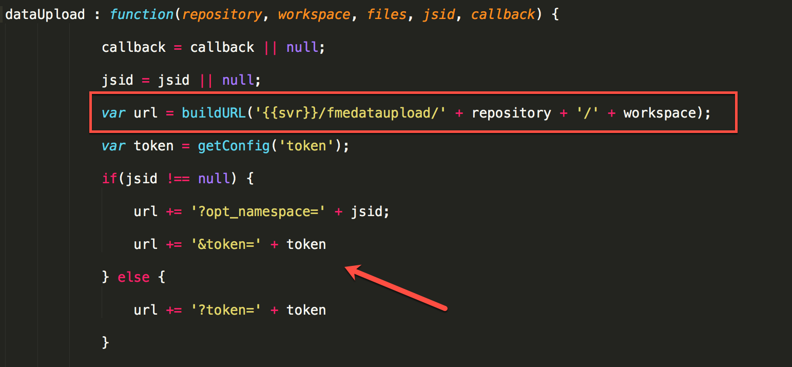</a></p>
<p><font style="vertical-align: inherit;"><font style="vertical-align: inherit;">这就是JavaScript库中的函数。</font><font style="vertical-align: inherit;">它基于在getSession调用中随机生成的JSID构建URL。</font><font style="vertical-align: inherit;">在上面的屏幕截图中，URL以存储库和工作空间开始，该存储库和工作空间由方框示出。</font><font style="vertical-align: inherit;">然后使用JSID和token变量添加URL，该变量由箭头示出。</font></font></p>
<hr>
<h4><a id="user-content-add-the-javascript-for-the-data-download" class="anchor" aria-hidden="true" href="./9.8.ExerciseUpload.md#add-the-javascript-for-the-data-download"></a><font style="vertical-align: inherit;"><font style="vertical-align: inherit;">添加数据下载的JavaScript</font></font></h4>
<p><font style="vertical-align: inherit;"><font style="vertical-align: inherit;">一旦用户单击“刷新文件列表”按钮，将激活下一个函数（getFiles）。</font></font></p>
<p><br><strong><font style="vertical-align: inherit;"><font style="vertical-align: inherit;">9）添加getFiles函数</font></font></strong></p>

```JavaScript
function getFiles()
{
    // Ask FME Server for the list of uploaded files
    FMEServer.getDataUploads(repository, workspace, jsid, processFiles);
}
```

<p><font style="vertical-align: inherit;"><font style="vertical-align: inherit;">此函数类似于前一次调用的结构。</font><font style="vertical-align: inherit;">它只是使用JSID检查服务器以查看已上传的文件。</font></font></p>
<p><br><strong><font style="vertical-align: inherit;"><font style="vertical-align: inherit;">10）添加proccessFiles函数</font></font></strong></p>
<p><br><font style="vertical-align: inherit;"><font style="vertical-align: inherit;">接下来，我们可以使用函数</font></font><strong><font style="vertical-align: inherit;"><font style="vertical-align: inherit;">proccessFiles</font></font></strong><font style="vertical-align: inherit;"><font style="vertical-align: inherit;">，它是getFiles和uploadFiles函数的回调函数。</font></font></p>

```JavaScript
function processFiles(json)
{
    var list = document.getElementById("fileList");
    if (json.serviceResponse != undefined)
    {
        list.innerHTML = "";
        files = json.serviceResponse.files.file;
        for (var file in files)
        {
            list.innerHTML += "<p>" + files[file].name + ", <em>" + files[file].size + " bytes</em></p>";
        }
        archives = json.serviceResponse.files.archive;
        for (var archive in archives)
        {
            list.innerHTML += "<p>" + archives[archive].name + ", <em>" + archives[archive].size + " bytes</em></p>";
        }
        showResults(json);
    }
    else
    {
        // Required for proper list refresh on IE9 below and older browsers
        setTimeout("getFiles();", 2000);
    }
}
```

<p><font style="vertical-align: inherit;"><font style="vertical-align: inherit;">此函数从前面的函数获取服务器响应并将其发送到show results函数。</font><font style="vertical-align: inherit;">showResults显示加载的文件和文件大小。</font></font></p>
<p><font style="vertical-align: inherit;"><font style="vertical-align: inherit;">用户输入参数后，可以单击“使用数据运行工作空间(Run Workspace with Data)”函数。</font></font></p>
<p><font style="vertical-align: inherit;"><font style="vertical-align: inherit;">这会激活runWorkspace函数。</font></font></p>
<p><br><strong><font style="vertical-align: inherit;"><font style="vertical-align: inherit;">11）添加runWorkspace函数</font></font></strong></p>

```JavaScript
function runWorkspace()
{
    if (files != undefined || archives != undefined)
    {
        if (archives != undefined)
        {
            files = archives;
        }
        setWorkspace();

        var params = {
            filename: fileInput.name,
            files: files,
            params: processParams()
        }
        // Ask FME Server to run the workspace with the uploaded data
        FMEServer.runWorkspaceWithData(path, params, showResults);
    }
    else
    {
        alert("No Files Uploaded.  Please upload a file.");
    }
}
```

<p><a target="_blank" rel="noopener noreferrer" href="./Images/12.1.6.RunWorkspace.png">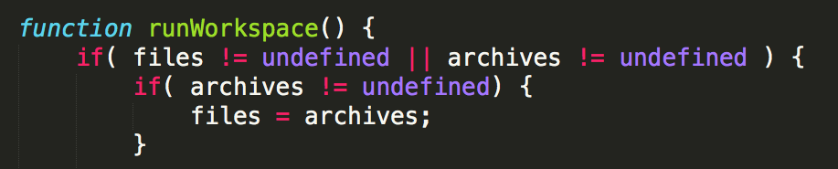</a></p>
<p><font style="vertical-align: inherit;"><font style="vertical-align: inherit;">runWorkspace检查文件是现在存在还是在存档中。</font><font style="vertical-align: inherit;">如果文件位于已实现的变量中，则将它们设置为files变量。</font></font></p>
<p><a target="_blank" rel="noopener noreferrer" href="./Images/12.1.7.SetWorkspace.png"></a></p>
<p><font style="vertical-align: inherit;"><font style="vertical-align: inherit;">从此处调用已设置在应用程序中的set workspace函数。</font></font></p>
<p><a target="_blank" rel="noopener noreferrer" href="./Images/12.1.8.ParamsVariable.png">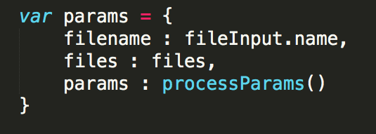</a></p>
<p><font style="vertical-align: inherit;"><font style="vertical-align: inherit;">接下来，在函数中，它设置运行工作空间的参数，输入文件名和文件。</font><font style="vertical-align: inherit;">但是，params需要一个名为processParams的新函数。</font></font></p>
<p><br><strong><font style="vertical-align: inherit;"><font style="vertical-align: inherit;">12）添加processParams函数</font></font></strong>
<br><font style="vertical-align: inherit;"><font style="vertical-align: inherit;">这可以插在runWorkspace函数之上。</font></font></p>

```JavaScript

function processParams()
{
    var inputs = document.getElementById("options").getElementsByTagName("input");
    var selects = document.getElementById("options").getElementsByTagName("select");
    var options = [];
    var properties = "";

    // Convert HTML NodeList types to regular array types
    inputs = Array.prototype.slice.call(inputs);
    selects = Array.prototype.slice.call(selects);

    // Merge the regular arrays
    options = inputs.concat(selects);

    for (var opt in options)
    {
        var option = options[opt];
        if (option.value && option.name != fileInput.name && option.type != "button")
        {
            properties += option.name + "=";
            if (option.type == "select")
            {
                properties += option[option.selectedIndex].value;
            }
            else
            {
                properties += option.value;
            }
            properties += "&";
        }
    }
    properties = properties.substr(0, properties.length - 1);
    return properties;
}
```

<p><font style="vertical-align: inherit;"><font style="vertical-align: inherit;">函数的第一部分设置输入，选择，选项和属性的变量。</font><font style="vertical-align: inherit;">输入和选择转换为数组，并将数组合并到选项数组中。</font><font style="vertical-align: inherit;">在此之后，我们有一个for循环。</font></font></p>
<p><a target="_blank" rel="noopener noreferrer" href="./Images/12.1.9.ProcessOptions.png">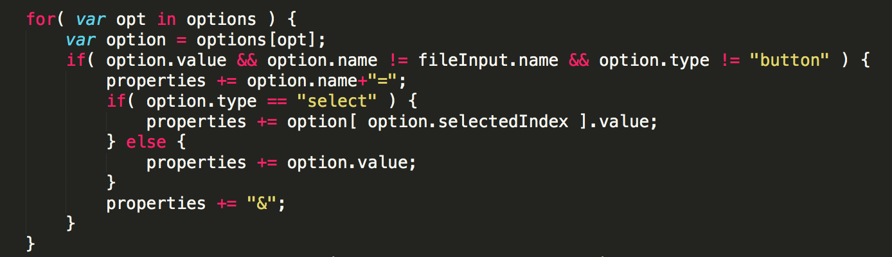</a></p>
<p><font style="vertical-align: inherit;"><font style="vertical-align: inherit;">此for循环扫描选项。</font><font style="vertical-align: inherit;">然后它格式化选项，因此它们是params变量的正确表示法。</font><font style="vertical-align: inherit;">第一个if语句检查选项名称和值是否与文件输入名称不相等。</font><font style="vertical-align: inherit;">这表示该选项不是文件。</font><font style="vertical-align: inherit;">然后，它检查选项类型不是按钮。</font><font style="vertical-align: inherit;">如果这是真的，则参数是输入框，并以适当的格式添加属性和选项名称。</font><font style="vertical-align: inherit;">如果选项类型为“选择”，则选择的选项值将以适当的符号添加。</font></font></p>
<p><a target="_blank" rel="noopener noreferrer" href="./Images/12.1.10.ReturnProp.png">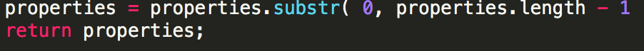</a></p>
<p><font style="vertical-align: inherit;"><font style="vertical-align: inherit;">然后，在属性中删除尾随符号（＆）。</font><font style="vertical-align: inherit;">运行此函数以正确设置属性后，我们将返回runWorkspace函数。</font></font></p>
<p><a target="_blank" rel="noopener noreferrer" href="./Images/12.1.11.RunWorkspace.png">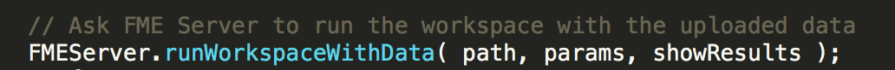</a></p>
<p><br><strong><font style="vertical-align: inherit;"><font style="vertical-align: inherit;">13）添加showResults函数</font></font></strong></p>
<p><font style="vertical-align: inherit;"><font style="vertical-align: inherit;">此函数使用路径和参数构建调用，然后将信息放入showResults函数中。</font></font></p>

```JavaScript
    function showResults( json ) {
        // The following is to write out the return object
        // for visualization of the example
        var div = document.createElement( "div" );
        div.innerHTML = "<hr /><h4>"+new Date().toLocaleTimeString()+" &gt; Return Object:</h4>";
        if( json.serviceResponse && json.serviceResponse.url ) {
          var a = document.createElement( "a" );
          a.href = json.serviceResponse.url;
          a.innerHTML = "Download Result";
          div.appendChild( a );
        }
        var pre = document.createElement( "pre" );
        pre.innerHTML = JSON.stringify(json, undefined, 4);
        div.appendChild( pre );
        var results = document.getElementById( "results" )
        results.insertBefore( div, results.firstChild );
      }
```

<p><font style="vertical-align: inherit;"><font style="vertical-align: inherit;">此函数创建一个新div并将结果呈现给用户。</font></font></p>
<p><a target="_blank" rel="noopener noreferrer" href="./Images/12.1.12.DownloadResult.png">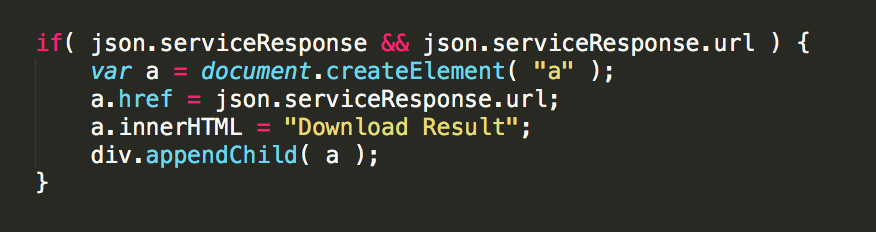</a></p>
<p><font style="vertical-align: inherit;"><font style="vertical-align: inherit;">如果有serviceResponse和URL，我们知道它包含下载链接。</font><font style="vertical-align: inherit;">因此该函数将创建一个链接到数据下载URL的按钮。</font></font></p>
<p><a target="_blank" rel="noopener noreferrer" href="./Images/12.1.13.ResultsPrinted.png">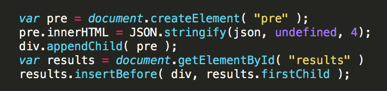</a></p>
<p><font style="vertical-align: inherit;"><font style="vertical-align: inherit;">如果没有，那么程序仍将在标题结果下向用户打印出JSON。</font></font></p>
<p><br><strong><font style="vertical-align: inherit;"><font style="vertical-align: inherit;">14）运行程序！</font></font></strong></p>
<p><font style="vertical-align: inherit;"><font style="vertical-align: inherit;">选择“选择文件”按钮。</font></font></p>
<p><font style="vertical-align: inherit;"><font style="vertical-align: inherit;">选择位于此处的KML：</font></font></p>
<p><font style="vertical-align: inherit;"><font style="vertical-align: inherit;">C:\FMEData2018\Data\Boundaries\VancouverNeighborhoods.kml
</font></font></p>
<p><font style="vertical-align: inherit;"><font style="vertical-align: inherit;">然后选择上传文件。</font></font></p>
<p><a target="_blank" rel="noopener noreferrer" href="./Images/12.1.14a.UploadFile.png">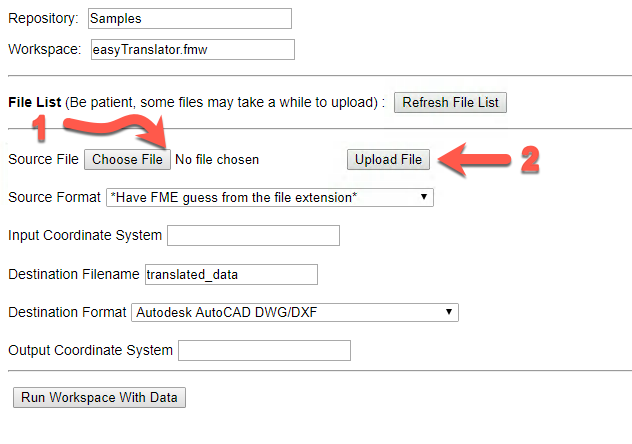</a></p>
<p><font style="vertical-align: inherit;"><font style="vertical-align: inherit;">在</font></font><strong><font style="vertical-align: inherit;"><font style="vertical-align: inherit;">输入坐标系下</font></font></strong><font style="vertical-align: inherit;"><font style="vertical-align: inherit;">：写入LL84</font></font></p>
<p><font style="vertical-align: inherit;"><font style="vertical-align: inherit;">在</font></font><strong><font style="vertical-align: inherit;"><font style="vertical-align: inherit;">输出坐标系下</font></font></strong><font style="vertical-align: inherit;"><font style="vertical-align: inherit;">：写入LL84</font></font></p>
<p><font style="vertical-align: inherit;"><font style="vertical-align: inherit;">然后选择Run Workspace with Data.。</font></font></p>
<p><a target="_blank" rel="noopener noreferrer" href="./Images/12.1.14b.RunWorkspace.png">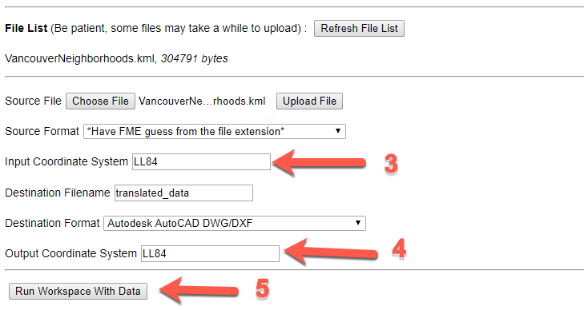</a></p>
<p><br><font style="vertical-align: inherit;"><font style="vertical-align: inherit;"> 选择Run Workspace with Data.后，我们可以单击Download Result函数。</font></font></p>
<p><a target="_blank" rel="noopener noreferrer" href="./Images/12.1.14c.ReviewTheResults.png">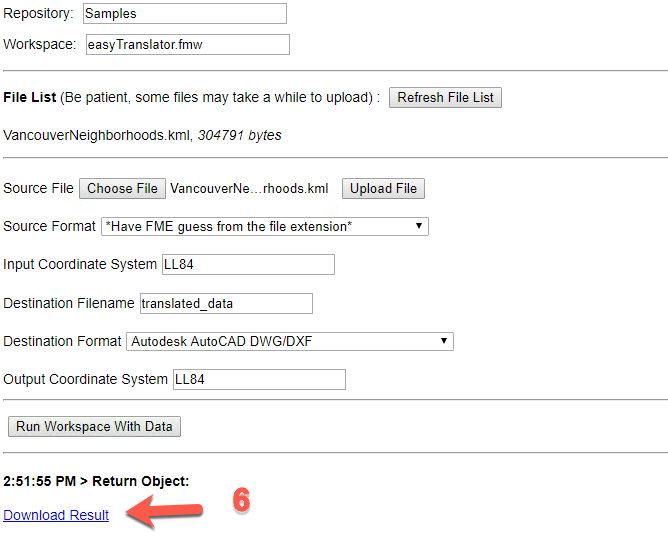</a></p>

<table>
<tbody><tr>
<td>
<i></i><font style="vertical-align: inherit;"><font style="vertical-align: inherit;">
恭喜
</font></font></td>
</tr>
<tr>
<td><font style="vertical-align: inherit;"><font style="vertical-align: inherit;">

通过完成本练习，您已学会如何：
</font></font><br>
<ul><li><font style="vertical-align: inherit;"><font style="vertical-align: inherit;">创建一个转换数据的应用程序</font></font></li>
<li><font style="vertical-align: inherit;"><font style="vertical-align: inherit;"> 使用FME Server JavaScript API上传文件</font></font></li>
<li><font style="vertical-align: inherit;"><font style="vertical-align: inherit;">使用getSession和generateOptions函数 </font></font></li>

</ul></td>
</tr>
</tbody></table>
</article>
  </div>
