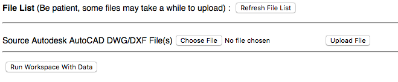
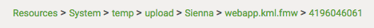
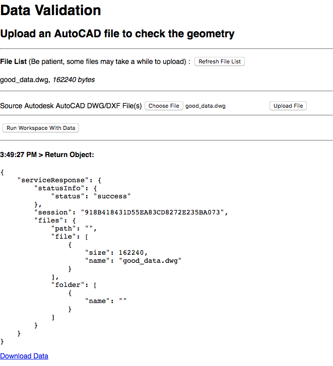

  <div id="readme" class="readme blob instapaper_body">
    <article class="markdown-body entry-content" itemprop="text"><table>
<tbody><tr>
<td width="25%">
<i></i><font style="vertical-align: inherit;"><font style="vertical-align: inherit;">
练习19
</font></font></td>
<td><font style="vertical-align: inherit;"><font style="vertical-align: inherit;">
 数据上传和验证 
</font></font></td>
</tr>
<tr>
<td><font style="vertical-align: inherit;"><font style="vertical-align: inherit;">数据</font></font></td>
<td><font style="vertical-align: inherit;"><font style="vertical-align: inherit;">无</font></font></td>
</tr>
<tr>
<td><font style="vertical-align: inherit;"><font style="vertical-align: inherit;">总体目标</font></font></td>
<td><font style="vertical-align: inherit;"><font style="vertical-align: inherit;"> 展示如何使用FME Server JavaScript API将文件上传到FME Server并通过工作空间运行它们。  </font></font></td>
</tr>
<tr>
<td><font style="vertical-align: inherit;"><font style="vertical-align: inherit;">演示</font></font></td>
<td><font style="vertical-align: inherit;"><font style="vertical-align: inherit;"> 如何使用数据流组件创建数据验证应用程序。 </font></font></td>
</tr>
<tr>
<td><font style="vertical-align: inherit;"><font style="vertical-align: inherit;">启动HTML </font></font></td>
<td><font style="vertical-align: inherit;"><font style="vertical-align: inherit;">C:\FMEData2018\Resources\RESTAPI\myFifthApp\myFifthAppBegin.html
  </font></font></td>
</tr>
<tr>
<td><font style="vertical-align: inherit;"><font style="vertical-align: inherit;">完成的HTML </font></font></td>
<td><font style="vertical-align: inherit;"><font style="vertical-align: inherit;">C:\FMEData2018\Resources\RESTAPI\myFifthApp\myFifthAppCompleted.html </font></font></td>
</tr>
<tr>
<td><font style="vertical-align: inherit;"><font style="vertical-align: inherit;"> 完成的工作空间 </font></font></td>
<td><font style="vertical-align: inherit;"><font style="vertical-align: inherit;"> C:\FMEData2018\Resources\RESTAPI\myFifthApp\webapp.kml.fmw  C:\FMEData2018\Resources\RESTAPI\myFifthApp\webapp.downloadresults.fmw
</font></font></td>
</tr>
</tbody></table>
<p><font style="vertical-align: inherit;"><font style="vertical-align: inherit;">本练习从上一个练习开始，并显示如何修改这些练习以创建特定于您的需求的应用程序。</font><font style="vertical-align: inherit;">在此示例中，您将获得一个工作空间和两个测试文件，以便使用并创建数据验证应用程序。</font><font style="vertical-align: inherit;">在我们最近上传到FME Server的项目文件中，它包含了本练习的附加工作空间。</font><font style="vertical-align: inherit;">我们现在要定制用于数据验证的网页。</font></font></p>

<table>
<tbody><tr>
<td>
<i></i><font style="vertical-align: inherit;"><font style="vertical-align: inherit;">
警告
</font></font></td>
</tr>
<tr>
<td><font style="vertical-align: inherit;"><font style="vertical-align: inherit;">

本练习使用从练习17期间上传到FME Server的项目文件夹导入的已完成工作空间。如果不这样做，则可以上传位于myFifthApp文件夹中的工作空间。</font><font style="vertical-align: inherit;">然后，确保guest帐户有权访问存储库。</font><font style="vertical-align: inherit;">此外，请在完成此操作之前完成练习14。

</font></font></td>
</tr>
</tbody></table>
<h3><a id="user-content-customize-for-data-validation" class="anchor" aria-hidden="true" href="./9.9.DataValidationExercise.md#customize-for-data-validation"></a><font style="vertical-align: inherit;"><font style="vertical-align: inherit;">自定义数据验证</font></font></h3>
<p><br><strong><font style="vertical-align: inherit;"><font style="vertical-align: inherit;">1）打开myFifthAppBegin.html并将其另存为index.html</font></font></strong></p>
<p><font style="vertical-align: inherit;"><font style="vertical-align: inherit;">导航到存储在C驱动器上的FMEData2018文件夹中的myFifthApp文件夹。</font><font style="vertical-align: inherit;">然后，找到myFifthAppBegin.html并重命名为index.html。</font><font style="vertical-align: inherit;">将服务器和令牌更改为您自己的。</font></font></p>
<p><br><strong><font style="vertical-align: inherit;"><font style="vertical-align: inherit;">2）更改存储库和工作空间</font></font></strong></p>
<ul>
<li><font style="vertical-align: inherit;"><font style="vertical-align: inherit;">更改服务器中的存储库和工作空间</font></font></li>
</ul>

```JavaScript
<form id="exampleForm">
    <label>Repository: </label>
    <input id="repository-name" type="text" name="repository" value="WebApplication" /><br />
    <label>Workspace: </label>
    <input id="workspace-name" type="text" name="workspace" value="webapp.kml.fmw" />
</form>

```
<br>
<p><br><strong><font style="vertical-align: inherit;"><font style="vertical-align: inherit;">3）选择good_data.dwg文件</font></font></strong></p>
<p><font style="vertical-align: inherit;"><font style="vertical-align: inherit;">单击选择文件，然后导航到C：/FMEData2018/Resources/RESTAPI/myFifthApp/Data/good_data.dwg</font></font></p>
<p><font style="vertical-align: inherit;"><font style="vertical-align: inherit;">单击上传文件来上传文件。</font></font></p>
<p><br><strong><font style="vertical-align: inherit;"><font style="vertical-align: inherit;">4）单击“使用数据运行工作空间”</font></font></strong></p>
<p><font style="vertical-align: inherit;"><font style="vertical-align: inherit;">您会注意到我们需要修复的一些事项才能使此应用正常运行：</font></font></p>
<ul>
<li>
<p><font style="vertical-align: inherit;"><font style="vertical-align: inherit;">消除存储库和工作空间的输入框 - 可以对此信息进行硬编码。</font></font></p>
</li>
<li>
<p><font style="vertical-align: inherit;"><font style="vertical-align: inherit;">更改措辞以使文件更具描述性。</font></font></p>
</li>
<li>
<p><font style="vertical-align: inherit;"><font style="vertical-align: inherit;">将HTML流回页面，为新文件提供数据下载链接。</font></font></p>
</li>
</ul>
<hr>
<h3><a id="user-content-hard-code-the-workspace" class="anchor" aria-hidden="true" href="./9.9.DataValidationExercise.md#hard-code-the-workspace"></a><font style="vertical-align: inherit;"><font style="vertical-align: inherit;">硬编码工作空间</font></font></h3>
<p><br><strong><font style="vertical-align: inherit;"><font style="vertical-align: inherit;">4）删除以下部分</font></font></strong></p>

```JavaScript
    <form id="exampleForm">
            <label>Repository: </label>
            <input id="repository-name" type="text" name="repository" value="Samples" /><br />
            <label>Workspace: </label>
            <input id="workspace-name" type="text" name="workspace" value="easyTranslator.fmw" />
        </form>
        <hr />
```
<p><br><strong><font style="vertical-align: inherit;"><font style="vertical-align: inherit;">5）更改setWorkspace函数</font></font></strong></p>

```JavaScript
function setWorkspace()
{
    repository = "WebApplication";
    workspace = "webapp.kml.fmw";

}
```

<p><br><strong><font style="vertical-align: inherit;"><font style="vertical-align: inherit;">6）保存并测试！</font></font></strong></p>
<p><font style="vertical-align: inherit;"><font style="vertical-align: inherit;">当前的应用程序如下所示：</font></font></p>
<p><a target="_blank" rel="noopener noreferrer" href="./Images/12.1.14.WebApp.png"></a></p>
<p><br><strong><font style="vertical-align: inherit;"><font style="vertical-align: inherit;">7）添加适当的标题和描述符</font></font></strong></p>
<p><font style="vertical-align: inherit;"><font style="vertical-align: inherit;">让我们添加一些HTML来使应用程序更具信息性。</font></font></p>
<p><font style="vertical-align: inherit;">在HTML中的</font><code>&lt;div id="fileList"&gt;&lt;/div&gt;</code><font style="vertical-align: inherit;">上面添加此段代码 </font></p>

```JavaScript
    <h1> Data Validation </h1>
    <h2> Upload an AutoCAD file for Quality Analysis </h2>
```

<p><strong><font style="vertical-align: inherit;"><font style="vertical-align: inherit;">与结果有一个数据流链接</font></font></strong></p>
<p><br><strong><font style="vertical-align: inherit;"><font style="vertical-align: inherit;">8）删除processParams函数。</font></font></strong></p>
<p><font style="vertical-align: inherit;"><font style="vertical-align: inherit;">不再需要此函数，因为只有一个工作空间带有一个参数，因此不需要包含它。</font></font></p>
<p><strong><font style="vertical-align: inherit;"><font style="vertical-align: inherit;">9）在processFiles函数中添加一行代码：</font></font></strong></p>

```JavaScript
function processFiles(json)
{

    var list = document.getElementById("fileList");

    if (json.serviceResponse != undefined)
    {

        list.innerHTML = "";

        files = json.serviceResponse.files.file;

        for (var file in files)
        {

            list.innerHTML += "<p>" + files[file].name + ", <em>" + files[file].size + " bytes</em></p>";

            filename = files[file].name; //<--Add this

        }

```

<p><font style="vertical-align: inherit;"><font style="vertical-align: inherit;">这将添加变量filename，该变量将用于我们的数据流调用。</font></font></p>
<p><br><strong><font style="vertical-align: inherit;"><font style="vertical-align: inherit;">10）注释掉以下代码：</font></font></strong></p>
<p><font style="vertical-align: inherit;"><font style="vertical-align: inherit;">接下来，我们需要在runWorkspace函数中注释掉或删除以下代码。</font></font></p>

```JavaScript
function runWorkspace()
{
    if (files != undefined || archives != undefined)
    {
        if (archives != undefined)
        {
            files = archives;
        }

        setWorkspace();


        //var params = {
        //    filename : fileInput.name,
        //    files : files,
        //    params : processParams()
        //    }
        //FMEServer.runWorkspaceWithData( path, params, showResults );

    }
    else
    {
        alert("No Files Uploaded.  Please upload a file.");
    }

}
```


<p><br><strong><font style="vertical-align: inherit;"><font style="vertical-align: inherit;">11）粘贴以下代码：</font></font></strong></p>
<p><font style="vertical-align: inherit;"><font style="vertical-align: inherit;">现在我们可以将代码添加到runWorkspace函数中以添加数据流组件。</font><font style="vertical-align: inherit;">这直接属于setWorkspace（）;</font></font></p>

```JavaScript

        resultUrl = server + '/fmedatastreaming/' + repository + '/' + workspace + '?SourceDataset_ACAD=%24(FME_SHAREDRESOURCE_SYSTEM)%2Ftemp%2Fupload%2F' + repository + '%2F' + workspace + '%2F' + jsid + '%2F' + filename;
```
		
<p><font style="vertical-align: inherit;"><font style="vertical-align: inherit;">那么这是如何工作的，因为URL创建了从setWorkspace函数导入的要素、存储库和工作空间。。</font><font style="vertical-align: inherit;">然后是上传使用的参数。</font><font style="vertical-align: inherit;">上传的文件将存储在系统下的共享资源文件夹中。</font></font></p>
<p><font style="vertical-align: inherit;"><font style="vertical-align: inherit;">这是上传文件的文件路径示例。</font></font></p>
<p><a target="_blank" rel="noopener noreferrer" href="./Images/12.1.15.FilePath.png"></a></p>
<p><font style="vertical-align: inherit;"><font style="vertical-align: inherit;">如果上传文件，它将始终属于Resources&gt; System&gt; temp&gt; upload文件夹。</font></font></p>
<p><font style="vertical-align: inherit;"><font style="vertical-align: inherit;">然后它将存储在具有存储库名称和工作空间的文件夹中。</font><font style="vertical-align: inherit;">最后，为JSID下的每个会话创建一个文件夹。</font><font style="vertical-align: inherit;">接着最后，URL需要文件名。</font></font></p>
<p><br><strong><font style="vertical-align: inherit;"><font style="vertical-align: inherit;">12）将以下代码粘贴到setWorkspace函数中：</font></font></strong></p>

```JavaScript
function setWorkspace()
{
    repository = "WebApplication";
    workspace = "webapp.kml.fmw";
    server = "http://xx.xxx.xxx"; // <---- Add this
}
```

<p><br><strong><font style="vertical-align: inherit;"><font style="vertical-align: inherit;">13）将以下代码添加到runWorkspace函数中</font></font></strong></p>
<p><font style="vertical-align: inherit;"><font style="vertical-align: inherit;">然后将以下代码直接添加到resultUrl下的runWorkspace函数中。</font></font></p>

```JavaScript
var finalResults = document.getElementById("finalResults");
finalResults.innerHTML += ('<a href="' + resultUrl + '">' + 'Display Result </a>');
document.body.appendChild(finalResults);  
```

<p><br><strong><font style="vertical-align: inherit;"><font style="vertical-align: inherit;">14）然后测试代码！</font></font></strong></p>
<p><a target="_blank" rel="noopener noreferrer" href="./Images/12.1.16.WebAppWorkspace.png"></a></p>
<p><br><strong><font style="vertical-align: inherit;"><font style="vertical-align: inherit;">当前代码应如下所示：</font></font></strong></p>

```JavaScript
<!doctype html>
<html>

<head>
    <meta charset="UTF-8">
    <title>Upload Files In Session Example from FME Server Developer Playground</title>
    <!-- Styles for example -->
    <link rel="stylesheet" href="https://playground.fmeserver.com/css/FMEServerExamples.css" type="text/css" />
    <!-- Include FMEServer.js -->
    <script type="text/javascript" src="https://api.fmeserver.com/js/v1.2/FMEServer.js"></script>
</head>

<body>
    <h1> Data Validation </h1>
    <h2> Upload an AutoCAD file for Quality Analysis </h2>

    <label><b>File List </b>(Be patient, some files may take a while to upload) : </label>
    <input id="refresh" type="button" onclick="getFiles();" value="Refresh File List" />
    <div id="fileList"></div>
    <hr />
    <form id="options"></form>
    <hr />
    <input type="button" onclick="runWorkspace();" value="Run Workspace With Data" />
    <div id="results"></div>
    <div id="finalResults"></div>

    <script type="text/javascript">
        var jsid, path, fileInput, files, archives, repository, workspace;

        window.onload = function()
        {
            FMEServer.init(
            {
                server: "http://localhost",
                token: "<yourToken>"
            });

            // Initialize variables
            setWorkspace();

            // Generate a JSID  for the session
            FMEServer.getSession(repository, workspace, setVars);

            // Get options for the workspace
            generateOptions();
        };

        function setWorkspace()
        {
            repository = "WebApplication";
            workspace = "webapp.kml.fmw";
            server = "http://localhost";
        }

        function generateOptions()
        {
            setWorkspace();

            // Get the workspace parameters from FME Server
            FMEServer.getWorkspaceParameters(repository, workspace, buildOptions);
        }

        function setVars(json)
        {
            if (json.serviceResponse.files)
            {
                jsid = json.serviceResponse.session;
                path = json.serviceResponse.files.folder[0].path;
            }
            else
            {
                showResults(json);
            }
        }

        function buildOptions(json)
        {
            // Use the API to build the form items
            FMEServer.generateFormItems("options", json);

            // Attach the upload button to the form file input
            var inputs = document.getElementById("options").getElementsByTagName("input");
            var added = false;

            for (var i in inputs)
            {
                if (inputs[i].type == "file" && added === false)
                {
                    fileInput = inputs[i];
                    var button = document.createElement("input");
                    button.type = "button";
                    button.value = "Upload File";
                    button.setAttribute("onclick", "uploadFile();");
                    fileInput.parentNode.insertBefore(button, fileInput.nextSibling);
                    added = true;
                }
            }
        }

        function uploadFile()
        {
            setWorkspace();

            // Ask FME Server to upload the file
            FMEServer.dataUpload(repository, workspace, fileInput, jsid, processFiles);
        }

        function getFiles()
        {
            // Ask FME Server for the list of uploaded files
            FMEServer.getDataUploads(repository, workspace, jsid, processFiles);
        }

        function processFiles(json)
        {
            var list = document.getElementById("fileList");
            if (json.serviceResponse != undefined)
            {
                list.innerHTML = "";
                files = json.serviceResponse.files.file;
                for (var file in files)
                {
                    list.innerHTML += "<p>" + files[file].name + ", <em>" + files[file].size + " bytes</em></p>";
                    filename = files[file].name;
                }
                archives = json.serviceResponse.files.archive;
                for (var archive in archives)
                {
                    list.innerHTML += "<p>" + archives[archive].name + ", <em>" + archives[archive].size + " bytes</em></p>";
                }
                showResults(json);
            }
            else
            {
                // Required for proper list refresh on IE9 below and older browsers
                setTimeout("getFiles();", 2000);
            }
        }

        function runWorkspace()
        {
            if (files != undefined || archives != undefined)
            {
                if (archives != undefined)
                {
                    files = archives;
                }
                setWorkspace();
                resultUrl = server + '/fmedatastreaming/' + repository + '/' + workspace + '?SourceDataset_ACAD=%24(FME_SHAREDRESOURCE_SYSTEM)%2Ftemp%2Fupload%2F' + repository + '%2F' + workspace + '%2F' + jsid + '%2F' + filename;
                var finalResults = document.getElementById("finalResults")
                finalResults.innerHTML += ('<a href="' + resultUrl + '">' + 'Display Result </a>')
                document.body.appendChild(finalResults);

            }
            else
            {
                alert("No Files Uploaded.  Please upload a file.");
            }
        }

        function showResults(json)
        {
            // The following is to write out the return object
            // for visualization of the example
            var div = document.createElement("div");
            div.innerHTML = "<hr /><h4>" + new Date().toLocaleTimeString() + " &gt; Return Object:</h4>";
            if (json.serviceResponse && json.serviceResponse.url)
            {
                var a = document.createElement("a");
                a.href = json.serviceResponse.url;
                a.innerHTML = "Download Result";
                div.appendChild(a);
            }
            var pre = document.createElement("pre");
            pre.innerHTML = JSON.stringify(json, undefined, 4);
            div.appendChild(pre);
            var results = document.getElementById("results")
            results.insertBefore(div, results.firstChild);
        }
    </script>


</body>

```
<hr>
<h3><a id="user-content-add-a-map-for-data-streaming" class="anchor" aria-hidden="true" href="./9.9.DataValidationExercise.md#add-a-map-for-data-streaming"></a><font style="vertical-align: inherit;"><font style="vertical-align: inherit;">添加数据流的地图</font></font></h3>
<p><font style="vertical-align: inherit;"><font style="vertical-align: inherit;">如果数据无效，此工作空间将创建HTML文件，以使用户了解问题的存在位置。</font><font style="vertical-align: inherit;">但是，如果数据有效，它将作为KML返回，可用于流回网站。</font></font></p>
<p><br><strong><font style="vertical-align: inherit;"><font style="vertical-align: inherit;">15）添加以下ArcGIS Maps API信息</font></font></strong></p>
<p><font style="vertical-align: inherit;"><font style="vertical-align: inherit;">在头部添加：</font></font></p>

```JavaScript
<!-- The following are Required for ArcGIS Maps Integration -->
<link rel="stylesheet" href="https://js.arcgis.com/3.8/js/esri/css/esri.css" />
<script type="text/javascript" src="https://js.arcgis.com/3.8/"></script>
```

<p><br><strong><font style="vertical-align: inherit;"><font style="vertical-align: inherit;">16）添加以下样式组件件</font></font></strong>
<br><font style="vertical-align: inherit;"><font style="vertical-align: inherit;">将以下样式组添加到文档中（它们仍应位于头部中）：</font></font></p>

```CSS
<style>
body {
    font-family: Helvetica, Arial, sans-serif;
    font-size: 14px;
}

input,
select,
textarea {
    margin: 5px;
    vertical-align: middle;
}

input[type=text] {
    width: 200px;
}

textarea {
    min-width: 300px;
    min-height: 150px;
}

label {
    display: inline;
    vertical-align: middle;
}

hr {
    clear: both;
    margin: 10px 0px;
}

#h1 {
    margin: 0 auto;
    width: 250px;
}

#mapDiv {
    width: 45%;
    height: 480px;
    position: absolute;
    right: 10px;
    top: 100px;
    z-index: 10002;
}

#results {
    width: 100%;
    height: 480px;
    position: absolute;
    z-index: 10002;
    top: 700px;
}

#text {
    width: 50%;
    height: 400px;
    margin: 10px 0px;
    position: relative;
    z-index: 10002;
}

#allWeb {
    margin: 10px 10px 10px 10px;
}

#loadingImg {
    display: none;
    position: absolute;
    left: 50%;
    top: 50%;
    z-index: 10002;
}

#finalResults {
    width: 50%;
    height: 100px;
    position: relative;
    z-index: 10002;
    top: 50px;
    left: 10px;
}

#resultsText {
    margin: 0 auto;
    width: 450px;
}

.topic {
    padding: 5px;
    margin: 2px;
    border: 1px solid #EEE;
    float: left;
}

</style>

```

<p><br><strong><font style="vertical-align: inherit;"><font style="vertical-align: inherit;">17）删除当前的HTML（但不是JavaScript）并粘贴以下内容：</font></font></strong></p>

```HTML
<div id="allWeb">


    <div id="h1">
        <h1> Data Validation </h1>
    </div>

    <div id="text">
        <h2> Upload an AutoCAD file for Quality Analysis </h2>
        <p> This web page will accept a file uploaded by a user. Then using the FME Server, the data will be used in a validation workspace.
            <br>
            If the file passes the validation and the user clicks "Display Results on Map" then the geometry will appear in all blue.
            <br>
            If the file passes the validation and the user clicks "Download Results" then a download link will appear. The download link will contain an HTML
            file that says "All data has passed the validation tests."
            <br>
            If the file fails the validation and the user clicks "Display Results on Map" then the geometry will appear in all blue and the errors will appear in red.
            <br>
            If the file fails the validation and the user clicks "Download Results" then a download link will appear. The download link will contain an HTML
            file with a full report on what components did not pass the tests.
        </p>
        <label><b>File List </b>(Be patient, some files may take a while to upload) : </label>
        <input id="refresh" type="button" onclick="getFiles();" value="Refresh File List" />
        <div id="fileList"></div>
        <hr />
        <form id="options"></form>
        <hr />
        <input type="button" onclick="streamResults();" value="Display Results on Map" />
        <input type="button" onclick="downloadWorkspace();" value="Download Results" />
        <input type="button" onclick="newSession();" value="Reset Session" />


        <!-- End of text div -->
    </div>

    <div id="results"></div>

    <div id="mapDiv" class="map"> </div>

    <div id="finalResults">

        <div id="resultsText">
            <h2> The final results link will appear here: </h2><br>
        </div>


        <!-- End of finalResults -->
    </div>

    <!-- End of allWeb -->
</div>
```

<p><br><strong><font style="vertical-align: inherit;"><font style="vertical-align: inherit;">18）添加以下JavaScript代码</font></font></strong></p>
<p><font style="vertical-align: inherit;"><font style="vertical-align: inherit;">谷歌地图所需的部分现在将添加到window.onload函数中。</font><font style="vertical-align: inherit;">请注意，您需要使用自己的服务器和令牌值替换它们。</font></font></p>

```JavaScript
//Add the require section
window.onload = function()
{
    require([
        "esri/map", "dojo/dom", "dojo/on", "dojo/domReady!"
    ], function(
        Map, dom, on
    )
    {

        FMEServer.init(
        {
            server: "http://xx.xxx.xx.xxx",
            token: "<yourToken>"
        });

        // Initialize variables
        setWorkspace();

        // Ask FME Server for the current session id and set it
        FMEServer.getSession(repository, workspace, setVars);

        // Get options for the workspace
        generateOptions();

        //*** Add all of the Code Below ****

        map = new Map("mapDiv",
        {
            basemap: "streets",
            center: [-97.650, 30.299],
            zoom: 14,
            minZoom: 9,
            smartNavigation: false
        });


    });
}
```

<p><font style="vertical-align: inherit;"><font style="vertical-align: inherit;">以上部分来自Google Maps JavaScript API，它初始化地图并添加事件监听器。</font><font style="vertical-align: inherit;">一旦加载图层，这将附加地图。</font></font></p>
<p><br><strong><font style="vertical-align: inherit;"><font style="vertical-align: inherit;">19）删除runWorkspace函数。</font><font style="vertical-align: inherit;">现在，添加streamResults和downloadWorkspace函数</font></font></strong></p>

```JavaScript
function streamResults()
{


    require([
        "esri/layers/KMLLayer", "dojo/parser"
    ], function(
        KMLLayer, parser
    )
    {

        if (files != undefined || archives != undefined)
        {
            if (archives != undefined)
            {
                files = archives;
            }


            setWorkspace();

            resultUrl = server + '/fmedatastreaming/' + repository + '/' + workspace + '?SourceDataset_ACAD=%24(FME_SHAREDRESOURCE_SYSTEM)%2Ftemp%2Fupload%2F' + repository + '%2F' + workspace + '%2F' + jsid + '%2F' + filename;
        }
        // Create the ArcGIS Layer and display on the map

        layer = new KMLLayer(resultUrl);
        map.addLayer(layer, 1000);
        layer.on("load", function() {

        });
    });
}


function downloadWorkspace()
{
    if (files != undefined || archives != undefined)
    {
        if (archives != undefined)
        {
            files = archives;
        }

        setWorkspace();

        resultUrl = server + '/fmedatastreaming/' + repository + '/' + 'webapp.downloadresults.fmw?SourceDataset_ACAD=%24(FME_SHAREDRESOURCE_SYSTEM)%2Ftemp%2Fupload%2F' + repository + '%2F' + workspace + '%2F' + jsid + '%2F' + filename;


        var finalResults = document.getElementById("finalResults")
        finalResults.innerHTML += ('<a href="' + resultUrl + '">' + 'Display Result </a>')
        document.body.appendChild(finalResults);


    }
    else
    {
        alert("No Files Uploaded.  Please upload a file.");
    }
}

```

We have split up the two functions, so the user may click downloadResults to get an HTML file with the results. Then, the streamResults function is used to stream the features back to the map.


<br>**20) Add the JavaScript function newSession to the end of your script**

```JavaScript
function newSession()
{
    FMEServer.getSession(repository, workspace, setVars);
    FMEServer.getDataUploads(repository, workspace, jsid, processFiles);

    function processFiles(json)
    {
        var list = document.getElementById("fileList");
        if (json.serviceResponse != undefined)
        {
            list.innerHTML = "";
            files = json.serviceResponse.files.file;
            for (var file in files)
            {
                list.innerHTML += "<p>" + files[file].name + ", <em>" + files[file].size + " bytes</em></p>";

                filename = files[file].name;
            }
            archives = json.serviceResponse.files.archive;
            for (var archive in archives)
            {
                list.innerHTML += "<p>" + archives[archive].name + ", <em>" + archives[archive].size + " bytes</em></p>";


            }
            showResults(json);
        }
        else
        {
            // Required for proper list refresh on IE9 below and older browsers
            setTimeout("getFiles();", 2000);
        }
    }
}
```

<p><font style="vertical-align: inherit;"><font style="vertical-align: inherit;">我们已将这两个函数分开，因此用户可以单击downloadResults以获取包含结果的HTML文件。</font><font style="vertical-align: inherit;">然后，streamResults函数用于将要素流回地图。</font></font></p>
<p><br><strong><font style="vertical-align: inherit;"><font style="vertical-align: inherit;">20）将JavaScript函数newSession添加到脚本的末尾</font></font></strong></p>

```JavaScript
function streamResults()
{


    require([
        "esri/layers/KMLLayer", "dojo/parser"
    ], function(
        KMLLayer, parser
    )
    {

        if (files != undefined || archives != undefined)
        {
            if (archives != undefined)
            {
                files = archives;
            }


            setWorkspace();

            resultUrl = server + '/fmedatastreaming/' + repository + '/' + workspace + '?SourceDataset_ACAD=%24(FME_SHAREDRESOURCE_SYSTEM)%2Ftemp%2Fupload%2F' + repository + '%2F' + workspace + '%2F' + jsid + '%2F' + filename;
        }
        // Create the ArcGIS Layer and display on the map

        layer = new KMLLayer(resultUrl);
        map.addLayer(layer, 1000);
        layer.on("load", function() {

        });
    });
}


function downloadWorkspace()
{
    if (files != undefined || archives != undefined)
    {
        if (archives != undefined)
        {
            files = archives;
        }

        setWorkspace();

        resultUrl = server + '/fmedatastreaming/' + repository + '/' + 'webapp.downloadresults.fmw?SourceDataset_ACAD=%24(FME_SHAREDRESOURCE_SYSTEM)%2Ftemp%2Fupload%2F' + repository + '%2F' + workspace + '%2F' + jsid + '%2F' + filename;


        var finalResults = document.getElementById("finalResults")
        finalResults.innerHTML += ('<a href="' + resultUrl + '">' + 'Display Result </a>')
        document.body.appendChild(finalResults);


    }
    else
    {
        alert("No Files Uploaded.  Please upload a file.");
    }
}

```

We have split up the two functions, so the user may click downloadResults to get an HTML file with the results. Then, the streamResults function is used to stream the features back to the map.


<br>**20) Add the JavaScript function newSession to the end of your script**

```JavaScript
function newSession()
{
    FMEServer.getSession(repository, workspace, setVars);
    FMEServer.getDataUploads(repository, workspace, jsid, processFiles);

    function processFiles(json)
    {
        var list = document.getElementById("fileList");
        if (json.serviceResponse != undefined)
        {
            list.innerHTML = "";
            files = json.serviceResponse.files.file;
            for (var file in files)
            {
                list.innerHTML += "<p>" + files[file].name + ", <em>" + files[file].size + " bytes</em></p>";

                filename = files[file].name;
            }
            archives = json.serviceResponse.files.archive;
            for (var archive in archives)
            {
                list.innerHTML += "<p>" + archives[archive].name + ", <em>" + archives[archive].size + " bytes</em></p>";


            }
            showResults(json);
        }
        else
        {
            // Required for proper list refresh on IE9 below and older browsers
            setTimeout("getFiles();", 2000);
        }
    }
}
```

<p><font style="vertical-align: inherit;"><font style="vertical-align: inherit;">我们需要使用newSession函数来刷新JSID。</font><font style="vertical-align: inherit;">如果在同一JSID下上传多个文件，则系统可能会混淆并显示错误的文件。</font></font></p>
<p><font style="vertical-align: inherit;"><font style="vertical-align: inherit;">在此部分中，图层将流式传输到地图上。</font></font></p>
<p><br><strong><font style="vertical-align: inherit;"><font style="vertical-align: inherit;">21）测试脚本</font></font></strong></p>
<p><font style="vertical-align: inherit;"><font style="vertical-align: inherit;">此时，应用程序将允许您上传文件并在ArcGIS Maps显示上查看文件，或将结果作为HTML轻松打开和查看。</font><font style="vertical-align: inherit;">然后，如果用户想要上传新文件，用户必须通过“重置会话”按钮重置会话。</font></font></p>
<p><a target="_blank" rel="noopener noreferrer" href="./Images/12.1.17b.TestRun.png"></a></p>
<p><br><strong><font style="vertical-align: inherit;"><font style="vertical-align: inherit;">22）最终回顾</font></font></strong></p>
<p><font style="vertical-align: inherit;"><font style="vertical-align: inherit;">我们一起将易于转换的基本应用程序转变为更复杂的质量控制应用程序。</font></font></p>
<hr>

<table>
<tbody><tr>
<td>
<i></i><font style="vertical-align: inherit;"><font style="vertical-align: inherit;">
恭喜
</font></font></td>
</tr>
<tr>
<td><font style="vertical-align: inherit;"><font style="vertical-align: inherit;">

通过完成本练习，您已学会如何：
</font></font><br>
<ul><li><font style="vertical-align: inherit;"><font style="vertical-align: inherit;">使用FME工作空间创建数据验证应用程序</font></font></li>
<li><font style="vertical-align: inherit;"><font style="vertical-align: inherit;"> 使用FME Server JavaScript API上传文件</font></font></li>
<li><font style="vertical-align: inherit;"><font style="vertical-align: inherit;">使用getSession和generateOptions函数 </font></font></li>

</ul></td>
</tr>
</tbody></table>
</article>
  </div>
