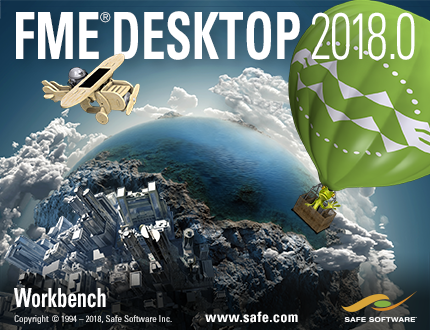

# 简介

这是Safe Software FME Desktop应用程序入门级培训课程的手册。

培训将介绍基本概念和术语，帮助学生成为FME的有效用户，并指导您使用资源来帮助您将产品应用于您自己的需求。

## 课程结构

全部课程由五个主要部分组成。这些部分是：

* 数据转换基础知识
* 数据转换
* 工作空间设计
* 实用转换器使用
* 最好的练习

## 当前状态

本手册的当前状态为：**完整**：本手册可用于培训。

本手册适用于**FME2018.0**

每章的状态是：

* 第0章：完整内容。没有练习
* 第1章：完整内容和练习
* 第2章：完整内容和练习
* 第3章：完整内容和练习
* 第4章：完整内容和练习
* 第5章：完整内容和练习
* 第6章：完整内容。没有练习
* 幻灯片：完整
* FME数据：完整
* 课程大纲：完整

_**注意：**_ _即使是已完整的内容，Safe Software Inc.也不对本文档中的任何错误或其后果承担任何责任，并保留对本文档进行改进和更改的权利，恕不另行通知。有关详细信息，请参阅完整许可协议。_

