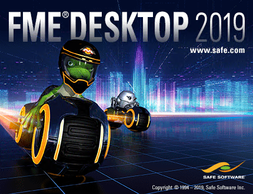

# 桌面基础训练手册 #

这是安全软件FME桌面应用入门级培训课程的手册。

培训将介绍基本概念和术语，帮助学生成为fme的高效用户，并指导您使用资源，帮助您将产品应用于自己的需求。

##课程结构##

整个课程由五个部分组成。这些部分是：

- 数据转换基础
- 数据转换
- 工作空间设计
- 实际转换器使用
- 最佳实践

## 现状 ##

本手册当前状态为：**完成**：本手册**可以**用于培训

本手册适用于**FME2019.0**

每一章的地位是：

- 第0章：完整内容。没有练习
- 第一章：完整的内容和练习
- 第二章：完整的内容和练习
- 第三章：完整的内容和练习
- 第四章：完整的内容和练习
- 第五章：完整的内容和练习
- 第六章：完整内容。没有练习
- 幻灯片：完成
- FMEData:完成

***注意：***即使是已完成的内容，SAFE Software Inc.也不对本文档中的任何错误及其后果承担任何责任，并保留对本文档进行改进和更改的权利，恕不另行通知。有关详细信息，请参阅完整的许可协议。*
