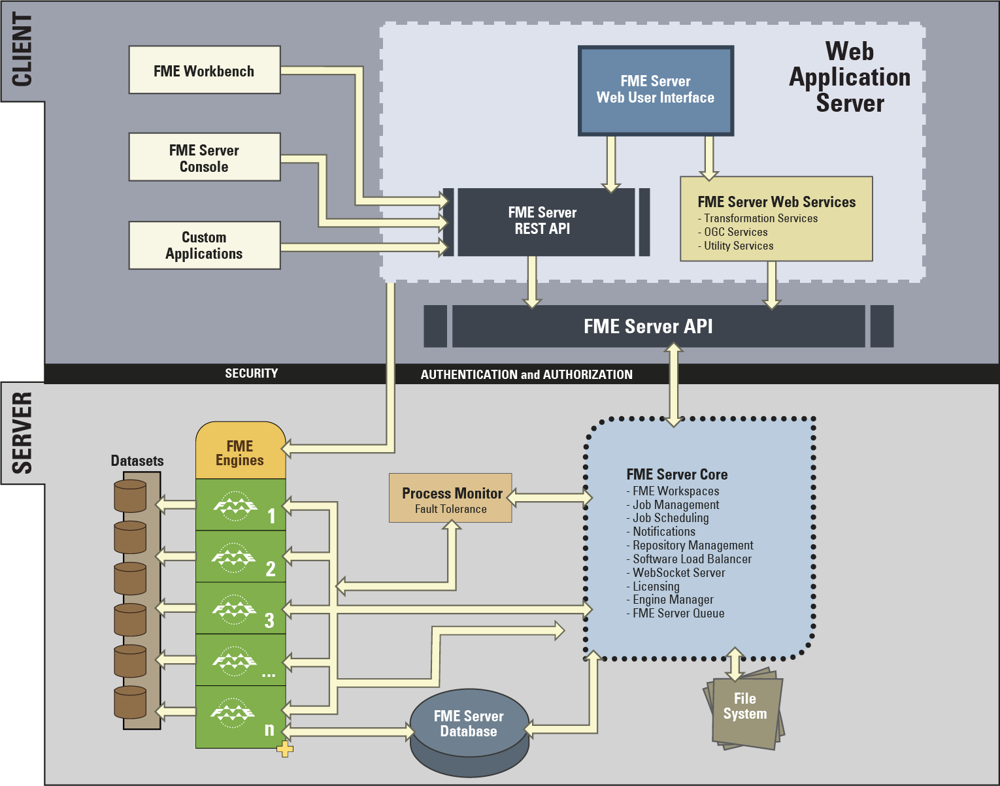

# FME Server架构e #

FME Server由许多不同的组件组成。

FME Server的体系结构是一个客户端 - 服务器模型，如下所示：

## FME Serve组件 ##

不要担心尝试了解整个结构，只需要了解FME Server的主要组件：

- FME引擎：进行数据转换处理
- 服务器核心：排队作业，处理调度和管理负载平衡
- Web服务：处理网络功能

### FM引擎 ###

FME引擎通过运行FME工作空间来处理作业请求。这是FME Desktop使用的相同核心引擎，执行相同的处理。FME Server安装可以拥有多个引擎。

每个FME引擎一次处理单个请求（作业）。

可以通过将其他FME引擎连接到服务器核心来扩展FME服务器处理。这些FME引擎可以在同一台计算机和核心上运行，也可以在分布式FME Server环境中的不同计算机上运行。

### 服务器核心 ###

FME Server核心管理调度，存储库内容（工作空间，自定义格式，自定义转换器，数据）以及处理通知请求。

 

FME Server核心包含一个软件负载均衡器（SLB），可将作业分配给FME引擎。

### Web服务 ###

许多FME Server网络功能都是使用我们称之为“Web服务”的方式处理的。这些Web服务是其接口提供服务器和客户端之间通信的软件。

FME Server有许多服务：

- 数据下载
- 数据流
- 作业提交者
- KML网络链接
- 通知
- 数据上传
- 令牌安全
- REST

某些服务（例如，数据下载）是执行数据转换的“转换”服务，而其他服务（例如，数据上载）是非转换“实用”服务。

### 服务器队列 ###

FME Server队列管理作业队列，并根据需要将作业分派给特定的FME引擎。也可以在作业队列中设置作业优先级。

