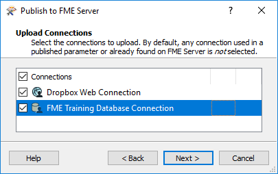

  

    <article class="markdown-body entry-content" itemprop="text"><h2>传输工作空间</h2>

通过菜单栏在FME Workbench中访问发布或下载工作空间的功能：

...或工具栏：

<h3>连接到FME服务器</h3>

FME Workbench中的Publish to FME Server工具打开一个简单的向导界面，其第一个对话框定义了与FME Server的连接。

添加Web连接将打开一个对话框，其中包含用于定义连接凭据的字段。保存这些连接详细信息，以便以后只需从下拉列表中选择即可重复使用它们：

<h3>存储库选择</h3>

下一个对话框定义存储工作空间的存储库：

工作空间名称也可以编辑，甚至可以与本地保存的名称不同。

<h3>连接上传</h3>

仅当需要使用工作空间上载数据库和/或Web连接时，才会显示此对话框。

此工作空间包含数据库连接和需要上载以在FME Server上运行的Web连接。请注意，<em>OAuth</em> Web连接需要将服务添加到FME Server，并且在允许FME Server使用之前还需要其他身份验证。

T数据库连接不需要进一步的身份验证，但必须注意不要意外覆盖可能已在FME Server上定义的同名的现有数据库连接。

<h3>工作空间注册</h3>

最后的对话框定义了工作空间要注册的服务。 工作区可以注册为与这些服务的任意数量一起使用。

Job Submitter服务允许FME Server按原样运行工作空间。这是最接近在FME Workbench中运行工作空间的。所有输入和输出都在工作空间中定义，因此数据只是简单地写出来而不是流式传输或以任何其他方式传递。

作业提交非常适合测试工作空间，以及运行使用服务器进程队列的大规模和批量转换。

<h2>重新发布工作空间</h2>

发布工作空间后，重新发布工具将变为活动状态。然后，只需单击即可上载对工作空间的进一步更新（在同一FME Workbench会话中）。

使用与以前相同的参数。如果需要对这些参数进行更改，则应使用完整发布向导。

<h2>下载工作空间</h2>

Workbench还可以下载FME Server存储库中保存的工作空间。通常这样做是为了对工作空间进行编辑。请注意，下载的工作空间是原始文件的副本，它保留在FME Server存储库中。

下载向导以与发布向导相同的连接对话框开始。 从那里，第二个 - 也是最后一个 - 对话框页面是一个存储库和工作空间选择工具：

然后提示用户输入保存工作空间的位置。 默认（在Windows上）是 &lt;User&gt;\Documents\FME\Workspaces. T然后下载工作空间 - 以及任何资源 - 并将其保存到该位置。

下载后，工作空间将在FME Workbench中自动打开以进行编辑。

 
<table>
<tbody><tr>
<td>
<i></i>
2018.1的新内容
</td>
</tr>
<tr>
<td>

也可以从FME Server Web界面下载工作空间。在整个Web界面的各个位置查找下载按钮，或在存储库中选择工作空间，然后单击“下载”按钮。 

</td>
</tr>
</tbody></table>

<table>
<tbody><tr>
<td>
<i></i>
分析师女士说......
</td>
</tr>
<tr>
<td>

除工作空间外，还可以在FME Server存储库中发布/下载FME自定义转换器和自定义格式。

</td>
</tr>
</tbody></table>
</article>
