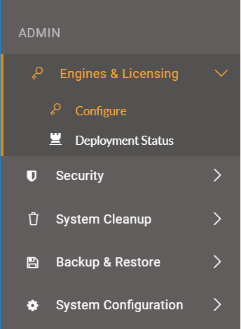
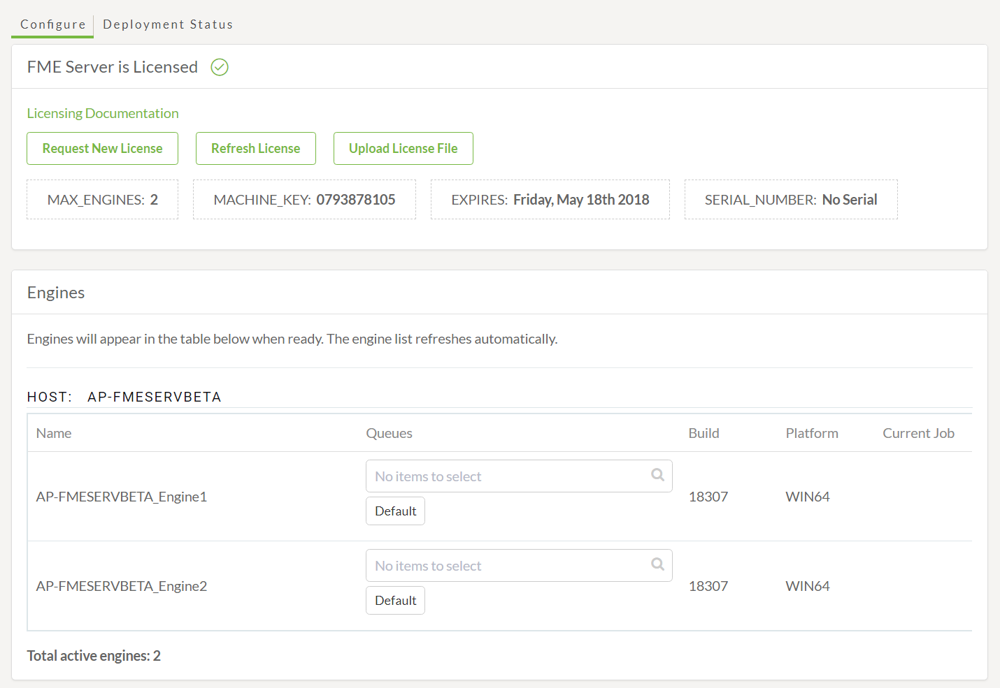
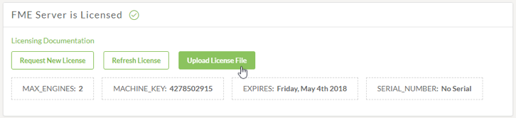
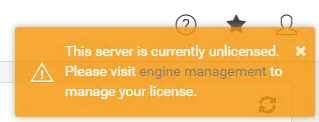
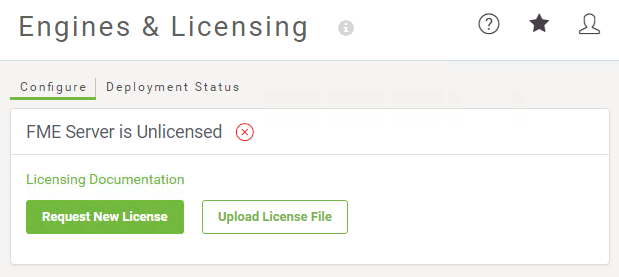
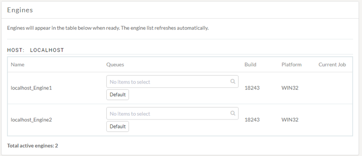
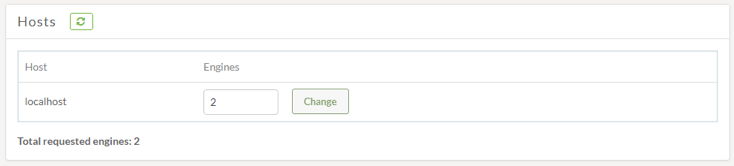
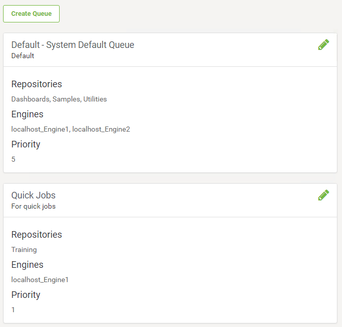

## 引擎和许可 ##

开始使用FME Server的第一步是选择引擎和许可的菜单选项：

这将打开“引擎和许可”页面，您可以在其中确保FME Server正常运行，已获得许可并具有活动引擎：

### 许可 ###

本页的上半部分与许可有关。标签显示许可证到期时许可的引擎数量，以及机器密钥和序列号的数量。这些按钮允许您刷新许可证，请求新许可证或上传许可证文件。

---

<!--Warning Section--> 

<table style="border-spacing: 0px">
<tr>
<td style="vertical-align:middle;background-color:darkorange;border: 2px solid darkorange">
<i class="fa fa-exclamation-triangle fa-lg fa-pull-left fa-fw" style="color:white;padding-right: 12px;vertical-align:text-top"></i>
警告
</td>
</tr>

<tr>
<td style="border: 1px solid darkorange">

在您首次登录之前，FME Server Administrator应该已经设置了许可。如果在登录FME Server时看到以下两个图像之一，请与FME Server Administator联系。有关如何许可FME Server的更多详细信息，请参阅<a href="https://safe-software.gitbooks.io/fme-server-administration-training-2018/content/ServerAdmin1Installation/1.07.Licensing.html"> “服务器管理员”课程手册</a>: 
  

   

</td>
</tr>
</table>

---

### 引擎 ###

中间部分显示当前启动的引擎，分配给它们的队列，它们的FME内部版本号，操作系统以及它们正在处理的作业（如果有）。平台（操作系统）很重要，因为分布式FME Server设置可以同时在各种操作系统上运行引擎。

### 主机 ###

引擎部分下方是主机部分，其中显示了每台主机上运行的引擎，并允许您轻松更改运行的引擎数，最多可达当前许可提供的最大引擎数：

---

如果您的FME Server已获得许可且运行的引擎已分配给正确的主机，则您可以运行已发布的工作空间。

---

### 作业队列 ###

“引擎和许可”页面的“作业队列”部分提供了一种方法，用于保留FME引擎以处理来自特定存储库的作业。例如 - 您可以使用专用于处理快速任务的FME引擎，以便较慢的作业不会导致积压。同样，您可以保留一台FME引擎，该引擎位于功能更强大的机器上，用于处理LiDAR数据转换。作业队列也是您可以设置作业优先级的地方。

