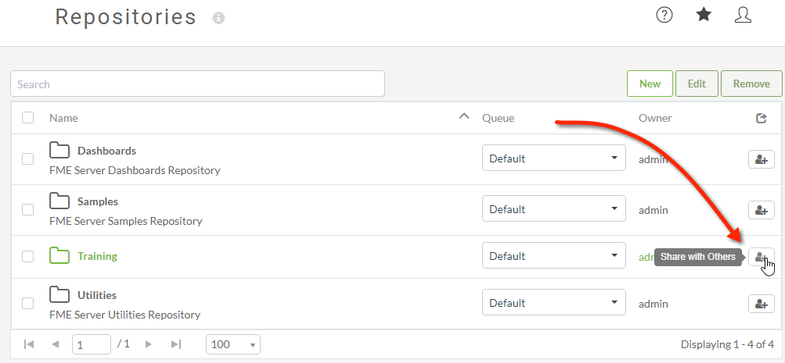
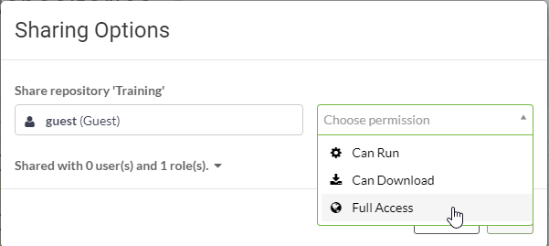

# 共享 #

FME Server安全性取决于您是拥有某个组件还是已获得组件的访问权限。组件可以是一组功能，也可以是存储库之类的对象。

创建内容时，您拥有该组件的完全权限。即使您没有管理FME Server安全性的权限，您也可以与其他用户共享组件。

## 共享存储库 ##

在Server Web界面中选择Repositories的菜单选项，您将看到系统上的存储库列表。

如果您是存储库的所有者，那么您可以单击按钮*与其他人共享*：

这将打开一个弹出对话框，在其中选择用户并选择您希望为其提供的权限级别：

FME Security也基于用户和角色。角色类似于一组用户。共享组件时，“用户”字段可以是单个用户，也可以应用于特定角色;例如，您可以将运行某个存储库中的工作空间的能力授予fmeuser角色中的任何人。

---

<!--Person X Says Section-->

<table style="border-spacing: 0px">
<tr>
<td style="vertical-align:middle;background-color:darkorange;border: 2px solid darkorange">
<i class="fa fa-quote-left fa-lg fa-pull-left fa-fw" style="color:white;padding-right: 12px;vertical-align:text-top"></i>
警察局长Webb-Mapp说...
</td>
</tr>

<tr>
<td style="border: 1px solid darkorange">

这是一项非常重要的功能。作为作者，您可以发布供组织内部（和外部）的多个用户使用的工作空间。但是，如果这些用户无法访问它，则工作空间几乎没用。 
  “与他人共享”工具允许您打开对工作空间的访问权限，而无需完全安全控制所需的高级权限。 
  除了存储库，FME Server的其他组件也可以与其他用户共享。在用户界面和整本手册中保持观察，以获得其他共享机会。

</td>
</tr>
</table>
