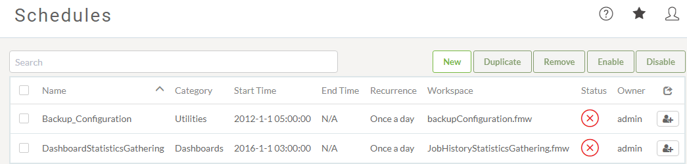

# 计划

计划转换是在特定时间或日期启动工作空间的最佳方式。同样重要的是，使用调度来自动化在一个定义的时间间隔内多次运行工作空间的任务。 

## 什么是计划? ##

调度是指将FME Server配置为在将来的特定时间在存储库中运行工作空间的功能。计划可以使工作空间运行一次或重复运行。

## 管理计划任务 ##

计划任务在Web界面中设置。可以通过主菜单上的按钮访问它们：

该界面支持您期望的所有功能，包括创建，删除，复制以及启用和禁用任务的能力：

## 创建计划任务 ##

创建计划任务时可以设置许多参数。

第一组参数包括用于命名和描述计划以及设置实际计划的选项。在这里工作空间将设置为从4月28日凌晨2:00开始每天运行一次。

---

<!--Tip Section-->

<table style="border-spacing: 0px">
<tr>
<td style="vertical-align:middle;background-color:darkorange;border: 2px solid darkorange">
<i class="fa fa-info-circle fa-lg fa-pull-left fa-fw" style="color:white;padding-right: 12px;vertical-align:text-top"></i>
2018.1的新变化
</td>
</tr>

<tr>
<td style="border: 1px solid darkorange">

请注意，在FME Server 2018.1中，“创建新计划”界面略有改变。主要变化是，如果结束（可选）字段留空，则计划不会过期。这将取代以前的FME Server版本中的Schedule Does Not Expire复选框： 
  

</td>
</tr>
</table>

---

请注意，每个计划都可以分配给特定类别。

接下来的几个参数集中在要运行的工作空间上。

选择工作空间后，FME将检索有关工作空间的信息，此时会有短暂的暂停。然后它将暴露工作空间中存在的任何已发布参数：

通知主题还有可选参数，可在完成计划任务时触发。这些可用于通知管理员转换成功或失败。

最后，还有一些高级选项可用于控制作业队列和作业到期（对于时间敏感的作业，如果通过更高优先级的任务在特定时间内保留，则不再有用）。

为计划任务设置参数后，它将添加到主计划界面中，可以轻松启用或禁用。
