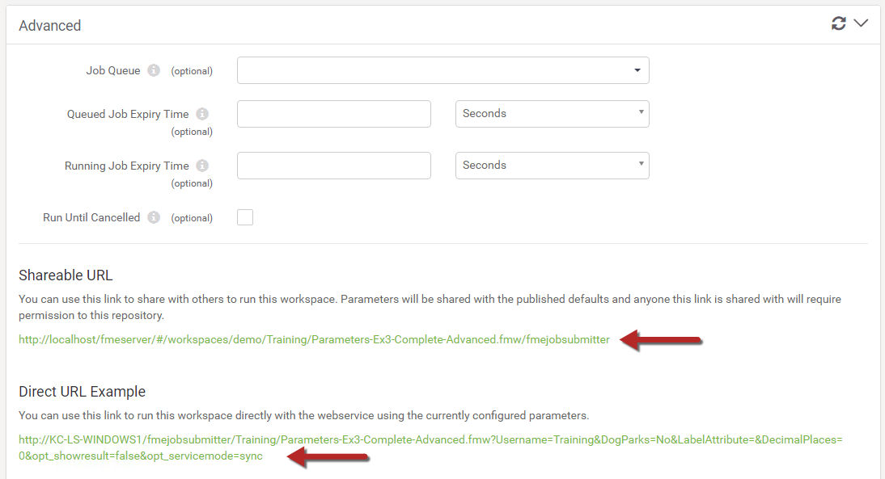

# 使用URL运行Job Submitter #

对FME Server的所有作业请求都是HTTP请求的变体。这使得通过URL运行工作空间变得非常简单，前提是您知道请求将采用何种形式。

查找该URL的最简单方法是在“运行工作空间”页面的高级部分中：

请注意，URL有两个版本。每个的描述如下。

### 可共享的网址 ###

此URL将使用户进入FME Server界面的Run Workspace页面，并提示他们填写任何已发布的参数。

### 直接的网址 ###

此URL包括参数和立即运行工作空间的命令。此URL将使用当前参数值运行工作空间，而无需将用户带到“运行工作空间”页面。

此信息是用于构建访问FME Server服务的Web应用程序的有用工具，因为您可以复制HTTP请求并将其嵌入到您自己的网站或应用程序中。您还可以将URL嵌入到电子邮件中，或将URL直接粘贴到Web浏览器中。

---

<table style="border-spacing: 0px">
<tr>
<td style="vertical-align:middle;background-color:darkorange;border: 2px solid darkorange">
<i class="fa fa-info-circle fa-lg fa-pull-left fa-fw" style="color:white;padding-right: 12px;vertical-align:text-top"></i>
技巧
</td>
</tr>

<tr>
<td style="border: 1px solid darkorange">

显示的URL使用HTTP GET请求，而在此HTML表单上单击“运行”则使用HTTP POST请求。 
  您可以在GET请求中发送的数据量有限制，因为URL的长度限制因使用的浏览器而异。如果您预计您的请求参数可能包含很长的字符串，请改用POST请求。

</td>
</tr>
</table>
