  

    <article class="markdown-body entry-content" itemprop="text">
<table>
<tbody><tr>
<td width="25%">
<i></i>
练习1.1
</td>
<td>
每日数据库更新：发布工作空间
</td>
</tr>
<tr>
<td>数据</td>
<td>消防站（GML） 街区（KML）</td>
</tr>
<tr>
<td>总体目标</td>
<td>创建工作空间以读取和处理部门数据并将其发布到FME Server</td>
</tr>
<tr>
<td>演示</td>
<td>将工作空间发布到FME Server</td>
</tr>
<tr>
<td>启动工作空间</td>
<td>无</td>
</tr>
<tr>
<td>结束工作空间</td>
<td>C:\FMEData2018\Workspaces\ServerAuthoring\Basics-Ex1-Complete.fmw
</td>
</tr>
</tbody></table>

对于本章的练习，您是当地城市GIS部门的技术分析师。您拥有使用FME Desktop的丰富经验，您的部门正在调查FME Server以评估其功能。

市内有许多部门，您的任务之一是从每个部门获取数据并将它们合并到一个公司数据库中。

由于每个部门都以不同的格式和样式生成数据集，因此您可以使用FME执行此任务，并每周执行一次。

购买FME Server的原因之一是自动执行此过程，所以让我们开始实现它。

<table>
<tbody><tr>
<td>
<i></i>
警察局长Webb-Mapp说......
</td>
</tr>
<tr>
<td>

如果您有丰富的FME Workbench经验 - <strong>如果您的指导老师同意</strong> - 只需打开上面标题中列出的工作空间并跳到第8步。

</td>
</tr>
</tbody></table>

 <strong>1）检查源数据</strong>
 为了简单起见 - 并且因为本课程是关于FME Server而不是FME Desktop - 我们将使用几个数据集。这些是：

<table>
<tbody><tr>
<td>读者格式</td>
<td>GML（地理标记语言）</td>
</tr>
<tr>
<td>读模块数据集</td>
<td>C:\FMEData2018\Data\Emergency\FireHalls.gml
</td>
</tr>
</tbody></table><table>
<tbody><tr>
<td>读模块格式</td>
<td>谷歌KML</td>
</tr>
<tr>
<td>读模块数据集</td>
<td>C:\FMEData2018\Data\Boundaries\VancouverNeighborhoods.kml</td>
</tr>
</tbody></table>

从Windows开始菜单中选择FME Data Inspector，启动它。检查所有源数据以熟悉它。VancouverNeighborhoods具有与其他数据集不同的坐标系，因此如果要一起查看所有数据，请小心并打开背景地图。

我们转换的目标是将FireHalls和Neighborhoods转换为数据库，将每个街区的消防站数据划分为一个单独的表。

 <strong>2）启动FME Workbench</strong>
 从Windows开始菜单中选择它，启动FME Workbench。在空白画布上，选择“读模块”&gt;“添加读模块”以开始将读模块添加到工作空间。出现提示时，输入FireHalls数据集的以下详细信息：

<table>
<tbody><tr>
<td>读模块格式</td>
<td>GML（地理标记语言）</td>
</tr>
<tr>
<td>读模块数据集</td>
<td>C:\FMEData2018\Data\Emergency\FireHalls.gml</td>
</tr>
</tbody></table>

 <strong>3）添加KML数据</strong>
 现在再次重复该过程以添加KML数据集的读模块：

<table>
<tbody><tr>
<td>读模块格式</td>
<td>谷歌KML</td>
</tr>
<tr>
<td>读模块数据集</td>
<td>C:\FMEData2018\Data\Boundaries\VancouverNeighborhoods.kml</td>
</tr>
</tbody></table>

添加KML数据集时，系统会提示您选择要添加到工作空间的要素类型（图层）。我们需要的唯一一个叫做Neighborhoods（街区）：

<a target="_blank" rel="noopener noreferrer" href="./Images/Img1.200.Ex1.KMLFTSelection.png">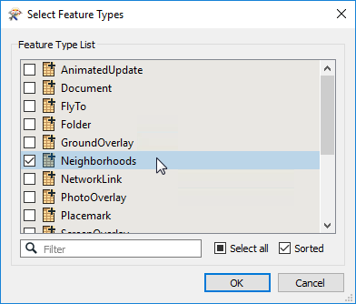</a>

你现在应该在画布上有两个读模块：

<a target="_blank" rel="noopener noreferrer" href="./Images/Img1.201.Ex1.TwoReaders.png">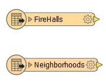</a>

 <strong>4）添加Reprojector转换器</strong>
 将Reprojector转换器添加到工作空间。只需单击画布并开始键入Reprojector即可完成此操作。将其连接到“Neighborhoods”要素类型：

<a target="_blank" rel="noopener noreferrer" href="./Images/Img1.202.Ex1.WorkspaceConnectedReprojector.png">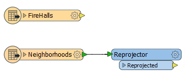</a>

在Reprojector的参数中，将目标坐标系设置为UTM83-10：

<a target="_blank" rel="noopener noreferrer" href="./Images/Img1.203.Ex1.ReprojectorParameters.png">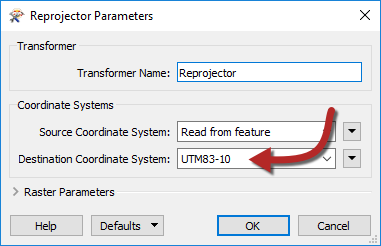</a>

这将确保Neighborhoods数据与其余数据处于相同的坐标系中。

 <strong>5）添加写模块</strong>
 现在我们应该在工作空间中添加一个写模块。现在，我们只是设置一个虚拟写模块，直到我们更熟悉FME Server。因此，在菜单栏上选择写模块s&gt; 添加写模块以添加写模块并使用以下参数进行设置：

<table>
<tbody><tr>
<td>写模块格式</td>
<td>空（什么也没有）</td>
</tr>
<tr>
<td>要素类或表定义</td>
<td>从读模块复制......</td>
</tr>
</tbody></table>

<a target="_blank" rel="noopener noreferrer" href="./Images/Img1.204.Ex1.AddWriterDialog.png">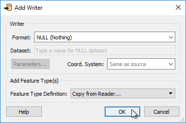</a>

单击确定。出现提示时，选择FireHalls和Neighborhoods作为要添加的要素类型，然后再次单击“确定”：

<a target="_blank" rel="noopener noreferrer" href="./Images/Img1.205.Ex1.AddWriterSelectFTs.png">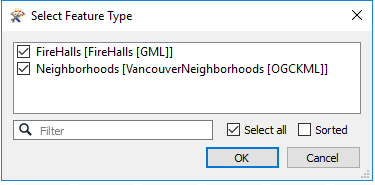</a>

工作空间现在看起来像这样：

<a target="_blank" rel="noopener noreferrer" href="./Images/Img1.206.Ex1.WorkspaceWithReadersWriters.png">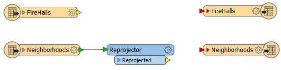</a>

 <strong>6）添加Clipper Transformer</strong>
 将Clipper转换器添加到工作空间。这将用于按街区划分FireHall数据。

将FireHalls要素类型连接到Clipper:Clippee端口以及Reprojector:Reprojected输出到Clipper:Clipper端口。您可能希望重新排列要素类型（或端口顺序）以避免重叠连接

<a target="_blank" rel="noopener noreferrer" href="./Images/Img1.207.Ex1.WorkspaceConnected.png">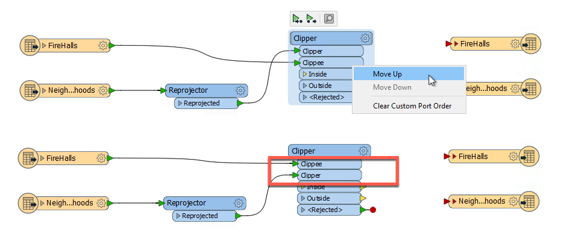</a>

检查Clipper转换器的参数，确保Clipper Type设置为Multiple Clippers。这是因为有多个Neighborhoods要素可以充当clipper要素。

启用合并属性，以便将Neighborhoods名称从Neighborhoods要素复制到FireHall要素：

<a target="_blank" rel="noopener noreferrer" href="./Images/Img1.208.Ex1.ClipperParameters.png">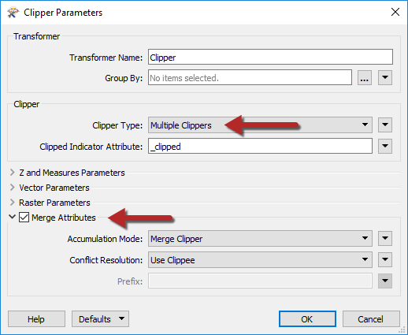</a>

将Clipper:Inside端口连接到FireHalls写模块要素类型。还可以从Reprojector：Reprojected端口连接到Neighborhoods 写模块要素类型：

<a target="_blank" rel="noopener noreferrer" href="./Images/Img1.209.Ex1.WorkspaceAllConnected.png">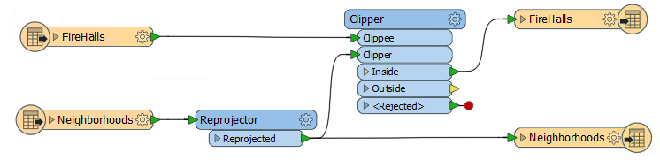</a>

 <strong>7）设置Firehall要素类型名称</strong>
 最后，让我们为FireHalls写模块要素类型设置要素类型名称。

检查其参数并在要素类型名称下输入：

<pre>FireHalls- @值（NeighborhoodName）
</pre>

...或单击下拉列表并使用文本编辑器对话框输入该值。这将导致每个不同Neighborhoods中的firehell被写入不同的表/层。

<a target="_blank" rel="noopener noreferrer" href="./Images/Img1.210.Ex1.FireHallFeatureType.png">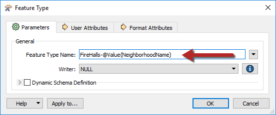</a>

 <strong>8）运行工作空间</strong>
 这是进程的服务器部分。

首先，保存工作空间。在发布到FME Server之前保存工作空间始终是个好主意。接下来，运行工作空间。如果工作空间不能在FME Desktop上运行，则它不太可能在FME Server上运行。

运行工作空间后，检查转换日志。您的转换日志应如下所示：

<a target="_blank" rel="noopener noreferrer" href="./Images/Img1.211.Ex1.Output.png">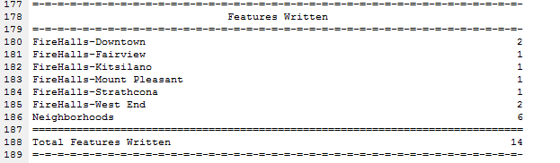</a>

 <strong>9）发布到服务器：创建连接</strong>
 现在我们有一个工作空间并且知道它可以正常工作，让我们将它发布到FME Server。

在FME Workbench中，从菜单栏中选择“文件”&gt;“发布到FME Server”。由于这是我们第一次连接到我们的FME Server，我们需要创建一个新连接，因此在Publish to FME Server向导中，从下拉菜单中选择Add Web Connection。

在打开的对话框中输入培训讲师提供的参数。在大多数情况下，参数如下：

<ul>
<li><strong>FME Server URL：</strong> <a href="http://localhost/" rel="nofollow">http：// localhost</a></li>
<li><strong>用户名：</strong> admin</li>
<li><strong>密码：</strong> admin</li>
</ul>

<a target="_blank" rel="noopener noreferrer" href="./Images/Img1.212.Ex1.ServerConnection.png">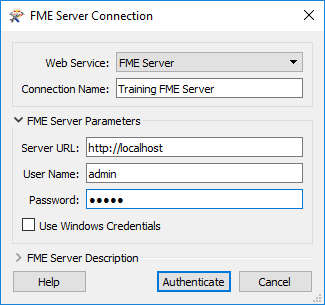</a>

您可能需要也可能不需要(大概不需要)输入带有主机名的端口号，这取决于系统的设置方式。

单击“验证”以确认连接并返回上一个对话框。确保选中新定义的连接，然后单击“下一步”继续。

 <strong>10）发布到服务器：存储库选择</strong>
 下一个对话框提示您选择存储工作空间的存储库。

在本练习中，我们将通过单击“新建”按钮创建新的存储库。出现提示时输入名称Training。

单击“确定”关闭“创建新存储库”对话框。输入工作空间的名称（如果它还没有）。勾选“上传数据文件”选项：

然后单击“下一步”继续向导。

 <strong>11）发布到服务器：选择服务</strong>
 在向导的最后一个屏幕中，我们可以注册工作空间以用于各种服务。

选择Job Submitter服务，因为这是我们现在使用的唯一服务：

...并单击“发布”以完成发布工作空间。

将工作空间传输到服务器后，日志窗口将显示一条消息，报告已将哪个工作空间发布到哪个存储库以及哪些服务。它看起来像这样：

<a target="_blank" rel="noopener noreferrer" href="./Images/Img1.216.Ex1.PublishLog.png">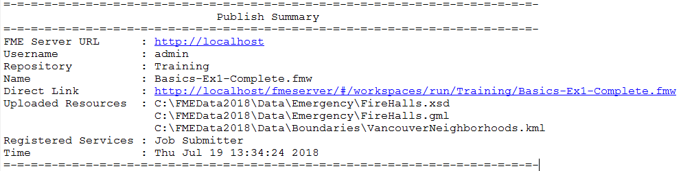</a>

<table>
<tbody><tr>
<td>
<i></i>
恭喜
</td>
</tr>
<tr>
<td>

通过完成本练习，您已学会如何：
 
<ul><li>创建将数据转换为Null（虚拟）格式的工作空间</li>
<li>使用Clipper将属性值从一个要素传输到另一个要素</li>
<li>根据属性的值重命名输出图层</li>
<li>使用发布向导将工作空间发布到FME Server</li>
<li>使用发布向导在FME Server上创建存储库</li>
<li>使用“发布向导”用“Job Submitter ”服务注册工作空间</li></ul>

</td>
</tr>
</tbody></table>
</article>
  

