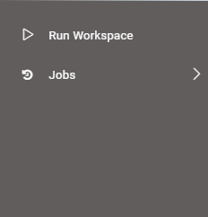
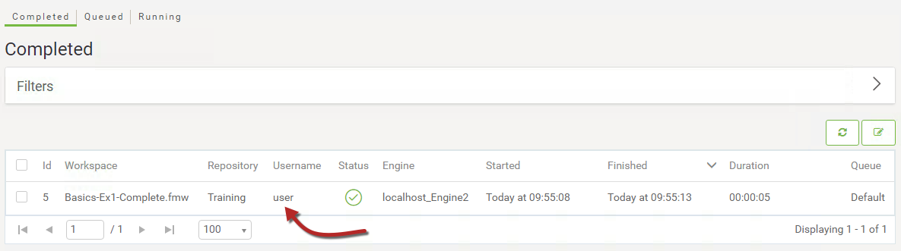

  

    <article class="markdown-body entry-content" itemprop="text">
<table>
<tbody><tr>
<td width="25%">
<i></i>
练习1.3
</td>
<td>
每日数据库更新：共享和调度
</td>
</tr>
<tr>
<td>数据</td>
<td>消防站Firehalls（GML） 街区Neighborhoods（KML）</td>
</tr>
<tr>
<td>总体目标</td>
<td>创建工作空间以读取和处理部门数据并将其发布到FME Server</td>
</tr>
<tr>
<td>演示</td>
<td>在FME Server中共享和调度转换</td>
</tr>
<tr>
<td>启动工作空间</td>
<td>无</td>
</tr>
<tr>
<td>结束工作空间</td>
<td>无</td>
</tr>
</tbody></table>

您已经（在练习1和练习2中）创建了一个工作空间来执行此转换，将其发布到FME Server，并运行它以确认它是否有效。

作为日常任务，您计划在下班后每天运行转换。但是...如果你不在那里或早退，或其他人迟到，会发生什么。谁会运行呢？

首先，您应该确保其他用户可以访问工作空间来运行它，但您也可以将其设置为以自动计划运行。

 <strong>1）连接到服务器</strong>
 浏览到FME Server界面的登录页面，方法是通过开始菜单上的Web 界面选项启动它，或者如果您已经登录则注销。

这次，使用通用用户帐户登录，该帐户是任何FME Server安装上的默认帐户。用户名是<em><strong>user</strong></em>，密码也是<em><strong>user</strong></em>！

您会注意到的第一件事是该帐户的菜单和功能受到更多限制：

实际上，如果您尝试运行一个工作空间，您会发现这个帐户能够访问的惟一存储库是sample存储库;不是现有工作空间所在的Training存储库:

 <strong>2）共享存储库</strong>
 注销用户帐户并以管理员身份（admin / admin）重新登录。

现在，您拥有完整的菜单条目集，单击菜单上的“存储库”。在存储库列表下，找到Training存储库。单击右侧的“共享”图标：

在“共享选项”对话框中，选择fmeuser作为要共享的角色，并允许它们运行工作空间：

通过选择<em>fmeuser</em>角色（而不是单个<em>user</em>帐户），我们允许任何被标记为用户的人访问工作空间; 并且只允许它们运行，我们阻止它们下载并对我们的工作空间进行编辑。

 <strong>3）检查共享</strong>
 退出管理员帐户并使用用户帐户（user/user）重新登录到FME Server。

这一次，您应该可以访问Training存储库。单击“运行工作空间”，在“Training ”存储库中选择您的工作空间并运行它。检查“已完成的作业”页面，当工作空间以用户身份运行时，您将看到该工作空间的一个条目。检查“作业”页面，当工作空间以用户身份运行时，您将看到该工作空间的一个条目。只有一个条目，因为用户没有查看任何其他用户作业所需的权限：

再次注销并以管理员身份重新登录。现在，在Jobs | Completed 窗口，您应该能够看到管理员的工作和用户的工作

这是因为管理员组确实有权查看所有作业。

 <strong>4）创建测试计划</strong>
 现在我们允许其他用户按需运行工作空间，但我们也应该将转换设置为按计划运行。

首先，为了确认调度确实有效，让我们设置一个测试计划。单击菜单上的“计划”，然后在“计划”页面中，单击“新建”按钮以启动该过程。

设置测试计划的名称，并通过在“类别”字段中键入“培训(Training)”将其添加到“培训(Training)”类别：

对于时间设置，将计划设置为立即启动并每30秒运行一次。取消选中Schedule Is Not Expire旁边的复选框，并将结束时间设置为未来后约30分钟（这样的话，如果我们忘记取消计划安排，它不会永远持续下去!）

请注意，时间以24小时格式给出，因此1:30表示AM，13：30表示PM。同样重要的是要注意，此时间是运行连接到FME Server的Web浏览器的计算机的本地时间。如果您的FME服务器位于与您正在访问FME Server的计算机不同时区的计算机上，请记住这一点。

在“工作空间设置”下，选择“Training库”，然后选择之前上载的工作空间（Basics-Ex1-Complete.fmw）：

我们不需要为此工作空间更改任何用户参数，因此可以忽略任何用户参数。

现在单击“确定”以添加新计划。

 <strong>5）检查作业页面</strong>
 打开“作业”页面。将打开以前运行的作业列表。您将发现(如果设置正确)将有一些作业正在以计划运行:

请注意，用户名设置为admin; 因为那是创建计划的用户，即用于运行作业的用户名。

 <strong>6）创建实际计划</strong>
 现在我们确信我们知道如何使用界面，让我们设置实际计划。我们希望工作空间在一周中的每一天都运行。也应该没有结束日期。

因此，请返回“计划”页面。您现在可以：

<ul>
<li>单击测试计划并将其编辑为所需的值</li>
<li>删除测试计划并创建具有所需值的新计划</li>
</ul>

此设置将在每天晚上8:00运行工作空间。别忘了单击“确定”按钮！

您可能希望在此培训期间定期检查以确保工作空间按预期运行。

<table>
<tbody><tr>
<td>
<i></i>
恭喜
</td>
</tr>
<tr>
<td>

通过完成本练习，您已学会如何：
 
<ul><li>在FME Server中共享一个存储库，并进行测试，以确保它对正确的用户可用</li>
<li>在FME Server中计划安排转换</li>
<li>检查作业历史记录以确保进行计划的转换</li></ul>

</td>
</tr>
</tbody></table>
</article>
  

