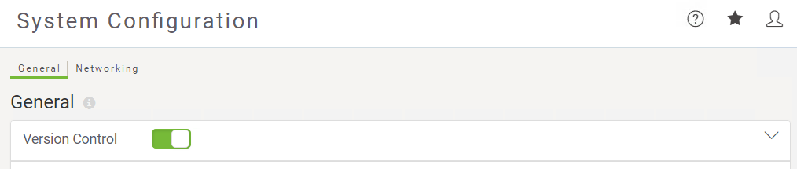

  

    <article class="markdown-body entry-content" itemprop="text">
<table>
<tbody><tr>
<td width="25%">
<i></i>
练习1.4
</td>
<td>
每日数据库更新：添加到版本历史记录
</td>
</tr>
<tr>
<td>数据</td>
<td>消防站Firehalls（GML） 街区Neighborhoods（KML）</td>
</tr>
<tr>
<td>总体目标</td>
<td>将先前练习中构建的工作空间的副本提交到FME Server上的版本历史记录。</td>
</tr>
<tr>
<td>演示</td>
<td>与版本历史工具交互</td>
</tr>
<tr>
<td>启动工作区</td>
<td>无</td>
</tr>
<tr>
<td>结束工作区</td>
<td>无</td>
</tr>
</tbody></table>

您已经（在练习1,2和3中）创建了一个工作空间来执行此转换，将其发布到FME Server，运行它以确认它是否正常工作并安排它每天运行。

您现在想要“检查点”工作空间的这个工作版本，以确保如果将来对其进行任何编辑，您始终可以返回到此状态。

<table>
<tbody><tr>
<td>
<i></i>
警告
</td>
</tr>
<tr>
<td>

在工作场所中，您必须先让FME Server管理员启用版本控制，然后才能开始使用它。

</td>
</tr>
</tbody></table>

 <strong>1）连接到服务器</strong>
 浏览到FME Server界面的登录页面，然后使用管理员帐户（admin / admin）登录。

 <strong>2）打开版本控制</strong>
 版本控制将默认关闭，因此您需要先打开它才能使用它。单击侧面菜单上的“系统配置”以展开菜单，然后在界面菜单的“管理”部分中单击“常规”。在“系统配置常规”页面上，找到“版本控制”设置以切换开关以打开“版本控制”，启用该功能时，开关将为绿色。

<table>
<tbody><tr>
<td>
<i></i>
2018.1新的变化
</td>
</tr>
<tr>
<td>

在FME Server 2018.1中，系统配置已压缩，并且可以在“系统配置”菜单的“常规”页面中找到“版本控制”。

</td>
</tr>
</tbody></table>

不要担心该页面上的其他设置，现在，只需将它们保留为默认值即可。

 <strong>3）将工作空间添加到版本历史记录</strong>
 由于Basics-Ex1-Complete.fmw工作空间已发布到FME Server，您可以从Web界面将其添加到版本历史记录中。转到“存储库”页面并打开“培训存储库”。选中工作空间旁边的复选框，然后单击Commit提交。

为此版本的工作空间添加有意义的提交注释，然后单击“提交”将其添加到历史记录中。

 <strong>4）检查版本历史记录</strong>
 确认已将此新版本添加到版本历史记录中。转到“存储库”页面并打开“培训存储库”。选中工作空间旁边的复选框，然后单击“历史记录”按钮以查看有关您刚刚提交的工作空间版本的信息。

<table>
<tbody><tr>
<td>
<i></i>
恭喜
</td>
</tr>
<tr>
<td>

通过完成本练习，您已学会如何：
 
<ul><li>将新版本的工作空间提交到版本历史记录</li>
<li>查看存储库的版本历史记录</li>

</ul></td>
</tr>
</tbody></table>
</article>
  

