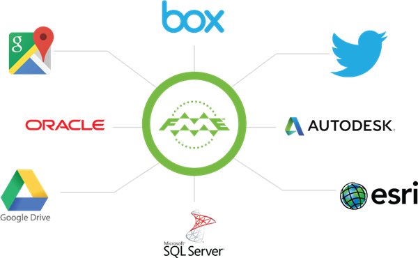

# 源数据管理

几乎每个FME工作空间都是从源数据集中读取要素开始的。

在某些情况下，源数据集可以保存在数据库中，也可以存储在Web服务（如Google Drive）上; 它甚至可能是在Web服务上运行的数据库！在其他情况下，数据可能根本不是基于Web的，而是存储在文件系统上并共享以供其他人访问。

通常，创建一个在FME Server上使用的工作空间很容易，因为在FME Desktop上工作的内容可以在服务器上发布和运行，而对源数据实践的更改很少。

但是，还有其他方法可用于将FME Server上的源数据管理提升到新的水平。这些方法包括：

- 对于存储在数据库中的数据使用数据库连接
- 将Web连接用于存储在Web服务上的数据集
- 管理文件数据集
    - 将文件数据集发布到存储库
    - 在运行时上传文件数据集
    - 在“资源”文件系统上存储文件数据集
