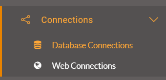

  

    <article class="markdown-body entry-content" itemprop="text"><h2>使用数据库连接</h2>

当数据集的源数据是数据库时，FME能够将连接参数存储在安全容器中。该容器可以发布到FME Server或在其上重新创建。

<h3>什么是数据库连接？</h3>

数据库连接是一组数据库连接参数的容器。这些参数包括数据库服务器，端口号，用户名，密码以及根据数据库类型而变化的其他参数。

数据库连接的两个主要优点是：

<ul>
<li>连接参数不再嵌入工作空间，这意味着更少的安全风险
<ul>
<li>例如，您的参数不会向下载工作空间的任何人公开</li>
</ul>
</li>
<li>连接参数可以在多个工作空间之间重用
<ul>
<li>例如，使用同一数据库的两个工作空间可以使用相同的连接</li>
</ul>
</li>
</ul>

数据库连接可以使用FME Desktop中的工作空间发布，也可以直接在FME Server中添加。

<h3>创建数据库连接</h3>

创建数据库连接通常在FME Desktop中启动。可以使用FME Workbench菜单栏中的工具&gt; FME选项&gt;数据库连接创建连接。然后，可以在读模块，写模块或转换器中使用已定义的连接。

例如，此工作空间具有PostGIS数据库的连接，如读模块参数和数据库连接列表中所示：

当工作空间发布到FME Server时，新对话框会询问作者是否还要发布数据库连接：

然后将连接添加到FME Server上的连接容器中。

<table>
<tbody><tr>
<td>
<i></i>
警察局长Webb-Mapp说......
</td>
</tr>
<tr>
<td>

请注意，您不必上传与工作空间的连接。如果FME Server上已存在该数据库的连接，则可以使用该连接。
  如果您没有上传连接，并且您还没有在FME Server上使用该连接，那么您将需要使用“数据库连接”页面来创建连接。

</td>
</tr>
</tbody></table>

<h3>管理数据库连接</h3>

FME Server有一个用于管理通过主菜单访问的数据库连接的页面：

此页面允许工作空间作者（通常是管理员）创建新连接，复制现有连接，删除现有连接或编辑现有连接：

<h3>使用数据库连接</h3>

运行工作空间时，如果它具有数据库读模块（例如），则会提示最终用户使用已发布的参数，并可以选择要使用的数据库连接：

然后工作空间正常运行完成。

<table>
<tbody><tr>
<td>
<i></i>
警察局长Webb-Mapp说......
</td>
</tr>
<tr>
<td>
连接与FME Server上的其他对象一样，具有安全权限。只有与连接共享的所有者或(默认情况下)管理员才能使用它。并不是任何随机用户都可以通过发布的参数访问所有数据库连接。
  这也意味着可以使用作者的连接参数在FME桌面测试工作空间，但是需要最终用户的连接发布到服务器;所有这一切都以一种既简单又安全的方式进行。
</td>
</tr>
</tbody></table>

<table>
<tbody><tr>
<td>
<i></i>
Vector小姐说...
</td>
</tr>
<tr>
<td>

如果我创建一个具有超级用户权限的数据库连接，那么它将绕过数据库为创建和删除表所做的任何权限检查。那么，您认为我如何才能防止用户滥用该功能呢?
  <a href="http://52.73.3.37/fmedatastreaming/Manual/QAResponse2017.fmw?chapter=21&amp;question=5&amp;answer=1&amp;DestDataset_TEXTLINE=C%3A%5CFMEOutput%5CQAResponse.html" rel="nofollow">1.删​​除该用户在FME Server上运行该工作空间的权限</a>
 <a href="http://52.73.3.37/fmedatastreaming/Manual/QAResponse2017.fmw?chapter=21&amp;question=5&amp;answer=2&amp;DestDataset_TEXTLINE=C%3A%5CFMEOutput%5CQAResponse.html" rel="nofollow">2.删除该用户访问工作空间所在的整个存储库的权限</a>
 <a href="http://52.73.3.37/fmedatastreaming/Manual/QAResponse2017.fmw?chapter=21&amp;question=5&amp;answer=3&amp;DestDataset_TEXTLINE=C%3A%5CFMEOutput%5CQAResponse.html" rel="nofollow">.3。删除该用户角色访问该特定数据库连接的权限</a>
 <a href="http://52.73.3.37/fmedatastreaming/Manual/QAResponse2017.fmw?chapter=21&amp;question=5&amp;answer=4&amp;DestDataset_TEXTLINE=C%3A%5CFMEOutput%5CQAResponse.html" rel="nofollow">4.从其角色权限中删除管理数据库连接</a>

</td>
</tr>
</tbody></table>
</article>
  

