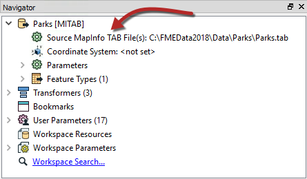
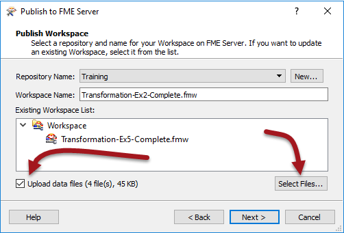
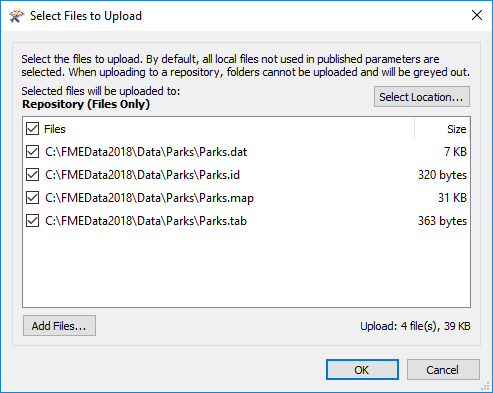
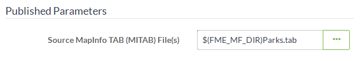

## 将文件数据集发布到存储库 ##

当转换的源数据存储为文件（而不是源或数据库）时，它可以与工作空间一起发布到FME Server存储库。

---

### 发布源数据 ###

在此工作空间中，源数据集是MapInfo TAB：

MapInfo TAB数据集由一系列文件（.tab，.dat，.id，.map）组成。发布此工作空间后，向导允许我们只需选中标记为*上传数据文件*的复选框，即可将数据文件与其一起发布。

FME根据其认为运行转换所需的内容自动选择要上载的文件。如果您要上传其他文件，或者选择了您不希望上传的文件FME，则可以使用“选择文件”按钮进行更改：

这个对话框还允许您更改文件发布到的位置，但是现在我们将忽略这个设置，默认情况下将文件发布到存储库。

发布向导完成后，这些文件将上载到FME Server并标记为与此工作空间一起使用。

---

### 使用已发布的源数据 ###

当使用其数据发布的工作空间在FME Server上运行时，上传的数据将自动用作源：

没有其他需要更改的设置，工作空间将使用已发布的数据作为源来运行完成。
