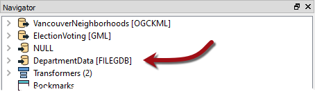
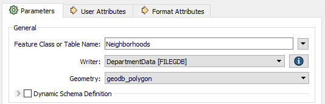
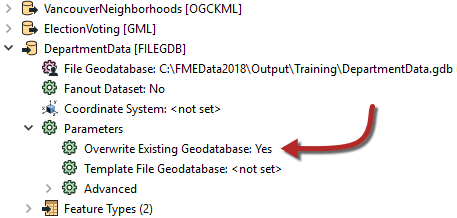

  

    <article class="markdown-body entry-content" itemprop="text">
<table>
<tbody><tr>
<td width="25%">
<i></i>
练习2.2
</td>
<td>
每日数据库更新：使用资源
</td>
</tr>
<tr>
<td>数据</td>
<td>街区（KML） 选举投票（GML）</td>
</tr>
<tr>
<td>总体目标</td>
<td>创建工作空间以读取和处理部门数据并将其发布到FME Server</td>
</tr>
<tr>
<td>演示</td>
<td>将数据上载到资源文件夹并创建工作空间以使用它</td>
</tr>
<tr>
<td>启动工作空间</td>
<td>C:\FMEData2018\Workspaces\ServerAuthoring\DataHandling-Ex2-Begin.fmw
</td>
</tr>
<tr>
<td>结束工作空间</td>
<td>C:\FMEData2018\Workspaces\ServerAuthoring\DataHandling-Ex2-Complete.fmw
</td>
</tr>
</tbody></table>

您已经（练习2.1）创建了一个工作空间来执行转换，并将其发布到FME Server; 数据和使用临时上传的数据。

但是，此类数据管理工具并不特别适合长期项目，因此此处的任务是升级工作空间以使用存储在资源文件夹中的数据集。我们可以存储源数据和写入目标数据。

 <strong>1）打开FME Server Web界面</strong>
 使用管理员帐户（例如admin / admin）登录FME Server Web界面。单击菜单栏上的“资源”以导航到资源管理页面。

 <strong>2）创建文件夹</strong>
 在大多数情况下，数据应存储在Data文件夹下，因此单击Resources对话框中的Data以打开该文件夹。为避免混合数据集，我们的数据应该进入自己的子文件夹。因此，单击New Folder按钮并创建一个名为Election的文件夹：

接下来单击Election文件夹，然后在其中创建名为Input and Output的<strong>新</strong>子文件夹：

 <strong>3）上传源数据集</strong>
 浏览到Input文件夹，单击Upload按钮，然后选择Files。上传当前转换的源数据集：

<table>
<tbody><tr>
<td>读模块数据集</td>
<td>C：\ FMEData2018 \ Data \ Elections \ ElectionVoting.gml  C：\ FMEData2018 \ Data \ Elections \ ElectionVoting.xsd  C：\ FMEData2018 \ Data \ Boundaries \ VancouverNeighborhoods.kml</td>
</tr>
</tbody></table>

所以我们现在有源数据集和一个文件夹来写入输出数据。

 <strong>4）添加写模块</strong>
 到目前为止，我们所有的工作空间都只有一个NULL（虚拟）写模块。现在我们了解了资源，我们可以添加一个适当的写模块，并将其输出指向资源输出文件夹。

因此，在FME Workbench中打开上面列出的起始工作空间，然后在菜单栏上选择Writers&gt; Add Writer并使用以下参数设置新的写模块：

<table>
<tbody><tr>
<td>写模块格式</td>
<td>Esri地理数据库（File Geodb Open API）</td>
</tr>
<tr>
<td>写模块数据集</td>
<td>C：\ FMEData2018 \输出\培训\ DepartmentData.gdb</td>
</tr>
<tr>
<td>要素类或表定义</td>
<td>无（高级）</td>
</tr>
</tbody></table>

我们想要不添加任何要素类型的原因是我们可以从NULL写模块中移动现有的要素类型。因此，当您单击“确定”时，工作空间看起来没有什么不同，但“导航”窗口中将有一个新的写模块：

 <strong>5）移动要素类型</strong>
 依次检查每个写模块要素类型的参数对话框。对于每种类型，将它从NULL写模块移动到FILE GDB写模块，如下所示：

这将暴露许多额外的参数。要设置的关键是几何。对于Neighborhoods ，它们应设置为geodb_polygon：

对于VotingPlaces要素类型，几何参数应设置为geodb_point。

现在，这两种要素类型属于地理数据库写模块，如果您愿意，可以从“导航”窗口中删除NULL写模块。

 <strong>6）设置地理数据库(Geodatabase)参数</strong>
 最后一件需要更改的事情(非常快)是：在“导航”窗口中找到地理数据库写模块并展开其参数列表。双击标记为Overwrite Existing Geodatabase的参数并将其设置为Yes：

这确保了如果我们多次运行工作空间，我们不会不断地将数据添加到同一数据集。

 <strong>7）运行工作空间</strong>
  在FME Desktop中测试运行工作空间。检查输出。您应该会发现输出是一个包含七个表的地理数据库（街区表和每个投票地点的单独表）。

 <strong>8）发布和运行工作空间</strong>
 将工作空间发布到FME Server。请务必不要选中按钮来上传任何数据。像往常一样在Job Submitter服务中注册工作空间。

返回FME Server Web界面。在“运行工作空间”对话框下找到工作空间。请注意数据集路径是如何硬编码到原始文件位置的：

显然，如果服务器无权访问这些文件，这将毫无用处。但是，因为我们已经将它们上传到资源文件夹，所以我们可以使用这些文件。

因此，对于每个文件，单击“浏览”按钮，浏览到“资源”文件夹中的相应子文件夹，然后选择/设置文件位置。对于地理数据库输出位置，您需要手动键入文件名：

<pre>$（FME_SHAREDRESOURCE_DATA）/Election/Output/DepartmentData.gdb
</pre>

记得删除任何现有的引用不正确的文件:

现在，当运行工作空间时，已完成的地理数据库文件应出现在Resources \ Data \ Election \ Output文件夹中：

 <strong>9）应用FME服务器参数</strong>
 虽然工作空间运行正常，并且使用了资源文件夹中的数据，但这只是因为我们在运行时选择了这些数据。它不是工作空间的永久功能。

如果工作空间被编程为自动查看资源文件夹，那会好得多。

因此，返回FME Workbench中的工作空间。

如果我们将工作空间设置为从资源文件夹中读取，我们不希望让用户有机会更改它。因此，在“导航”窗口中，找到源和目标数据集的三个参数并将其删除：

 <strong>10）设置源/目标参数</strong>
 现在，依次找到两个读模块和一个写模块的源和目标数据集参数。依次双击每个并将其更改为：

<table>
<tbody><tr><td>KML读模块</td><td>$(FME_SHAREDRESOURCE_DATA)\Election\Input\VancouverNeighborhoods.kml
</td></tr>
<tr><td>GML读模块</td><td>$(FME_SHAREDRESOURCE_DATA)\Election\Input\ElectionVoting.gml
</td></tr>
<tr><td>地理数据库写模块</td><td>$（FME_SHAREDRESOURCE_DATA）\选举\输出\ DepartmentData.gdb
</td></tr>
</tbody></table>

保存工作空间并将其发布回FME Server。

<table>
<tbody><tr>
<td>
<i></i>
姐姐直觉说......
</td>
</tr>
<tr>
<td>

这次您将无法在FME Workbench中测试运行工作空间，因为它无法识别共享资源参数。只有FME Server会返回该参数的值。

</td>
</tr>
</tbody></table>

 <strong>11）重新运行工作空间</strong>
 现在在FME Server上运行工作空间。这次不会提示您使用参数来选择源（或目标）数据集，但是它们将从资源文件夹中使用。

<table>
<tbody><tr>
<td>
<i></i>
恭喜
</td>
</tr>
<tr>
<td>

通过完成本练习，您已学会如何：
 
<ul><li>创建资源文件夹并将数据上传到它们</li>
<li>将写模块添加到工作空间并从另一个写模块移动功能类型</li>
<li>运行工作空间并从资源文件夹中选择数据</li>
<li>编辑工作空间以永久使用资源文件夹</li>
<li>删除参数以防止最终用户更改它们</li></ul>

</td>
</tr>
</tbody></table>
</article>
  

