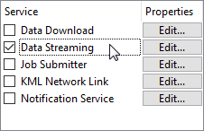
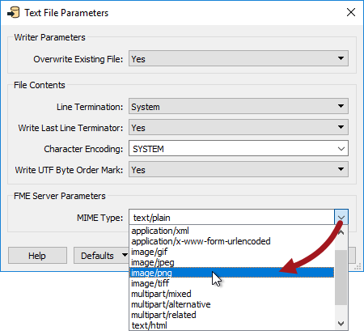
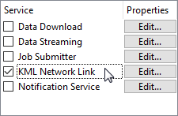
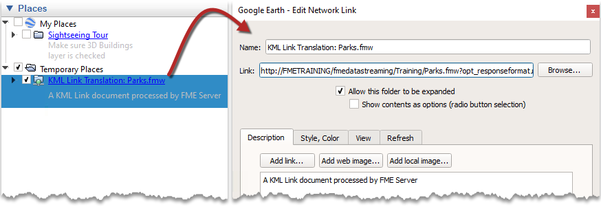

  

    <article class="markdown-body entry-content" itemprop="text"><h1>其他自助服务</h1>

虽然大多数人都是在下载数据的情况下考虑自助服务，但这并不是唯一可用的自助服务。

<h2>数据流</h2>

数据流是另一种可以注册工作空间的服务：

Job Submitter服务写入数据，而Data Download服务返回数据链接，而Data Streaming服务返回数据本身的文件，然后流回客户端。

例如，如果工作空间的数据流URL被发布到Web浏览器中，则数据将自动下载并在浏览器与该文件类型关联的任何应用程序中打开（某些数据可能直接在Web浏览器本身中打开）。

或者，URL可以直接用作客户端应用程序(比如GIS工具)的源。当客户端定期主动下载内容时——就像GeoRSS阅读器那样——那么您就有了一个Feed，这与常规的数据下载服务有很大不同。

<table>
<tbody><tr>
<td>
<i></i>
空间FME教授，ETL说......
</td>
</tr>
<tr>
<td>

数据流是一种轻微的误称，因为数据流服务不提供连续的数据流; 它仅提供特定时间点的数据快照。

</td>
</tr>
</tbody></table>

<h3>什么格式可以流式传输？</h3>

您可以将任何工作空间与数据流服务一起使用，前提是它以基于文件或基于文件夹的格式（即不是数据库或Web URL）写入数据。

如果输出数据集由多个文件组成，则数据流服务会自动从数据中创建压缩（zip）文件夹。例如，AutoCAD DWG格式可以流式传输，而ESRI Shape将以压缩文件的形式返回。

最流行的流格式是那些有合适的客户端来读取Feed的格式。使用数据流服务输出的一些主要格式包括：

<ul>
<li>RSS</li>
<li>GeoRSS</li>
<li>GeoJSON</li>
<li>KML</li>
<li>HTML</li>
<li>JSON</li>
</ul>
<h3>工作空间中的MIME类型</h3>

MIME标头是能够指示文件内容类型的文件或电子邮件的组件; 例如，<em><strong>Content-Type：text / plain</strong></em>表示一个简单的文本文件。

选择打开流式文件的应用程序将取决于客户端系统上的MIME类型和文件关联。

设置MIME类型对于FME写模块来说是最重要的，其中内容不是由写模块特别定义的。例如，HTML写模块没有MIME类型设置，因为它显然提供text / html。TextFile写模块具有MIME类型设置，因为其内容的性质不明确; 它可能是写纯文本（text / plain）或XML（text / xml），也可能写入包含栅格png图像（image / png）的blob属性的内容：

这里作者说文本文件的内容是有效的PNG，应该在默认的PNG应用程序（可能是Web浏览器，可能是图形编辑器）中打开。

<h2>KML网络链接</h2>

Google <a href="https://www.google.ca/earth/outreach/tutorials/network_link.html" rel="nofollow">将KML网络链接描述</a>为一种<em>书签</em> ; 从Google地球（或任何其他KML阅读应用程序）到真实数据集的链接。

在FME中，您可以注册将KML写为KML网络链接服务的任何工作空间，但您也必须在数据流下注册它：

使用此服务运行工作空间仅返回包含此“书签”的小型KMZ（压缩KML）文件。书签是返回工作空间的链接，其URL指向数据流服务。

当Google地球从FME Server打开KML网络链接服务时，它会收到指向工作空间的链接：

当跟踪链接时，它会触发FME Server运行工作空间并将结果作为KML数据流返回。

由于Google地球允许网络链接的刷新率，因此可以按用户定义的间隔重新运行转换。这样，结果总是根据所选择的间隔实时更新。

当然，在这种情况下，输出永远不会写入永久数据集; 生成的数据只是流式传输到浏览器，浏览器将其写入缓存。

</article>
  

