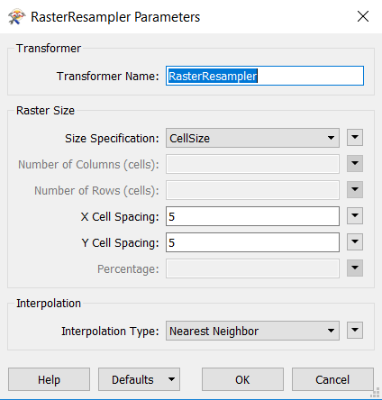
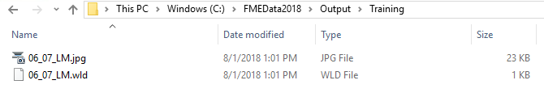

  

    <article class="markdown-body entry-content" itemprop="text">
<table>
<tbody><tr>
<td width="25%">
<i></i>
练习3.1
</td>
<td>
数据下载系统：工作空间创建
</td>
</tr>
<tr>
<td>数据</td>
<td>正射影像（GeoTIFF）</td>
</tr>
<tr>
<td>总体的目标</td>
<td>为正射影像创建FME Server数据下载系统</td>
</tr>
<tr>
<td>演示</td>
<td>创建工作空间并使用数据下载运行它</td>
</tr>
<tr>
<td>启动工作空间</td>
<td>无</td>
</tr>
<tr>
<td>结束工作空间</td>
<td>C:\FMEData2018\Workspaces\ServerAuthoring\SelfServe1-Ex1-Complete.fmw
</td>
</tr>
</tbody></table>

作为当地城市GIS部门的技术分析师，您拥有使用FME Desktop的丰富经验，并且刚刚开始使用FME Server。

其他部门经常要求GIS团队提供城市的正射影像。他们选择的格式通常是JPEG。目前，您使用FME Desktop转换数据，向工作空间添加任何特殊请求，例如特定分辨率，特定感兴趣区域，甚至是标记在栅格上的矢量数据集。

无论您对FME Workbench有多熟练，都需要时间来设置每个单独的请求。如果其他部门可以自己处理栅格数据，并且内置所有特殊请求的选项，那将会好得多。

当然，您很快就会意识到在FME Server上实施的数据下载系统将是一个理想的解决方案。

<table>
<tbody><tr>
<td>
<i></i>
Vector小姐说......
</td>
</tr>
<tr>
<td>

如果您有丰富的FME Workbench经验 - <strong>如果您的指导老师同意</strong> - 只需打开上面标题中列出的工作空间并跳到第6步。但是一定要检查转换器和它们的参数，这样你就知道你在用什么了。

</td>
</tr>
</tbody></table>

 <strong>1）创建工作空间</strong>
 让我们从创建基本FME工作空间开始，以转换和变换源栅格数据。启动FME Workbench并选择Readers&gt; Add Reader。出现提示时输入以下参数：

<table>
<tbody><tr>
<td>读模块格式</td>
<td>GeoTIFF（地理参考标记图像文件格式）</td>
</tr>
<tr>
<td>读模块数据集</td>
<td>C:\FMEData2018\Data\Orthophotos\06-07-LM.tif
</td>
</tr>
<tr>
<td>读模块参数</td>
<td>要素类型名称：来自文件名称</td>
</tr>
<tr>
<td>工作流程选项</td>
<td>单一合并要素类型</td>
</tr>
</tbody></table>

使用“单一合并要素类型”选项很重要，因为有许多数据源瓦片，我们可能希望读取其中任何一个，而不必将它们添加为单独的要素类型。

要素类型名称参数很重要，因为它将帮助我们以后允许用户选择要读取的图层。

 <strong>2）添加写模块</strong>
 现在我们需要一个写模块。从菜单栏中选择Writers&gt; Add Writer。出现提示时输入以下参数：

<table>
<tbody><tr>
<td>写模块格式</td>
<td>JPEG（联合图像专家组）</td>
</tr>
<tr>
<td>写模块数据集</td>
<td>C:\FMEData2018\Output\Training
</td>
</tr>
<tr>
<td>添加要素类型</td>
<td>从读模块复制</td>
</tr>
</tbody></table>

您的工作空间现在看起来像这样：

 <strong>3）添加转换器</strong>
 我们将从工作空间开始使用两台转换器; RasterResampler和RasterMosaicker。所以放置其中一个并连接工作空间中的所有内容：

 <strong>4）设置转换器参数</strong>
 检查RasterResampler的参数并设置：

<table>
<tbody><tr><td>尺寸规格</td><td>单元格大小</td></tr>
<tr><td>X单元格间距</td><td>5</td></tr>
<tr><td>Y单元格间距</td><td>5</td></tr>
</tbody></table>

您可以检查RasterMosaicker的参数，但目前没有任何需要更改的参数。

 <strong>5）保存并运行工作空间</strong>
 保存工作空间 - 只是为了确保在FME Workbench中运行良好。结果应该是一个JPEG文件(06_07_LM.jpg)和一个world文件(06_07_LM.wld)。

 <strong>6）发布工作空间</strong>
 现在将工作空间发布到FME Server。将其注册到数据下载服务。如果您正在使用远程服务器（例如FME 云实例），则需要使用工作空间发布数据或将其上载到FME Server资源文件夹。

 <strong>7）运行工作空间</strong>
 登录FME Server Web界面，找到工作空间并运行它。

工作空间将运行，您将看到一个指向输出数据集的zip文件的超链接：

<table>
<tbody><tr>
<td>
<i></i>
恭喜
</td>
</tr>
<tr>
<td>

通过完成本练习，您已学会如何：
 
<ul><li>创建工作空间以读取和写入栅格数据</li>
<li>使用数据下载服务发布和运行工作空间</li></ul>

</td>
</tr>
</tbody></table>   
</article>
  

