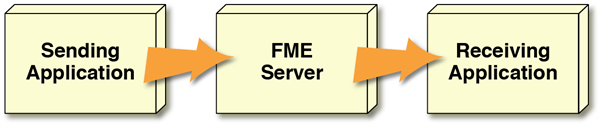

# 通知服务

通知服务是一种以短消息的形式将数据推送到FME Server或从FME Server推送的方式。

## 什么是通知？ ##

通知是一种简单的消息（有时称为“警报”），可以通知某人或某事特定事件已发生。

FME Server上的通知可以以两种不同的形式出现：传入和传出。

传入通知提醒FME Server注意其他地方发生的事件。

传出通知会提醒用户注意FME Server上发生的事件。

通过这种方式，FME Server可以响应事件通知采取行动，或者用户可以响应来自FME Server的通知采取行动。

该通知服务是处理传入和传出通知的FME Server体系结构的一部分。

## 何时使用通知 ##

当您要触发FME Server对从FME外部报告的事件的响应时，应使用通知。该活动不应是连续的一系列信息; 如果每秒有多个消息，则应考虑使用消息流技术。

当您想向外部订户发送关于FME Server,上发生的事情的消息时，通知也很有用。。同样，如果每秒可能有多个消息，则应考虑使用消息流。

在任何一种情况下，通知都是为了发送短消息，通常是为了触发收件人的动作。它不打算用于传输大量空间数据。最多，您应该将其用于单个地理要素，例如点的位置。
