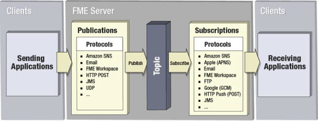

## 通知服务的要素 ##

通知服务包括许多不同的组件。

- **客户端：** 发送或接收通知的外部用户或系统
- **发布:** 侦听传入通知的事件处理程序
- **订阅:** 发送传出通知的事件处理程序
- **主题:** 描述通知内容的主题
- **协议:** FME Server可以接收或发送通知的方法

---

<!--Person X Says Section-->

<table style="border-spacing: 0px">
<tr>
<td style="vertical-align:middle;background-color:darkorange;border: 2px solid darkorange">
<i class="fa fa-quote-left fa-lg fa-pull-left fa-fw" style="color:white;padding-right: 12px;vertical-align:text-top"></i>
Vector小姐说...
</td>
</tr>

<tr>
<td style="border: 1px solid darkorange">

所有通知设置必须具有以下哪一种:
  <a href="http://52.73.3.37/fmedatastreaming/Manual/QAResponse2017.fmw?chapter=24&question=1&answer=1&DestDataset_TEXTLINE=C%3A%5CFMEOutput%5CQAResponse.html">1. 传入组件（发布，发布者）和传出组件（订阅，订阅者）</a>
 <a href="http://52.73.3.37/fmedatastreaming/Manual/QAResponse2017.fmw?chapter=24&question=1&answer=2&DestDataset_TEXTLINE=C%3A%5CFMEOutput%5CQAResponse.html">2. 传入组件或传出组件或两者</a>
 <a href="http://52.73.3.37/fmedatastreaming/Manual/QAResponse2017.fmw?chapter=24&question=1&answer=3&DestDataset_TEXTLINE=C%3A%5CFMEOutput%5CQAResponse.html">3. 传入组件或传出组件但从不两者都有 </a>
 <a href="http://52.73.3.37/fmedatastreaming/Manual/QAResponse2017.fmw?chapter=24&question=1&answer=4&DestDataset_TEXTLINE=C%3A%5CFMEOutput%5CQAResponse.html">4. 以上都没有</a>

</td>
</tr>
</table>
