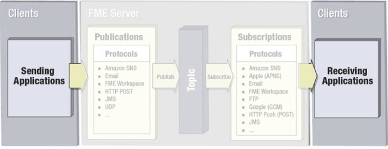

## 客户端 ##

客户端是发送或接收通知的用户或系统。客户端可以是自然人，或者可以仅是计算机系统中的组件。无论哪种方式，客户端都不是FME Server的核心部分，而是与其交互的某人或某物。

例如，数据库更新可能会导致触发器向FME Server发送通知，在这种情况下，数据库系统是客户端。但是，客户端也可以是一个人，例如，通过向FME Server发送电子邮件触发通知。

同样，FME服务器可以发送通知给另一个客户端系统接收。或者，这个客户也可以是一个真实的人，他可能会收到一封电子邮件形式的通知。
