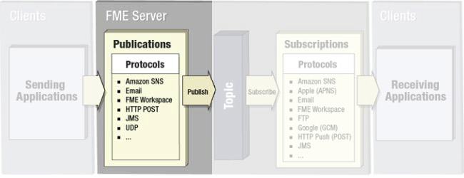
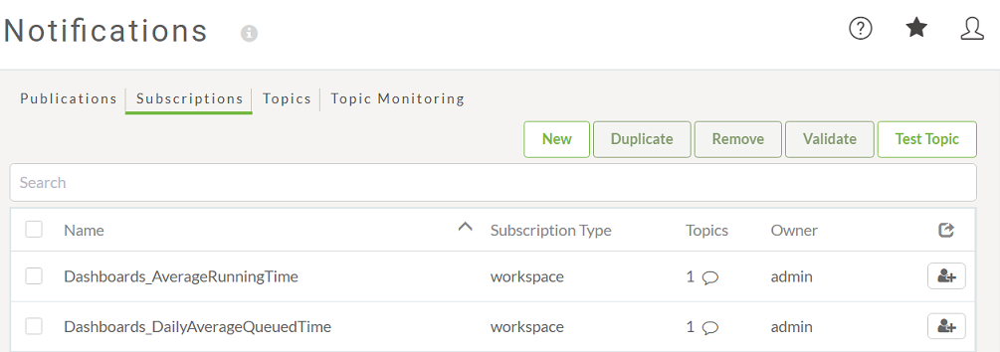

## 发布 ##

发布（Publication）是一个FME Server组件，用于接收来自客户端的传入通知。

要在FME Server中接收通知，工作空间作者（或管理员）必须创建新的发布。将在“通知”页面的FME Server Web界面中创建发布：

 

---

## 订阅 ##

订阅（Subscription）是一种FME Server组件，可将传出通知发送到客户端。

要在FME Server中发送通知，工作空间作者（或管理员）必须创建新的订阅。订阅将在“通知”页面上的FME Server Web界面中创建：

FME会在安装时自动创建一些订阅，例如，提醒客户已经运行的作业成功或失败。

---

<table style="border-spacing: 0px">
<tr>
<td style="vertical-align:middle;background-color:darkorange;border: 2px solid darkorange">
<i class="fa fa-quote-left fa-lg fa-pull-left fa-fw" style="color:white;padding-right: 12px;vertical-align:text-top"></i>
重要
</td>
</tr>

<tr>
<td style="border: 1px solid darkorange">

尽管这些行为在名字上看起来很奇怪 – 发布接收消息，订阅发送它们– 它是正确的。它们的命名与它们与主题的交互方式有关。  因此，发布将数据<strong>发布</strong> 到主题（即，它将数据发送到主题）并且订阅<strong>订阅</strong> 主题（即，它从主题接收数据）。

</td>
</tr>
</table>
