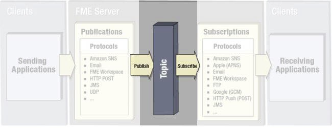
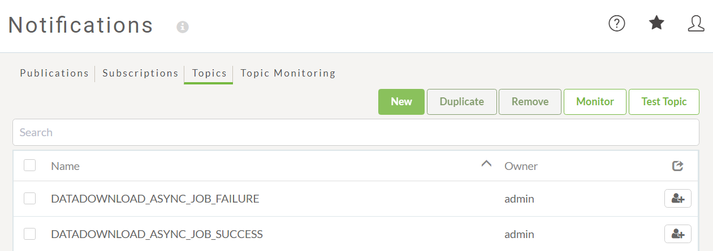

## 主题 ##

主题是充当消息中介者并定义消息内容的组件。可以将其视为通知主题行和通知发生的触发器的混合。

与发表一样，在通知页面的FME Server Web界面中创建了一个主题：

FME在安装时自动创建一些主题，以触发它创建的订阅。

---

### 发布和主题 ###

所有发布都链接到主题，以便当发布收到传入消息时，将对其进行分类并触发相关主题。

发布可以链接到多个主题，因此每个传入消息都可以触发多个操作。此外，多个发布可以触发相同的主题。

例如，雷击传感器可能会发布到主题WeatherEvent和AircraftAlerts，而洪水传感器可能会发布到主题WeatherEvent和RoadConditions。

---

<table style="border-spacing: 0px">
<tr>
<td style="vertical-align:middle;background-color:darkorange;border: 2px solid darkorange">
<i class="fa fa-quote-left fa-lg fa-pull-left fa-fw" style="color:white;padding-right: 12px;vertical-align:text-top"></i>
Interop日报记者, Chad Pugh-Litzer说…
</td>
</tr>

<tr>
<td style="border: 1px solid darkorange">

当我写一篇新闻文章时，我将这篇文章发布到Interop日报网站上，标记了许多主题来描述它。例如，关于足球队的纳税申报表的报告将在“财务”和“体育”下提交，因为它与两者都有关。

</td>
</tr>
</table>

---

### 订阅和主题 ###

所有订阅也链接到主题。触发主题时，将通过订阅将传出消息发送到接收客户端。

订阅可以链接到多个主题，每个主题被触发都会导致传出通知。每个主题也可以由多个订阅订阅。

例如，警察总部可能会订阅“道路状况”（RoadConditions）主题，以接收有关该主题的通知。本地电视天气频道也订阅了的主题，但除此之外，还订阅了“天气事件”（WeatherEvent）来收听这些特定事件。

---

<table style="border-spacing: 0px">
<tr>
<td style="vertical-align:middle;background-color:darkorange;border: 2px solid darkorange">
<i class="fa fa-quote-left fa-lg fa-pull-left fa-fw" style="color:white;padding-right: 12px;vertical-align:text-top"></i>
InteropGeek68说…
</td>
</tr>

<tr>
<td style="border: 1px solid darkorange">

我订阅了根据他们的主题在Interop日报网站上发布的文章。例如，我订阅了主题为金融的报告，而我的朋友--InteropJock72--订阅了体育文章。因为Chad的文章都有两个标签，我们都会收到它。

</td>
</tr>
</table>

---

<!--Person X Says Section-->

<table style="border-spacing: 0px">
<tr>
<td style="vertical-align:middle;background-color:darkorange;border: 2px solid darkorange">
<i class="fa fa-quote-left fa-lg fa-pull-left fa-fw" style="color:white;padding-right: 12px;vertical-align:text-top"></i>
Vector小姐说...
</td>
</tr>

<tr>
<td style="border: 1px solid darkorange">

请不要误会!发布与主题有什么关系?
  <a href="http://52.73.3.37/fmedatastreaming/Manual/QAResponse2017.fmw?chapter=24&question=2&answer=1&DestDataset_TEXTLINE=C%3A%5CFMEOutput%5CQAResponse.html">1.一：一（每个发布有一个主题，每个主题属于一个发布）</a>
 <a href="http://52.73.3.37/fmedatastreaming/Manual/QAResponse2017.fmw?chapter=24&question=2&answer=2&DestDataset_TEXTLINE=C%3A%5CFMEOutput%5CQAResponse.html">2. 一个：多个（每个发布可以有很多主题，每个主题属于一个发布）</a>
 <a href="http://52.73.3.37/fmedatastreaming/Manual/QAResponse2017.fmw?chapter=24&question=2&answer=3&DestDataset_TEXTLINE=C%3A%5CFMEOutput%5CQAResponse.html">3. 多个：一个（每个发布有一个主题） ，每个主题可以属于多个发布</a>
 <a href="http://52.73.3.37/fmedatastreaming/Manual/QAResponse2017.fmw?chapter=24&question=2&answer=4&DestDataset_TEXTLINE=C%3A%5CFMEOutput%5CQAResponse.html">4. 多个：多个（每个发布可以有很多主题，每个主题可以属于多个发布）</a>

</td>
</tr>
</table>
