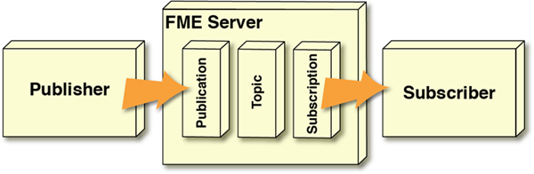

 

    <article class="markdown-body entry-content" itemprop="text"><h1>通知和工作空间</h1>

工作空间使FME Server成为空间数据通知的理想引擎。这是因为用于执行空间和表格数据转换的相同功能也非常适合创建和转换通知消息 - 还增加了基于空间的条件处理功能!

<h2>消息转换</h2>
<h3>简单通知设置</h3>

FME服务器通知服务最简单的设置是发布服务器将传入消息发送到发布，后者又触发特定主题。订阅侦听主题并将其信息作为传出消息传递给任何订阅服务器:

例如，有人向FME Server发送电子邮件，该电子邮件会响应传出的电子邮件。

但是，该方案不包括消息内容的任何转换/重构。如果需要以某种方式处理消息，则可以在FME Server中使用FME工作空间。

工作空间是FME的基础。对于通知，它可用于读取传入消息，从消息中提取空间数据（无论格式如何），对该数据执行空间转换，然后以某种方式写入结果。工作空间甚至可以读取要处理消息的额外数据。

它还可以生成传出消息 - 可能是为了响应某些其他空间处理 - 并将其传递给订阅服务器。

这种实时消息与空间ETL的融合是独一无二的。

我们来看两个具体的场景：

<ul>
<li>工作空间运行以响应传入消息</li>
<li>工作空间运行并触发传出消息</li>
</ul>

<h3>工作空间响应传入消息</h3>

让我们从逻辑上思考一下。传入消息会触发主题。要让工作空间响应传入消息，必须有一种机制使其侦听该主题并从中接收信息。

我们已经有了这些机制的术语：<strong>订阅和订阅服务器！</strong>

是的，通过创建订阅来设置此方案。工作空间实际上是该订阅的订阅服务器，并从中接收消息内容。简单通知设置的唯一不同之处在于，订阅服务器现在驻留在FME Server内部，而不是在其外部。

此处的示例是发布服务器/发布触发将传入数据写入数据库的工作空间。

<h3>工作空间触发传出消息</h3>

要继续逻辑，主题将激活传出消息。对于导致该传出消息的工作空间，必须有机制来触发该主题并向其发送信息。

我们已经有了这些机制的术语：<strong>发布和发布服务器！</strong>

工作空间再次实际上是一个发布服务器。该发布服务器现在再次驻留在FME Server中，而不是在FME Server之外。

但是，上面的简单通知设置还有另一个不同之处：此方案不需要发布组件。工作空间能够直接向主题发送信息，而无需定义发布组件。

此处的示例是作为计划任务启动的工作空间，一旦完成，就会向管理员发送通知电子邮件。

<h3>完整系统</h3>

当然，上图显示了半系统; 即，工作空间要么响应消息(它是订阅服务器)<strong>要么</strong>引发消息(它是发布服务器)。

但是，拥有一个既是订阅服务器又是发布服务器的工作空间也是同样合适的。

发布服务器

例如，发布服务器发送包含紧急事件和发布服务器位置坐标的消息。工作空间响应该紧急情况而运行，处理坐标，并将新消息发送到紧急响应单元。

注意，这个设置需要FME服务器中的一个发布和两个订阅对象。有一个外部发布服务器（带有发布），一个既是订阅服务器又是发布服务器的工作空间（带有订阅），还有一个外部订阅服务器（带有订阅）。

还有两个不同的主题对象。这很重要，我们稍后会看到。

<table>
<tbody><tr>
<td>
<i></i>
Vector小姐说......
</td>
</tr>
<tr>
<td>

当工作空间是通知系统的一部分，处理传入的消息时，它是...
   <a href="http://52.73.3.37/fmedatastreaming/Manual/QAResponse2017.fmw?chapter=24&amp;question=4&amp;answer=1&amp;DestDataset_TEXTLINE=C%3A%5CFMEOutput%5CQAResponse.html" rel="nofollow">1.订阅</a>
 <a href="http://52.73.3.37/fmedatastreaming/Manual/QAResponse2017.fmw?chapter=24&amp;question=4&amp;answer=2&amp;DestDataset_TEXTLINE=C%3A%5CFMEOutput%5CQAResponse.html" rel="nofollow">2.发布</a>
 <a href="http://52.73.3.37/fmedatastreaming/Manual/QAResponse2017.fmw?chapter=24&amp;question=4&amp;answer=3&amp;DestDataset_TEXTLINE=C%3A%5CFMEOutput%5CQAResponse.html" rel="nofollow">3.协议</a>
 <a href="http://52.73.3.37/fmedatastreaming/Manual/QAResponse2017.fmw?chapter=24&amp;question=4&amp;answer=4&amp;DestDataset_TEXTLINE=C%3A%5CFMEOutput%5CQAResponse.html" rel="nofollow">4.客户端</a>

</td>
</tr>
</tbody></table>
</article>
  

