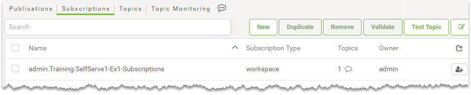

 

    <article class="markdown-body entry-content" itemprop="text"><h1>工作空间作为订阅者</h1>

当工作空间需要对传入通知作出反应时，它实际上是订阅者，订阅一个主题。这是通过使用订阅将工作空间连接到该主题来设置的：

当通过发布或任何其他方式触发该主题时，将运行通过<em>FME Workspace</em>协议连接到该主题的任何工作空间。

<h2>注册工作空间</h2>

如上图所示，接收通知的工作空间需要将主题的订阅传送到工作空间。

有两种方法可以创建此订阅：

<ul>
<li>通过FME Server Web界面</li>
<li>使用FME Server发布向导发布工作空间时</li>
</ul>

<h3>Web界面工作空间订阅</h3>

要创建的订阅应该有一个称为（正如您可能已经猜到的）<em>FME Workspace的协议</em>。

为新订阅选择该协议时，将检查所选工作空间并提供其已发布参数的列表：

在这样的对话框中使用参数意味着设置要运行的工作空间非常简单，但是您希望它能够响应通知。创建后，当触发该主题时，工作空间将作为响应运行。

<h3>发布向导工作空间订阅</h3>

创建FME工作区订阅的第二种方法是将工作空间从Workbench发布到FME Server。此时，您可以选择通知服务并选择一个主题以从以下位置接收信息：

完成此操作后，您无需创建新的订阅对象; FME将为您创建一个。它看起来像这样：

用于新订阅的名称包括存储库名称，所有者的名称和工作区的名称。

<table>
<tbody><tr>
<td>
<i></i>
警告
</td>
</tr>
<tr>
<td>

了解FME创建此新订阅非常重要。否则可能会在许多情况下产生影响; 例如，如果您将组件复制到新的FME Server（在一个项目中），但不包括此组件，那么您的通知将无法在该服务器上运行！
</td>
</tr>
</tbody></table>
</article>
  

