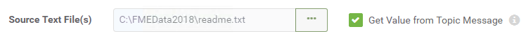
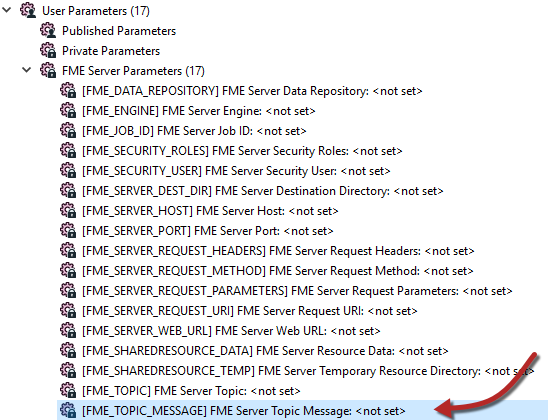
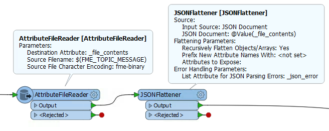

## 消息内容 ##

解释和处理消息内容的能力是将FME工作空间用作订阅者的关键原因。他们可以接收消息，然后以任何需要的方式对其进行转换，并根据需要合并空间数据和空间条件。

---

### 传递消息 ###

主题将消息传递给订阅。当它为此协议执行此操作时，主题消息将写入临时JSON文件，并且该文件的名称将通过已发布的参数传递到工作空间。

有两种方法可以设置工作空间来检索文件名信息。

获取消息文件位置的第一种方法是在创建工作空间订阅时使用复选框将其发送到您自己选择的用户参数：

第二种方法使用名为FME_TOPIC_MESSAGE的FME Server参数。这是FME Workbench中公开的固定FME Server参数之一：

请记住，这只是传递包含消息的文件的名称 - 它不包括消息本身。为此，您必须读取该JSON文件的内容。

例如，您可以将JSON（或文本文件）读模块添加到工作空间，并选择其源数据集参数作为接收JSON文件名称的参数。这样，数据就可以直接读入工作空间。

或者，您可以使用诸如AttributeFileReader之类的转换器来读取文件内容。

---

### 解释消息 ###

将消息读入Workbench之后，就必须处理它。

如上所述，工作空间订阅将消息内容写入临时文件，并通过已发布的参数将该文件的名称传递给工作空间。

可以使用许多不同的转换器扫描和处理传入的消息。如果消息是JSON格式，则存在转换器，例如JSONExtractor和JSONFlattener。类似地，XMLFlattener和XMLFragmenter转换器用于XML内容。

这些转换器将消息从JSON（或XML）字符串转换为FME Workbench能够处理的属性。

这里 - 例如 - 作者已将AttributeFileReader和JSONFlattener转换器添加到其工作空间。AttributeFileReader读取JSON内容（使用FME_TOPIC_MESSAGE标识文件），JSONFlattener转换器处理JSON以将消息提取为名为subscriber_content的属性：

如果传入的消息是电子邮件，那么JSON内容可能如下所示：

<pre>
{
"fns_type": "email_publisher",
"email_publisher_to": "demo@somehost.com",
"email_publisher_subject": "MIME message from sender",
"email_publisher_content{0}": "Testing Email",
"email_publisher_content_type{0}": "text/plain",
"email_publisher_from": "sender@somehost.com",
"email_publisher_received": "Thu May 18 11:15:46 PDT 2018",
"email_publisher_sent": "Thu May 18 11:15:46 PDT 2018",
}
</pre>

请注意它是如何包含“来自”和“去到”字段的电子邮件以及内容本身的。

使用JSONFlattener转换器转换为FME属性时，结果（如FME Data Inspector中所示）将如下所示：

现在，内容可作为一组属性提供给工作空间，并可根据需要进行处理。

---

### 使用消息 ###

您对邮件的处理取决于您所需的设置。如果主题仅仅是一个触发器，并且消息不重要，则可以忽略它。但是，在大多数情况下，消息内容很重要。

FME可用于处理传入消息的方式几乎是无限的。但是，需要考虑的一个有用示例是消息包含工作空间应读取的数据集的名称。这里有两种可能的情况。

如果附带数据集的电子邮件到达，附件将存储在文件系统中，部分JSON内容会将附件指定为路径：

<pre>
"email_publisher_attachment{0}": "C:\\Temp\\demo246129673106713_canada.dwg"
</pre>

同样，消息可能包含需要读取的数据集的名称（不包含附件）。在这两种情况下，都不能使用读模块，因为我们需要在读取之前提取数据集的名称，因此FeatureReader转换器 - 能够在工作空间中读取数据 - 成为完美的解决方案。

另一个有趣的场景是消息包含X / Y坐标 - 例如人的位置。在这里，可以使用VertexCreator转换器将X / Y坐标转换为点要素，并且从那里可以使用任意数量的FME转换器来执行空间处理，例如地理围栏。
