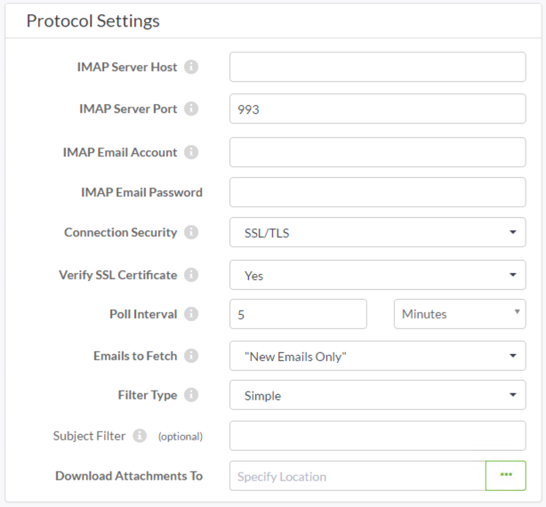

## IMAP发布 ##

IMAP (Internet Message Access Protocol)（Internet消息访问协议）是用于传入（发布）通知的电子邮件的变体。

IMAP发布不是使用内置电子邮件服务器，而是连接到另一个电子邮件服务器并监视它以接收传入的电子邮件。当电子邮件到达该帐户时，将触发与该出版物绑定的任何主题。

---

### 创建IMAPP发布 ###

与SMTP协议一样，通过创建新的发布和（在本例中）选择电子邮件（IMAP）协议，在Web界面的“通知”页面中设置IMAP发布：

请注意，大多数参数用于定义IMAP（电子邮件）服务器连接。

通过两个重要参数，您可以确定检查电子邮件的时间间隔，并决定是仅提取所有未读电子邮件还是新电子邮件。

还有一个参数可用于选择存储任何电子邮件附件的FME Server资源位置。

---

<table style="border-spacing: 0px">
<tr>
<td style="vertical-align:middle;background-color:darkorange;border: 2px solid darkorange">
<i class="fa fa-quote-left fa-lg fa-pull-left fa-fw" style="color:white;padding-right: 12px;vertical-align:text-top"></i>
D. Server先生说 …
</td>
</tr>

<tr>
<td style="border: 1px solid darkorange">

大多数电子邮件服务器都支持IMAP功能，大多数基于云的电子邮件提供商也是如此，例如Gmail，Outlook.com，Yahoo！等; 所以让FME Server扫描一个Gmail帐户（例如）接收邮件非常容易，然后对其内容采取行动。

</td>
</tr>
</table>
