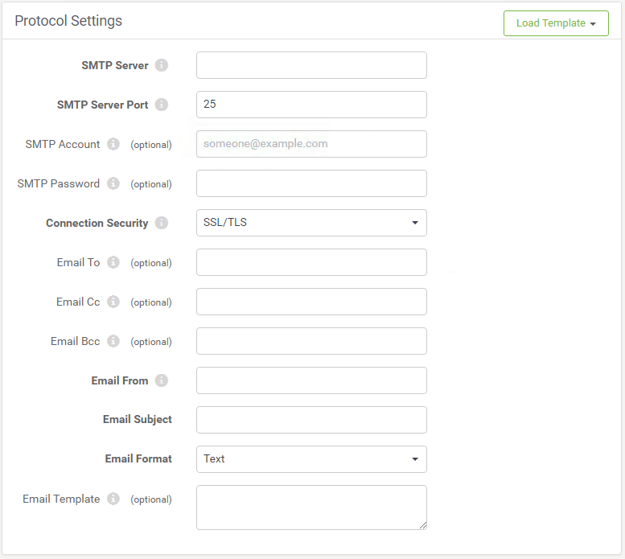

## 电子邮件订阅 ##

电子邮件订阅用于让FME Server发送电子邮件以响应主题。FME Server中的内置电子邮件服务器仅用于传入邮件，IMAP协议也是如此，因此需要通过现有（外部）SMTP电子邮件服务器发送邮件。

### 设置电子邮件订阅 ###

通过选择新订阅的电子邮件协议，可以在Web界面的“通知”页面中创建电子邮件订阅。

为订阅提供名称和选择要触发的现有主题。传出邮件还有更多参数，因为需要定义完整的SMTP服务器连接参数。但是，可以选择为最常见的电子邮件服务加载模板。

电子邮件本身的各个字段（From，To，Subject，Template）不需要进行硬编码，可以从工作空间传递到订阅。另一个重要参数是电子邮件格式，可以是纯文本或HTML。

有关如何为外发电子邮件生成内容的信息，请参阅工作空间的以下部分。
